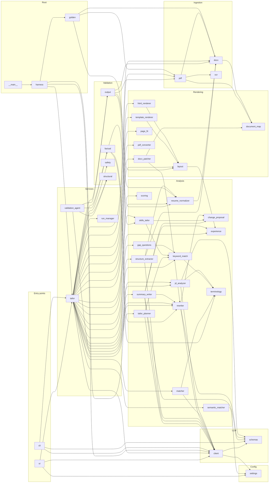

# Knowledge Graph — Resume-optimizer

> **Auto-generated** by `scripts/update_docs.py graph` (run by the pre-commit hook). Do not edit by hand —
> change the code, or the `STAGE_MAP` / `LAYERS` tables in the script. Machine-readable twin: `KNOWLEDGE_GRAPH.json`.

**47 app modules · 40 test files · 82 classes · 594 functions/methods · 13,283 lines of Python** · source hash `7e17dd0b2b698547`

How to read this: every file sits at a point in a 3-D space — **where** it lives (path), **what** it is (layer), and **when** it runs (pipeline stage). Section 2 is that matrix; section 3 zooms into each module.

## Contents
1. [Directory map](#1-directory-map)
2. [Layer × Stage matrix](#2-layer--stage-matrix)
3. [Module cards](#3-module-cards)
4. [Dependency diagram](#4-dependency-diagram)
5. [Configuration keys](#5-configuration-keys)
6. [Prompts](#6-prompts)
7. [Gaps: untested and unmapped modules](#7-gaps-untested-and-unmapped-modules)

## 1. Directory map

```text
.env.example
ARCHITECTURE.md
BUILD.md
CLAUDE.md
README.md
pyproject.toml
.githooks/
  _python
  post-commit
  pre-commit
app/
  cli.py                                         check_llm(), main()
  ui.py                                          get_local_pdf_preview_url(), display_pdf_with_fallback(), _cleanup_ses…
  analysis/
    change_proposal.py                           ChangeProposal
    experience.py                                Years of experience from role date ranges (P1.5), and the page target
    gap_questions.py                             Suggest-and-confirm gaps (P3.1): ask, never assume.
    jd_analyzer.py                               JDAnalyzer
    keyword_match.py                             Keyword-level match rate, the headline score (P1.2).
    matcher.py                                   EvidenceMatcher
    resume_normalizer.py                         ResumeNormalizer
    rewriter.py                                  LLMRewriter
    scoring.py                                   ScoreComponents, AlignmentScorer
    semantic_matcher.py                          Semantic (embedding-based) matching layer.
    skills_tailor.py                             Skills tailoring (P1.6), deterministic: no LLM, nothing added.
    structure_extractor.py                       LLM-assisted resume structure extraction with a verbatim guard (P1.13).
    summary_writer.py                            Tailored professional summary (P1.5).
    tailor_planner.py                            TailoringPlanner
    terminology.py                               flat_alias_to_canonical(), normalize_phrase()
  config/
    settings.py                                  Settings
  domain/
    evidence.py                                  Evidence
    job.py                                       Requirement, JobDescription
    report.py                                    Match, KeywordRow, KeywordMatchReport, TailoringReport
    resume.py                                    Candidate, ResumeBullet, Role, Experience, Project, Education, Resume
    resume_document.py                           ResumePresentation, ResumeSource, ResumeRevision, ResumeDocument
    tailoring.py                                 TailoringAction, TailoringPlan
  eval/
    __init__.py                                  Evaluation harness (P4.1): run resume + JD cases through the pipeline …
    __main__.py                                  python -m app.eval run [--live] [--tailor] [--case NAME] [--compare BA…
    golden.py                                    Canonical projection of a parsed resume, compared against hand-checked
    harness.py                                   Run evaluation cases through the pipeline and collect metrics (P4.1).
  ingestion/
    docx.py                                      RawBlock, RawDocument, DocxParser
    ocr.py                                       OCREngine
    pdf.py                                       _Line, PdfParser
  llm/
    client.py                                    LLMClient
    schemas.py                                   LLMResponse, LLMError, LLMConnectionError, LLMTimeoutError, LLMInvalid…
    prompts/
      final_review.txt
      jd_analysis.txt
      resume_normalization.txt
      rewrite_bullet.txt
      rewrite_role.txt
      summary.txt
      tailoring_plan.txt
      validate_claims.txt
  rendering/
    document_map.py                              DocumentLocation, DocumentMap
    docx_patcher.py                              DocxPatcher
    html_renderer.py                             HtmlResumeRenderer
    layout.py                                    Shared layout rules for the ATS template (P2.1).
    page_fit.py                                  Page-fit loop (P2.4): render, count pages, trim, render again.
    pdf_converter.py                             PdfConverter
    template_renderer.py                         TemplateRenderer
  services/
    run_manager.py                               RunManager
    tailor.py                                    TailorService
    validation_agent.py                          ValidationAgent
  validation/
    factual.py                                   ClaimCheck, ValidationResult, FactualValidator
    output.py                                    OutputQAValidator
    safety.py                                    SafetyGuard
    structural.py                                StructuralValidator
scripts/
  autocommit.sh
  benchmark_model.py                             Benchmark local LLM latency and availability via Ollama.
  check_dependencies.py                          Simple dependency checker for LibreOffice and Ollama.
  create_sample_docx.py                          Generate sample fixture DOCX resume for testing.
  create_sample_pdf.py                           Generate sample PDF resume fixture using PyMuPDF.
  install_hooks.sh
  update_docs.py                                 Regenerate the repo's living docs: the knowledge graph and the change …
tests/
  conftest.py                                    Test-wide isolation from the developer's .env.
  fixtures/
    jds/
      replica_layout_jd.txt
      sample.txt
    resumes/
      make_replica_layout_pdf.py                 Generate replica_layout.pdf: an anonymized resume with the same PDF la…
      replica_layout.golden.json
      replica_layout.pdf
      sample.docx
      sample.pdf
  integration/
    test_end_to_end.py                           test_integration_docx_pipeline(), test_integration_pdf_pipeline(), tes…
    test_parse_golden.py                         Parse a resume and compare it, field by field, with a hand-checked gol…
    test_preserve_rewrite_end_to_end.py          test_approved_rewrite_appears_in_all_outputs()
  unit/
    test_ats_round_trip.py                       P2.5: the rendered template must read back exactly as rendered, and the
    test_check_parsed_resume.py                  P3.5: "Check parsed resume" step: corrections applied by the service,
    test_cli.py                                  test_tailor_service_analyze_only(), test_tailor_service_end_to_end_doc…
    test_docx_parser.py                          test_docx_parser_sample(), test_docx_parser_file_not_found()
    test_docx_renderer.py                        test_docx_patcher_preserve_mode(), test_template_renderer_ats_mode(), …
    test_env.py                                  test_environment_baseline()
    test_eval_harness.py                         Evaluation harness (P4.1).
    test_experience.py                           P2.3: years of experience (overlaps merged) -> 1 or 2 target pages.
    test_gap_questions.py                        Suggest-and-confirm gaps (P3.1).
    test_html_renderer.py                        test_html_renderer_outputs_ats_sections_and_escapes_content()
    test_jd_analyzer.py                          test_jd_analyzer_heuristic(), test_heading_variants_are_not_extracted_…
    test_jd_analyzer_llm.py                      _FakeLLMClient
    test_jd_analyzer_v2.py                       JD analysis v2 (P1.1): title/company without labels, whole-line
    test_keyword_match.py                        Keyword-level match rate as the headline score (P1.2).
    test_llm_client.py                           SampleSchema
    test_matcher.py                              test_evidence_matcher_exact_and_alias(), test_one_generic_word_cannot_…
    test_page_fit.py                             P2.4: the page-fit loop trims in a fixed order, keeps minimums, reports
    test_parsing_fixes_p19.py                    P1.9: links (DOCX hyperlinks, PDF link annotations, URLs in text),
    test_pdf_converter.py                        test_pdf_converter_find_binary_or_graceful_none(), test_output_qa_vali…
    test_pdf_parser.py                           test_pdf_parser_text_layer(), test_pdf_parser_file_not_found(), test_m…
    test_project_rewrites.py                     Project bullets go through the same plan -> rewrite -> validate flow (…
    test_resume_document.py                      test_resume_document_has_versioned_json_snapshot(), test_resume_docume…
    test_resume_model_v2.py                      Resume model v2 (P1.12): several roles at one company, project
    test_resume_normalizer.py                    test_resume_normalizer(), _normalize_replica(), test_replica_header_su…
    test_rewriter.py                             test_rewriter_deterministic_fallback(), test_rewrite_bullet_parses_str…
    test_scoring.py                              _req(), _match(), test_semantic_partial_excluded_from_headline_score()…
    test_semantic_matcher.py                     Tests for SemanticMatcher.
    test_skills_tailor.py                        Skills tailoring (P1.6): reorder by JD relevance, JD spelling, never a…
    test_structure_extractor.py                  LLM-assisted structure extraction with a verbatim guard (P1.13).
    test_summary_writer.py                       Summary tailoring (P1.5) and years of experience from dates.
    test_tailor_planner.py                       test_tailor_planner(), test_semantic_only_match_produces_rewrite_with_…
    test_tailor_resume_flow.py                   tailor_resume orchestration: pre-approved proposals and Strict Factual…
    test_tailor_service_addition.py              _service(), test_incorporate_user_addition_appends_bullet_to_most_rece…
    test_template_layout.py                      P2.1: the ATS template (A4, Arial, standard headings, section order,
    test_template_renderer_standalone.py         _full_text(), test_template_renderer_ats_mode(), test_template_rendere…
    test_ui.py                                   test_ui_importable(), test_ats_template_is_the_default_output()
    test_validation.py                           test_factual_validator_preserves_grounded_claims(), test_factual_valid…
```

## 2. Layer × Stage matrix

Rows = layer (what kind of code), columns = pipeline stage (when it runs during a tailoring run). Orchestrators (`tailor.py`, `ui.py`, `cli.py`) span every stage and are listed once below the table.

| Layer | 1 Ingest | 2 Normalize | 3 JD analysis | 4 Match | 5 Score | 6 Plan | 7 Rewrite | 8 Validate | 9 Render | 10 Report |
|---|---|---|---|---|---|---|---|---|---|---|
| **Ingestion** | `docx`<br>`ocr`<br>`pdf` | · | · | · | · | · | · | · | · | · |
| **Analysis** | · | `experience`<br>`resume_normalizer`<br>`structure_extractor` | `jd_analyzer` | `matcher`<br>`semantic_matcher`<br>`terminology` | `keyword_match`<br>`scoring` | `gap_questions`<br>`tailor_planner` | `change_proposal`<br>`experience`<br>`rewriter`<br>`skills_tailor`<br>`summary_writer` | · | · | · |
| **LLM** | · | · | `client`<br>`schemas` | · | · | · | `client`<br>`schemas` | · | · | · |
| **Validation** | · | · | `safety` | · | · | · | · | `factual`<br>`output`<br>`structural` | · | · |
| **Rendering** | `document_map` | · | · | · | · | · | · | · | `document_map`<br>`docx_patcher`<br>`html_renderer`<br>`layout`<br>`page_fit`<br>`pdf_converter`<br>`template_renderer` | · |
| **Domain models** | · | `evidence`<br>`resume`<br>`resume_document` | `job` | `evidence`<br>`report` | `report` | `tailoring` | · | · | `resume_document` | · |
| **Services** | · | · | · | · | · | · | · | `validation_agent` | · | `run_manager` |

Spanning all stages: `app/cli.py`, `app/eval/harness.py`, `app/services/tailor.py`, `app/ui.py`

## 3. Module cards

### `app/analysis/change_proposal.py`

**Layer:** Analysis · **Stage:** 7 Rewrite · **Lines:** 85

- class **`ChangeProposal`** ([app/analysis/change_proposal.py:6](../app/analysis/change_proposal.py#L6)) — Richer change proposal schema for review and audit.
  - `model_dump()` :45
  - `semantic_id()` :60
  - `source_id()` :70
  - `rewritten_text()` :79
- **Imported by:** `analysis/rewriter.py`, `analysis/skills_tailor.py`, `analysis/summary_writer.py`
- **Tested by:** `tests/unit/test_skills_tailor.py`, `tests/unit/test_summary_writer.py`

### `app/analysis/experience.py`

**Layer:** Analysis · **Stage:** 2 Normalize, 7 Rewrite · **Lines:** 83

_Years of experience from role date ranges (P1.5), and the page target_

- function **`parse_month()`** ([app/analysis/experience.py:19](../app/analysis/experience.py#L19)) — 'August 2024' / 'Aug. 2024' / '08/2024' / '2024' / 'Present' -> (year, month).
- function **`role_intervals()`** ([app/analysis/experience.py:40](../app/analysis/experience.py#L40)) — Each dated role as [start, end] in absolute months (year*12 + month).
- function **`years_of_experience()`** ([app/analysis/experience.py:57](../app/analysis/experience.py#L57)) — Total months covered by any role (overlaps merged), in years.
- function **`years_phrase()`** ([app/analysis/experience.py:69](../app/analysis/experience.py#L69)) — How a resume states it: '4+ years', '1 year', or None under 1 year.
- function **`target_pages()`** ([app/analysis/experience.py:81](../app/analysis/experience.py#L81)) — How many A4 pages the tailored resume should fill.
- **Imports:** `domain/resume.py`
- **Imported by:** `analysis/summary_writer.py`, `rendering/layout.py`, `services/tailor.py`
- **Tested by:** `tests/unit/test_experience.py`, `tests/unit/test_summary_writer.py`

### `app/analysis/gap_questions.py`

**Layer:** Analysis · **Stage:** 6 Plan · **Lines:** 54

_Suggest-and-confirm gaps (P3.1): ask, never assume._

- class **`GapQuestion`** ([app/analysis/gap_questions.py:19](../app/analysis/gap_questions.py#L19))
- class **`GapAnswer`** ([app/analysis/gap_questions.py:27](../app/analysis/gap_questions.py#L27))
- function **`build_questions()`** ([app/analysis/gap_questions.py:34](../app/analysis/gap_questions.py#L34))
- **Imports:** `analysis/keyword_match.py`, `domain/job.py`, `domain/report.py`
- **Imported by:** `services/tailor.py`
- **Tested by:** `tests/unit/test_gap_questions.py`

### `app/analysis/jd_analyzer.py`

**Layer:** Analysis · **Stage:** 3 JD analysis · **Lines:** 418

- class **`JDAnalyzer`** ([app/analysis/jd_analyzer.py:11](../app/analysis/jd_analyzer.py#L11)) — Extract only text that is visibly present in the supplied job description.
  - `__init__()` :65
  - `extract_keywords_from_text()` :93 — Stopgap keyword extraction: keep only technical-looking terms,
  - `_category()` :136
  - `_clean_line()` :149 — Strip a bullet marker, including private-use glyphs pasted from Word/PDF.
  - `_is_heading()` :154 — A section heading: the known patterns, an ALL-CAPS short line
  - `_is_requirement()` :171
  - `_reflow_lines()` :180 — Undo hard line-wrapping from pasted JDs (job boards/PDFs often wrap
  - `_verbatim()` :218 — The JD's own spelling of `value` if it occurs in the JD (case- and
  - `_verbatim_list()` :228
  - `_contains_term()` :239 — Whole-term containment: "A/B" is in "A/B testing", "ML" is not in "MLflow".
  - `count_occurrences()` :244 — Whole-term, case-insensitive count ("R" doesn't match "React").
  - `_heuristic_title_company()` :250
  - `_seniority()` :271
  - `_years()` :278
  - `_llm_analyze()` :286 — One structured call: metadata, requirement lines by index, skills.
  - `analyze()` :314
- **Imports:** `analysis/terminology.py`, `domain/job.py`, `llm/client.py`, `llm/schemas.py`
- **Imported by:** `eval/harness.py`, `services/tailor.py`
- **Tested by:** `tests/unit/test_jd_analyzer.py`, `tests/unit/test_jd_analyzer_llm.py`, `tests/unit/test_jd_analyzer_v2.py`
- **Prompts:** `llm/prompts/jd_analysis.txt`

### `app/analysis/keyword_match.py`

**Layer:** Analysis · **Stage:** 5 Score · **Lines:** 162

_Keyword-level match rate, the headline score (P1.2)._

- class **`KeywordMatcher`** ([app/analysis/keyword_match.py:94](../app/analysis/keyword_match.py#L94))
  - `_find()` :95
  - `_title_credit()` :115
  - `match()` :125
- function **`_stem()`** ([app/analysis/keyword_match.py:37](../app/analysis/keyword_match.py#L37))
- function **`_alias()`** ([app/analysis/keyword_match.py:45](../app/analysis/keyword_match.py#L45))
- function **`tokens()`** ([app/analysis/keyword_match.py:52](../app/analysis/keyword_match.py#L52)) — Lowercased, alias-canonical, plural-insensitive tokens.
- function **`_contains_seq()`** ([app/analysis/keyword_match.py:57](../app/analysis/keyword_match.py#L57))
- function **`resume_sections()`** ([app/analysis/keyword_match.py:62](../app/analysis/keyword_match.py#L62)) — (label, text) for every part of the resume a recruiter or ATS reads.
- **Imports:** `analysis/terminology.py`, `domain/job.py`, `domain/report.py`, `domain/resume.py`
- **Imported by:** `analysis/gap_questions.py`, `analysis/skills_tailor.py`, `analysis/tailor_planner.py`, `services/tailor.py`
- **Tested by:** `tests/unit/test_gap_questions.py`, `tests/unit/test_keyword_match.py`, `tests/unit/test_skills_tailor.py`, `tests/unit/test_summary_writer.py`

### `app/analysis/matcher.py`

**Layer:** Analysis · **Stage:** 4 Match · **Lines:** 146

- class **`EvidenceMatcher`** ([app/analysis/matcher.py:20](../app/analysis/matcher.py#L20)) — Deterministic, evidence-only matcher.
  - `__init__()` :27
  - `_normalize_text()` :30
  - `_extract_key_tokens()` :38
  - `_meaningful_tokens()` :42
  - `_extract_requirement_units()` :45 — Break a requirement into comparable 'units' for coverage scoring.
  - `match()` :89
- **Imports:** `analysis/terminology.py`, `domain/evidence.py`, `domain/job.py`, `domain/report.py`, `llm/client.py`
- **Imported by:** `services/tailor.py`
- **Tested by:** `tests/unit/test_matcher.py`

### `app/analysis/resume_normalizer.py`

**Layer:** Analysis · **Stage:** 2 Normalize · **Lines:** 655

- class **`ResumeNormalizer`** ([app/analysis/resume_normalizer.py:8](../app/analysis/resume_normalizer.py#L8))
  - `_header_urls()` :40
  - `_is_headline()` :51 — A short title line under the name, e.g. 'Senior Data Scientist |
  - `_split_skill_line()` :101 — 'Languages: Python, SQL<tab>Frameworks: Pandas, and XGBoost' ->
  - `_skill_items()` :122
  - `_looks_like_degree()` :137 — 'B.Tech in Computer Science' yes; 'State University' no.
  - `_split_middle_dot()` :142 — 'Acme Corp · Pune, India' -> ('Acme Corp', 'Pune, India'), the
  - `_is_dated_line()` :151 — A job title/company line carrying a date range or year.
  - `_experience_line_kind()` :158 — 'dated' (title and/or company with dates), 'header_line' (a short
  - `_add_role()` :177 — Record a role; the first one also fills the entry's title/dates.
  - `_merge_links()` :187 — Profile links from the file's hyperlinks and from URLs written in
  - `_extract_date_range()` :201
  - `_strip_date_range()` :205
  - `_parse_title_and_dates()` :209 — 'Data Scientist II | August 2024 - Present' ->
  - `_split_respecting_parens()` :218 — Split on sep_chars, but never inside ( ) or [ ] groups — so
  - `normalize()` :241
- **Imports:** `domain/evidence.py`, `domain/resume.py`, `domain/resume_document.py`, `ingestion/docx.py`
- **Imported by:** `analysis/structure_extractor.py`, `eval/golden.py`, `services/tailor.py`, `validation/output.py`
- **Tested by:** `tests/integration/test_preserve_rewrite_end_to_end.py`, `tests/unit/test_ats_round_trip.py`, `tests/unit/test_parsing_fixes_p19.py`, `tests/unit/test_resume_model_v2.py`, `tests/unit/test_resume_normalizer.py`, `tests/unit/test_structure_extractor.py`, `tests/unit/test_tailor_resume_flow.py`

### `app/analysis/rewriter.py`

**Layer:** Analysis · **Stage:** 7 Rewrite · **Lines:** 289

- class **`LLMRewriter`** ([app/analysis/rewriter.py:69](../app/analysis/rewriter.py#L69))
  - `__init__()` :70
  - `rewrite_bullet()` :73 — Rewrite (or, given a single free-text `original_text` with no
  - `rewrite_bullet_with_status()` :93 — Like rewrite_bullet, plus what happened, so failures are visible
  - `rewrite_role()` :151 — Rewrite several bullets of one role in ONE call (P1.4).
  - `execute_plan()` :210 — One LLM call per role (P1.4): all of a job's bullets that the
- function **`normalize_llm_text()`** ([app/analysis/rewriter.py:27](../app/analysis/rewriter.py#L27))
- function **`_same_wording()`** ([app/analysis/rewriter.py:34](../app/analysis/rewriter.py#L34)) — Equal apart from case, whitespace and closing punctuation, so adding a
- function **`breaks_bullet_rules()`** ([app/analysis/rewriter.py:50](../app/analysis/rewriter.py#L50)) — True when a bullet is over the word limit or uses a filler word.
- **Imports:** `analysis/change_proposal.py`, `domain/evidence.py`, `domain/job.py`, `domain/resume.py`, `domain/tailoring.py`, `llm/client.py`, `llm/schemas.py`
- **Imported by:** `analysis/summary_writer.py`, `rendering/docx_patcher.py`, `services/tailor.py`, `services/validation_agent.py`, `validation/factual.py`
- **Tested by:** `tests/integration/test_preserve_rewrite_end_to_end.py`, `tests/unit/test_docx_renderer.py`, `tests/unit/test_project_rewrites.py`, `tests/unit/test_rewriter.py`, `tests/unit/test_tailor_planner.py`, `tests/unit/test_tailor_resume_flow.py`, `tests/unit/test_validation.py`
- **Prompts:** `llm/prompts/rewrite_bullet.txt`, `llm/prompts/rewrite_role.txt`

### `app/analysis/scoring.py`

**Layer:** Analysis · **Stage:** 5 Score · **Lines:** 134

- class **`ScoreComponents`** ([app/analysis/scoring.py:7](../app/analysis/scoring.py#L7))
- class **`AlignmentScorer`** ([app/analysis/scoring.py:31](../app/analysis/scoring.py#L31)) — A transparent weighted average of evidence-backed requirement coverage.
  - `calculate_components()` :43
  - `_compute()` :46
  - `calculate_score()` :123
- **Imports:** `domain/job.py`, `domain/report.py`
- **Imported by:** `services/tailor.py`
- **Tested by:** `tests/unit/test_matcher.py`, `tests/unit/test_scoring.py`

### `app/analysis/semantic_matcher.py`

**Layer:** Analysis · **Stage:** 4 Match · **Lines:** 172

_Semantic (embedding-based) matching layer._

- class **`SemanticMatcher`** ([app/analysis/semantic_matcher.py:42](../app/analysis/semantic_matcher.py#L42)) — Adds SEMANTIC_PARTIAL matches for requirements the deterministic
  - `__init__()` :54
  - `_get_embedder()` :77
  - `match()` :103 — Returns a new match list: every non-MISSING match from
- function **`_cosine_similarity()`** ([app/analysis/semantic_matcher.py:33](../app/analysis/semantic_matcher.py#L33))
- **Imports:** `config/settings.py`, `domain/evidence.py`, `domain/job.py`, `domain/report.py`
- **Imported by:** `services/tailor.py`
- **Tested by:** `tests/unit/test_semantic_matcher.py`

### `app/analysis/skills_tailor.py`

**Layer:** Analysis · **Stage:** 7 Rewrite · **Lines:** 91

_Skills tailoring (P1.6), deterministic: no LLM, nothing added._

- class **`SkillsTailor`** ([app/analysis/skills_tailor.py:43](../app/analysis/skills_tailor.py#L43))
  - `tailor()` :44
  - `propose()` :71 — A skills proposal, or None when nothing would change.
- function **`format_skills()`** ([app/analysis/skills_tailor.py:21](../app/analysis/skills_tailor.py#L21)) — One "Category: a, b, c" line per category (the editable form).
- function **`parse_skills()`** ([app/analysis/skills_tailor.py:26](../app/analysis/skills_tailor.py#L26)) — Inverse of format_skills; a line without a label goes under "Skills".
- function **`_key()`** ([app/analysis/skills_tailor.py:39](../app/analysis/skills_tailor.py#L39))
- function **`unknown_skills()`** ([app/analysis/skills_tailor.py:88](../app/analysis/skills_tailor.py#L88)) — Skills in `proposed` that aren't in `original` under any spelling.
- **Imports:** `analysis/change_proposal.py`, `analysis/keyword_match.py`, `domain/report.py`, `domain/resume.py`
- **Imported by:** `services/tailor.py`, `validation/factual.py`
- **Tested by:** `tests/unit/test_skills_tailor.py`

### `app/analysis/structure_extractor.py`

**Layer:** Analysis · **Stage:** 2 Normalize · **Lines:** 173

_LLM-assisted resume structure extraction with a verbatim guard (P1.13)._

- class **`LineLabel`** ([app/analysis/structure_extractor.py:43](../app/analysis/structure_extractor.py#L43))
- class **`ResumeLineLabels`** ([app/analysis/structure_extractor.py:48](../app/analysis/structure_extractor.py#L48)) — Structural role of each numbered resume line, selected by INDEX. The
- class **`StructureExtractor`** ([app/analysis/structure_extractor.py:71](../app/analysis/structure_extractor.py#L71))
  - `__init__()` :76
  - `problems()` :82 — Signs that the deterministic parse misread the layout.
  - `label_lines()` :108 — Ask the LLM for a label per block index. None if unavailable or
  - `apply_labels()` :138 — A copy of raw_doc with each labelled block carrying a hint. Text
  - `improve()` :152 — Return the better of the deterministic parse and an LLM-guided
- **Imports:** `analysis/resume_normalizer.py`, `domain/evidence.py`, `domain/resume.py`, `domain/resume_document.py`, `ingestion/docx.py`, `llm/client.py`
- **Imported by:** `services/tailor.py`
- **Tested by:** `tests/unit/test_parsing_fixes_p19.py`, `tests/unit/test_structure_extractor.py`

### `app/analysis/summary_writer.py`

**Layer:** Analysis · **Stage:** 7 Rewrite · **Lines:** 112

_Tailored professional summary (P1.5)._

- class **`SummaryWriter`** ([app/analysis/summary_writer.py:33](../app/analysis/summary_writer.py#L33))
  - `__init__()` :34
  - `facts()` :38 — The inputs code decides; the LLM only phrases them.
  - `propose()` :55 — A summary proposal, or None when there's nothing to write from
- **Imports:** `analysis/change_proposal.py`, `analysis/experience.py`, `analysis/rewriter.py`, `domain/evidence.py`, `domain/job.py`, `domain/report.py`, `domain/resume.py`, `llm/client.py`, `llm/schemas.py`
- **Imported by:** `services/tailor.py`
- **Tested by:** `tests/unit/test_summary_writer.py`
- **Prompts:** `llm/prompts/summary.txt`

### `app/analysis/tailor_planner.py`

**Layer:** Analysis · **Stage:** 6 Plan · **Lines:** 183

- class **`TailoringPlanner`** ([app/analysis/tailor_planner.py:35](../app/analysis/tailor_planner.py#L35)) — Planner v2 (P1.3): scores every experience bullet for relevance to the
  - `__init__()` :42
  - `_similarities()` :47 — bullets x requirements similarity in 0..1.
  - `create_plan()` :65
  - `rank_missing_requirements()` :166 — Order MISSING matches so the most important, still-unaddressed
- function **`_content()`** ([app/analysis/tailor_planner.py:25](../app/analysis/tailor_planner.py#L25))
- function **`_cosine()`** ([app/analysis/tailor_planner.py:29](../app/analysis/tailor_planner.py#L29))
- **Imports:** `analysis/keyword_match.py`, `domain/evidence.py`, `domain/job.py`, `domain/report.py`, `domain/resume.py`, `domain/tailoring.py`, `llm/client.py`
- **Imported by:** `services/tailor.py`
- **Tested by:** `tests/unit/test_project_rewrites.py`, `tests/unit/test_rewriter.py`, `tests/unit/test_tailor_planner.py`

### `app/analysis/terminology.py`

**Layer:** Analysis · **Stage:** 4 Match · **Lines:** 55

- function **`flat_alias_to_canonical()`** ([app/analysis/terminology.py:32](../app/analysis/terminology.py#L32)) — Build a flat alias->canonical map (e.g. 'k8s' -> 'kubernetes') for
- function **`normalize_phrase()`** ([app/analysis/terminology.py:42](../app/analysis/terminology.py#L42)) — Normalize a phrase to its canonical lowercased form and expand common acronyms.
- **Imported by:** `analysis/jd_analyzer.py`, `analysis/keyword_match.py`, `analysis/matcher.py`, `validation/factual.py`

### `app/cli.py`

**Layer:** Entry points · **Stage:** all · **Lines:** 112

- function **`check_llm()`** ([app/cli.py:11](../app/cli.py#L11)) — One live, structured call to the configured provider. Returns an exit
- function **`main()`** ([app/cli.py:44](../app/cli.py#L44))
- **Imports:** `llm/client.py`, `llm/schemas.py`, `services/tailor.py`
- **Tested by:** `tests/unit/test_cli.py`

### `app/config/settings.py`

**Layer:** Config · **Stage:** — · **Lines:** 46

- class **`Settings`** ([app/config/settings.py:4](../app/config/settings.py#L4))
- **Imported by:** `analysis/semantic_matcher.py`, `llm/client.py`, `ui.py`

### `app/domain/evidence.py`

**Layer:** Domain models · **Stage:** 2 Normalize, 4 Match · **Lines:** 21

- class **`Evidence`** ([app/domain/evidence.py:4](../app/domain/evidence.py#L4))
- **Imported by:** `analysis/matcher.py`, `analysis/resume_normalizer.py`, `analysis/rewriter.py`, `analysis/semantic_matcher.py`, `analysis/structure_extractor.py`, `analysis/summary_writer.py`, `analysis/tailor_planner.py`, `services/tailor.py`, `validation/factual.py`
- **Tested by:** `tests/unit/test_matcher.py`, `tests/unit/test_project_rewrites.py`, `tests/unit/test_resume_normalizer.py`, `tests/unit/test_rewriter.py`, `tests/unit/test_semantic_matcher.py`, `tests/unit/test_summary_writer.py`, `tests/unit/test_tailor_planner.py`, `tests/unit/test_tailor_service_addition.py`, `tests/unit/test_validation.py`

### `app/domain/job.py`

**Layer:** Domain models · **Stage:** 3 JD analysis · **Lines:** 45

- class **`Requirement`** ([app/domain/job.py:4](../app/domain/job.py#L4))
- class **`JobDescription`** ([app/domain/job.py:28](../app/domain/job.py#L28))
- **Imported by:** `analysis/gap_questions.py`, `analysis/jd_analyzer.py`, `analysis/keyword_match.py`, `analysis/matcher.py`, `analysis/rewriter.py`, `analysis/scoring.py`, `analysis/semantic_matcher.py`, `analysis/summary_writer.py`, `analysis/tailor_planner.py`, `services/tailor.py`
- **Tested by:** `tests/unit/test_gap_questions.py`, `tests/unit/test_jd_analyzer.py`, `tests/unit/test_keyword_match.py`, `tests/unit/test_matcher.py`, `tests/unit/test_project_rewrites.py`, `tests/unit/test_rewriter.py`, `tests/unit/test_scoring.py`, `tests/unit/test_semantic_matcher.py`, `tests/unit/test_skills_tailor.py`, `tests/unit/test_summary_writer.py`, `tests/unit/test_tailor_planner.py`, `tests/unit/test_tailor_service_addition.py`

### `app/domain/report.py`

**Layer:** Domain models · **Stage:** 4 Match, 5 Score · **Lines:** 61

- class **`Match`** ([app/domain/report.py:8](../app/domain/report.py#L8))
- class **`KeywordRow`** ([app/domain/report.py:23](../app/domain/report.py#L23))
- class **`KeywordMatchReport`** ([app/domain/report.py:34](../app/domain/report.py#L34))
  - `matched()` :40
  - `missing()` :44
- class **`TailoringReport`** ([app/domain/report.py:49](../app/domain/report.py#L49))
- **Imported by:** `analysis/gap_questions.py`, `analysis/keyword_match.py`, `analysis/matcher.py`, `analysis/scoring.py`, `analysis/semantic_matcher.py`, `analysis/skills_tailor.py`, `analysis/summary_writer.py`, `analysis/tailor_planner.py`, `services/tailor.py`
- **Tested by:** `tests/unit/test_keyword_match.py`, `tests/unit/test_matcher.py`, `tests/unit/test_scoring.py`, `tests/unit/test_semantic_matcher.py`, `tests/unit/test_tailor_planner.py`, `tests/unit/test_tailor_service_addition.py`

### `app/domain/resume.py`

**Layer:** Domain models · **Stage:** 2 Normalize · **Lines:** 88

- class **`Candidate`** ([app/domain/resume.py:5](../app/domain/resume.py#L5))
  - `display_links()` :14 — Links as shown on a resume: 'linkedin.com/in/x', no scheme/www.
- class **`ResumeBullet`** ([app/domain/resume.py:18](../app/domain/resume.py#L18))
- class **`Role`** ([app/domain/resume.py:26](../app/domain/resume.py#L26)) — One title held at a company, e.g. 'Data Scientist II, Aug 2024 - Present'.
- class **`Experience`** ([app/domain/resume.py:32](../app/domain/resume.py#L32)) — One company entry. `title` / `start_date` / `end_date` describe the
  - `all_roles()` :47
  - `bullet_groups()` :54 — Consecutive bullets grouped by sub-heading, in document order.
- class **`Project`** ([app/domain/resume.py:64](../app/domain/resume.py#L64))
- class **`Education`** ([app/domain/resume.py:71](../app/domain/resume.py#L71))
- class **`Resume`** ([app/domain/resume.py:79](../app/domain/resume.py#L79))
- **Imported by:** `analysis/experience.py`, `analysis/keyword_match.py`, `analysis/resume_normalizer.py`, `analysis/rewriter.py`, `analysis/skills_tailor.py`, `analysis/structure_extractor.py`, `analysis/summary_writer.py`, `analysis/tailor_planner.py`, `domain/resume_document.py`, `eval/golden.py`, `rendering/html_renderer.py`, `rendering/layout.py`, `rendering/page_fit.py`, `services/tailor.py`, `validation/structural.py`
- **Tested by:** `tests/unit/test_ats_round_trip.py`, `tests/unit/test_docx_renderer.py`, `tests/unit/test_experience.py`, `tests/unit/test_gap_questions.py`, `tests/unit/test_html_renderer.py`, `tests/unit/test_keyword_match.py`, `tests/unit/test_page_fit.py`, `tests/unit/test_parsing_fixes_p19.py`, `tests/unit/test_project_rewrites.py`, `tests/unit/test_resume_document.py`, `tests/unit/test_resume_model_v2.py`, `tests/unit/test_resume_normalizer.py`, `tests/unit/test_rewriter.py`, `tests/unit/test_skills_tailor.py`, `tests/unit/test_summary_writer.py`, `tests/unit/test_tailor_planner.py`, `tests/unit/test_tailor_service_addition.py`, `tests/unit/test_template_layout.py`, `tests/unit/test_template_renderer_standalone.py`

### `app/domain/resume_document.py`

**Layer:** Domain models · **Stage:** 2 Normalize, 9 Render · **Lines:** 79

- class **`ResumePresentation`** ([app/domain/resume_document.py:10](../app/domain/resume_document.py#L10)) — Display choices; content remains in the canonical Resume model.
- class **`ResumeSource`** ([app/domain/resume_document.py:25](../app/domain/resume_document.py#L25))
- class **`ResumeRevision`** ([app/domain/resume_document.py:31](../app/domain/resume_document.py#L31))
- class **`ResumeDocument`** ([app/domain/resume_document.py:43](../app/domain/resume_document.py#L43)) — Versioned source of truth for editing, tailoring, and rendering.
  - `record_revision()` :52
  - `snapshot()` :77 — Return a JSON-serializable, versioned document for storage or export.
- **Imports:** `domain/resume.py`
- **Imported by:** `analysis/resume_normalizer.py`, `analysis/structure_extractor.py`, `rendering/html_renderer.py`, `rendering/layout.py`, `rendering/page_fit.py`, `rendering/template_renderer.py`, `services/tailor.py`, `services/validation_agent.py`
- **Tested by:** `tests/unit/test_ats_round_trip.py`, `tests/unit/test_docx_renderer.py`, `tests/unit/test_html_renderer.py`, `tests/unit/test_page_fit.py`, `tests/unit/test_parsing_fixes_p19.py`, `tests/unit/test_project_rewrites.py`, `tests/unit/test_resume_document.py`, `tests/unit/test_resume_model_v2.py`, `tests/unit/test_template_layout.py`, `tests/unit/test_template_renderer_standalone.py`

### `app/domain/tailoring.py`

**Layer:** Domain models · **Stage:** 6 Plan · **Lines:** 29

- class **`TailoringAction`** ([app/domain/tailoring.py:4](../app/domain/tailoring.py#L4))
- class **`TailoringPlan`** ([app/domain/tailoring.py:25](../app/domain/tailoring.py#L25))
- **Imported by:** `analysis/rewriter.py`, `analysis/tailor_planner.py`, `services/tailor.py`
- **Tested by:** `tests/unit/test_rewriter.py`, `tests/unit/test_tailor_planner.py`

### `app/eval/__init__.py`

**Layer:** Root · **Stage:** — · **Lines:** 2

_Evaluation harness (P4.1): run resume + JD cases through the pipeline and_

- **Tested by:** `tests/unit/test_eval_harness.py`

### `app/eval/__main__.py`

**Layer:** Root · **Stage:** — · **Lines:** 62

_python -m app.eval run [--live] [--tailor] [--case NAME] [--compare BASELINE] [--save PATH]_

- function **`main()`** ([app/eval/__main__.py:20](../app/eval/__main__.py#L20))
- **Imports:** `eval/harness.py`
- **Tested by:** `tests/unit/test_eval_harness.py`

### `app/eval/golden.py`

**Layer:** Root · **Stage:** 2 Normalize · **Lines:** 49

_Canonical projection of a parsed resume, compared against hand-checked_

- function **`project_resume()`** ([app/eval/golden.py:11](../app/eval/golden.py#L11)) — The parts of a parsed resume a golden file pins down.
- function **`project()`** ([app/eval/golden.py:41](../app/eval/golden.py#L41)) — Parse a file deterministically (no LLM) and project it.
- function **`golden_mismatches()`** ([app/eval/golden.py:47](../app/eval/golden.py#L47)) — Top-level fields where the parse differs from the golden file.
- **Imports:** `analysis/resume_normalizer.py`, `domain/resume.py`, `ingestion/docx.py`, `ingestion/pdf.py`
- **Imported by:** `eval/harness.py`
- **Tested by:** `tests/integration/test_parse_golden.py`

### `app/eval/harness.py`

**Layer:** Root · **Stage:** all · **Lines:** 274

_Run evaluation cases through the pipeline and collect metrics (P4.1)._

- class **`Case`** ([app/eval/harness.py:32](../app/eval/harness.py#L32))
- class **`OfflineLLM`** ([app/eval/harness.py:40](../app/eval/harness.py#L40)) — Stands in for LLMClient when no model should be called: every
  - `is_available()` :47
  - `get_usage_summary()` :50
- class **`_RetryCounter`** ([app/eval/harness.py:56](../app/eval/harness.py#L56))
  - `__init__()` :57
  - `emit()` :61
- function **`load_cases()`** ([app/eval/harness.py:66](../app/eval/harness.py#L66))
- function **`keyword_coverage()`** ([app/eval/harness.py:84](../app/eval/harness.py#L84)) — Share of the JD's keywords found verbatim (whole term, any case) in
- function **`run_case()`** ([app/eval/harness.py:93](../app/eval/harness.py#L93))
- function **`_tailor_metrics()`** ([app/eval/harness.py:166](../app/eval/harness.py#L166))
- function **`run()`** ([app/eval/harness.py:195](../app/eval/harness.py#L195))
- function **`_flatten()`** ([app/eval/harness.py:211](../app/eval/harness.py#L211))
- function **`compare()`** ([app/eval/harness.py:228](../app/eval/harness.py#L228)) — Human-readable differences per case between a report and a baseline.
- function **`summary_lines()`** ([app/eval/harness.py:256](../app/eval/harness.py#L256))
- **Imports:** `analysis/jd_analyzer.py`, `eval/golden.py`, `llm/client.py`, `services/tailor.py`
- **Imported by:** `eval/__main__.py`
- **Tested by:** `tests/unit/test_eval_harness.py`, `tests/unit/test_gap_questions.py`

### `app/ingestion/docx.py`

**Layer:** Ingestion · **Stage:** 1 Ingest · **Lines:** 184

- class **`RawBlock`** ([app/ingestion/docx.py:11](../app/ingestion/docx.py#L11))
- class **`RawDocument`** ([app/ingestion/docx.py:27](../app/ingestion/docx.py#L27))
- class **`DocxParser`** ([app/ingestion/docx.py:35](../app/ingestion/docx.py#L35))
  - `_classify()` :46 — -> (block_type, text without a bullet glyph, whole line bold).
  - `_hyperlinks()` :74 — Targets of every external hyperlink in the body, in rId order
  - `parse()` :85
- **Imports:** `rendering/document_map.py`
- **Imported by:** `analysis/resume_normalizer.py`, `analysis/structure_extractor.py`, `eval/golden.py`, `ingestion/pdf.py`, `services/tailor.py`, `validation/output.py`
- **Tested by:** `tests/integration/test_preserve_rewrite_end_to_end.py`, `tests/unit/test_ats_round_trip.py`, `tests/unit/test_docx_parser.py`, `tests/unit/test_docx_renderer.py`, `tests/unit/test_parsing_fixes_p19.py`, `tests/unit/test_pdf_parser.py`, `tests/unit/test_resume_model_v2.py`, `tests/unit/test_resume_normalizer.py`, `tests/unit/test_structure_extractor.py`, `tests/unit/test_tailor_resume_flow.py`

### `app/ingestion/ocr.py`

**Layer:** Ingestion · **Stage:** 1 Ingest · **Lines:** 33

- class **`OCREngine`** ([app/ingestion/ocr.py:6](../app/ingestion/ocr.py#L6))
  - `__init__()` :7
  - `is_available()` :15
  - `extract_text_from_image()` :18
- **Imported by:** `ingestion/pdf.py`

### `app/ingestion/pdf.py`

**Layer:** Ingestion · **Stage:** 1 Ingest · **Lines:** 339

- class **`_Line`** ([app/ingestion/pdf.py:41](../app/ingestion/pdf.py#L41)) — One visual text line with the layout facts the parser needs.
- class **`PdfParser`** ([app/ingestion/pdf.py:64](../app/ingestion/pdf.py#L64))
  - `__init__()` :69
  - `_ensure_fitz()` :72
  - `_merge_wrapped_lines()` :80 — Text-only fallback for joining word-wrapped lines: a line is joined
  - `_page_lines()` :101
  - `_attach_right_columns()` :119 — A short, right-aligned run printed on the same row as a left-hand
  - `_split_bullet()` :147 — Return the bullet text without its glyph, or None if not a bullet.
  - `_continues()` :154 — Is `line` a word-wrap continuation of the item ending with `prev`?
  - `_assemble()` :177 — Join continuation lines onto their bullet/paragraph. Each returned
  - `_body_size()` :201
  - `_is_heading()` :208
  - `parse()` :224
- function **`_clean()`** ([app/ingestion/pdf.py:54](../app/ingestion/pdf.py#L54))
- function **`_is_bold_span()`** ([app/ingestion/pdf.py:60](../app/ingestion/pdf.py#L60))
- **Imports:** `ingestion/docx.py`, `ingestion/ocr.py`, `rendering/document_map.py`
- **Imported by:** `eval/golden.py`, `services/tailor.py`, `validation/output.py`
- **Tested by:** `tests/unit/test_parsing_fixes_p19.py`, `tests/unit/test_pdf_parser.py`, `tests/unit/test_resume_normalizer.py`, `tests/unit/test_structure_extractor.py`

### `app/llm/client.py`

**Layer:** LLM · **Stage:** 3 JD analysis, 7 Rewrite · **Lines:** 635

- class **`LLMClient`** ([app/llm/client.py:54](../app/llm/client.py#L54)) — Unified client for text generation across three interchangeable providers:
  - `__init__()` :70
  - `is_available()` :139 — Whether the configured provider is reachable AND the configured
  - `_check_available()` :151
  - `_ollama_check()` :158
  - `_groq_check()` :170
  - `_anthropic_check()` :191
  - `_record()` :212
  - `generate()` :230 — Generate text from the LLM using the chat interface.
  - `get_usage_summary()` :259 — Aggregate every LLM call made on this client instance so far
  - `_generate_ollama()` :281
  - `_groq_supports_strict_schema()` :326
  - `_generate_groq()` :330
  - `_split_system()` :414 — The Messages API takes the system prompt as a top-level field,
  - `_anthropic_request()` :421
  - `_anthropic_response()` :458
  - `_generate_anthropic()` :475
  - `_generate_json_anthropic()` :480 — Structured outputs guarantee the response matches the schema, so
  - `generate_json()` :501 — Generate structured JSON conforming to a Pydantic model.
- function **`_requested_wait()`** ([app/llm/client.py:591](../app/llm/client.py#L591)) — How long Groq asks us to wait: the retry-after header, else the
- function **`_retry_after_seconds()`** ([app/llm/client.py:607](../app/llm/client.py#L607)) — Seconds to wait before retrying a 429: the server's `retry-after`
- function **`strict_json_schema()`** ([app/llm/client.py:622](../app/llm/client.py#L622)) — Adapt a Pydantic JSON schema for strict structured-output modes: every
- **Imports:** `config/settings.py`, `llm/schemas.py`
- **Imported by:** `analysis/jd_analyzer.py`, `analysis/matcher.py`, `analysis/rewriter.py`, `analysis/structure_extractor.py`, `analysis/summary_writer.py`, `analysis/tailor_planner.py`, `cli.py`, `eval/harness.py`, `services/tailor.py`, `ui.py`, `scripts/benchmark_model.py`
- **Tested by:** `tests/unit/test_llm_client.py`, `tests/unit/test_rewriter.py`

### `app/llm/schemas.py`

**Layer:** LLM · **Stage:** 3 JD analysis, 7 Rewrite · **Lines:** 80

- class **`LLMResponse`** ([app/llm/schemas.py:4](../app/llm/schemas.py#L4))
- class **`LLMError`** ([app/llm/schemas.py:13](../app/llm/schemas.py#L13)) — Base exception for LLM errors.
- class **`LLMConnectionError`** ([app/llm/schemas.py:18](../app/llm/schemas.py#L18)) — Raised when Ollama server is unreachable.
- class **`LLMTimeoutError`** ([app/llm/schemas.py:23](../app/llm/schemas.py#L23)) — Raised when LLM call exceeds timeout.
- class **`LLMInvalidJSONError`** ([app/llm/schemas.py:28](../app/llm/schemas.py#L28)) — Raised when structured JSON output parsing fails after retries.
- class **`BulletRewriteResult`** ([app/llm/schemas.py:32](../app/llm/schemas.py#L32)) — Structured response for a single bullet rewrite/composition call.
- class **`JDRequirementLine`** ([app/llm/schemas.py:39](../app/llm/schemas.py#L39)) — One JD line the LLM judged to be a candidate requirement, by index.
- class **`JDAnalysisResult`** ([app/llm/schemas.py:46](../app/llm/schemas.py#L46)) — One structured JD analysis call (P1.1). Requirement lines are chosen
- class **`RoleBulletRewrite`** ([app/llm/schemas.py:63](../app/llm/schemas.py#L63)) — One rewritten bullet from a per-role rewrite call (P1.4).
- class **`RoleRewriteResult`** ([app/llm/schemas.py:71](../app/llm/schemas.py#L71)) — All bullets of one role rewritten in a single call (P1.4).
- class **`SummaryResult`** ([app/llm/schemas.py:76](../app/llm/schemas.py#L76)) — A tailored professional summary (P1.5).
- **Imported by:** `analysis/jd_analyzer.py`, `analysis/rewriter.py`, `analysis/summary_writer.py`, `cli.py`, `llm/client.py`
- **Tested by:** `tests/unit/test_cli.py`, `tests/unit/test_jd_analyzer_llm.py`, `tests/unit/test_jd_analyzer_v2.py`, `tests/unit/test_llm_client.py`, `tests/unit/test_project_rewrites.py`, `tests/unit/test_rewriter.py`, `tests/unit/test_summary_writer.py`, `tests/unit/test_tailor_resume_flow.py`

### `app/rendering/document_map.py`

**Layer:** Rendering · **Stage:** 1 Ingest, 9 Render · **Lines:** 22

- class **`DocumentLocation`** ([app/rendering/document_map.py:4](../app/rendering/document_map.py#L4))
- class **`DocumentMap`** ([app/rendering/document_map.py:15](../app/rendering/document_map.py#L15))
  - `add_location()` :18
  - `get_location()` :21
- **Imported by:** `ingestion/docx.py`, `ingestion/pdf.py`, `rendering/docx_patcher.py`
- **Tested by:** `tests/unit/test_docx_parser.py`, `tests/unit/test_parsing_fixes_p19.py`, `tests/unit/test_resume_model_v2.py`, `tests/unit/test_structure_extractor.py`

### `app/rendering/docx_patcher.py`

**Layer:** Rendering · **Stage:** 9 Render · **Lines:** 59

- class **`DocxPatcher`** ([app/rendering/docx_patcher.py:9](../app/rendering/docx_patcher.py#L9)) — Apply approved text-only rewrites without rebuilding the source document.
  - `_replace_paragraph_text()` :13
  - `patch()` :26
- **Imports:** `analysis/rewriter.py`, `rendering/document_map.py`
- **Imported by:** `services/tailor.py`
- **Tested by:** `tests/integration/test_preserve_rewrite_end_to_end.py`, `tests/unit/test_docx_renderer.py`

### `app/rendering/html_renderer.py`

**Layer:** Rendering · **Stage:** 9 Render · **Lines:** 136

- class **`HtmlResumeRenderer`** ([app/rendering/html_renderer.py:9](../app/rendering/html_renderer.py#L9)) — Render an ATS-safe, printable résumé from the canonical document.
  - `_items()` :12
  - `_meta_line()` :15 — A de-emphasized 'Company · Location' style line under a bolded
  - `_dates()` :24
  - `_experience_entry()` :27
  - `_section()` :52
  - `render()` :55 — Same sections, order and headings as the DOCX template (P2.1).
  - `write_html()` :132
- **Imports:** `domain/resume.py`, `domain/resume_document.py`, `rendering/layout.py`
- **Imported by:** `services/tailor.py`
- **Tested by:** `tests/integration/test_preserve_rewrite_end_to_end.py`, `tests/unit/test_html_renderer.py`, `tests/unit/test_parsing_fixes_p19.py`, `tests/unit/test_resume_model_v2.py`, `tests/unit/test_template_layout.py`

### `app/rendering/layout.py`

**Layer:** Rendering · **Stage:** 9 Render · **Lines:** 113

_Shared layout rules for the ATS template (P2.1)._

- function **`section_order_for()`** ([app/rendering/layout.py:39](../app/rendering/layout.py#L39)) — Default order; education moves before experience for someone with
- function **`format_date()`** ([app/rendering/layout.py:51](../app/rendering/layout.py#L51)) — 'August 2024' / 'Aug. 2024' / '08/2024' -> 'Aug 2024'; 'Current' ->
- function **`date_range()`** ([app/rendering/layout.py:71](../app/rendering/layout.py#L71)) — 'Jan 2022 – Present'; one side only when the other is missing.
- function **`format_date_text()`** ([app/rendering/layout.py:76](../app/rendering/layout.py#L76)) — A free-text range such as an education's '2016 - 2020' or
- function **`contact_parts()`** ([app/rendering/layout.py:86](../app/rendering/layout.py#L86)) — email | phone | City, Country | linkedin | github | other links.
- function **`display_skills()`** ([app/rendering/layout.py:94](../app/rendering/layout.py#L94)) — At most `max_categories` lines: the first ones as they are (JD-relevant
- function **`output_basename()`** ([app/rendering/layout.py:108](../app/rendering/layout.py#L108)) — First_Last_Resume_<Company>, using only file-name-safe characters.
- **Imports:** `analysis/experience.py`, `domain/resume.py`, `domain/resume_document.py`
- **Imported by:** `rendering/html_renderer.py`, `rendering/template_renderer.py`, `services/tailor.py`, `validation/output.py`
- **Tested by:** `tests/unit/test_template_layout.py`

### `app/rendering/page_fit.py`

**Layer:** Rendering · **Stage:** 9 Render · **Lines:** 206

_Page-fit loop (P2.4): render, count pages, trim, render again._

- class **`FitResult`** ([app/rendering/page_fit.py:43](../app/rendering/page_fit.py#L43))
  - `trimmed()` :51
  - `fits()` :55
- class **`PageFitter`** ([app/rendering/page_fit.py:74](../app/rendering/page_fit.py#L74)) — `render(document, docx_path, out_dir)` writes the DOCX and returns the
  - `__init__()` :79
  - `fit()` :84
  - `_drop_interests()` :127
  - `_trim_bullets()` :134 — Least relevant bullets first, within the per-role minimums.
  - `_drop_sections()` :163 — Least relevant job sub-section or project, as a whole.
  - `_compact()` :197
- function **`measure_pdf()`** ([app/rendering/page_fit.py:59](../app/rendering/page_fit.py#L59)) — (page count, points of the last page used by text below its top margin).
- function **`bullet_height()`** ([app/rendering/page_fit.py:70](../app/rendering/page_fit.py#L70))
- function **`_short()`** ([app/rendering/page_fit.py:204](../app/rendering/page_fit.py#L204))
- **Imports:** `domain/resume.py`, `domain/resume_document.py`
- **Imported by:** `services/tailor.py`
- **Tested by:** `tests/unit/test_page_fit.py`, `tests/unit/test_tailor_resume_flow.py`

### `app/rendering/pdf_converter.py`

**Layer:** Rendering · **Stage:** 9 Render · **Lines:** 60

- class **`PdfConverter`** ([app/rendering/pdf_converter.py:9](../app/rendering/pdf_converter.py#L9))
  - `find_libreoffice_binary()` :10
  - `convert_docx_to_pdf()` :27
- **Imported by:** `services/tailor.py`
- **Tested by:** `tests/integration/test_preserve_rewrite_end_to_end.py`, `tests/unit/test_ats_round_trip.py`, `tests/unit/test_pdf_converter.py`

### `app/rendering/template_renderer.py`

**Layer:** Rendering · **Stage:** 9 Render · **Lines:** 279

- class **`TemplateRenderer`** ([app/rendering/template_renderer.py:22](../app/rendering/template_renderer.py#L22)) — Standard single-column, ATS-safe DOCX renderer with support for ResumeDocument.
  - `render_ats_default()` :27 — Render the ATS template (P2.1): A4, single column, Arial,
  - `_add_header()` :63
  - `_add_summary()` :87
  - `_add_experience()` :93
  - `_add_skills()` :122
  - `_add_education()` :133
  - `_add_projects()` :145
  - `_add_certifications()` :168
  - `_add_achievements()` :174
  - `_add_interests()` :179
  - `_set_document_defaults()` :186 — A4, the template's margins and font, instead of python-docx's
  - `_content_width()` :208
  - `_add_section_heading()` :212 — A section label in the accent color with a rule underneath —
  - `_role_dates()` :227
  - `_add_meta_line()` :230 — 'Company · Location' in italic grey under a title line.
  - `_add_bullets()` :239
  - `_add_title_dates_line()` :244 — Title (bold) on the left, date range right-aligned on the same
  - `_add_bottom_border()` :266 — Adds a single bottom border to a paragraph via raw OOXML — the
- **Imports:** `domain/resume_document.py`, `rendering/layout.py`
- **Imported by:** `services/tailor.py`
- **Tested by:** `tests/unit/test_ats_round_trip.py`, `tests/unit/test_docx_renderer.py`, `tests/unit/test_parsing_fixes_p19.py`, `tests/unit/test_resume_model_v2.py`, `tests/unit/test_template_layout.py`, `tests/unit/test_template_renderer_standalone.py`

### `app/services/run_manager.py`

**Layer:** Services · **Stage:** 10 Report · **Lines:** 37

- class **`RunManager`** ([app/services/run_manager.py:8](../app/services/run_manager.py#L8))
  - `__init__()` :9
  - `create_run()` :12
  - `save_json()` :30
- **Imported by:** `services/tailor.py`
- **Tested by:** `tests/unit/test_gap_questions.py`, `tests/unit/test_project_rewrites.py`, `tests/unit/test_skills_tailor.py`, `tests/unit/test_summary_writer.py`, `tests/unit/test_tailor_resume_flow.py`

### `app/services/tailor.py`

**Layer:** Services · **Stage:** all · **Lines:** 902

- class **`TailorService`** ([app/services/tailor.py:42](../app/services/tailor.py#L42))
  - `__init__()` :43
  - `generate_preview_md()` :75
  - `_patchable()` :121 — Proposals as in-place DOCX patches. A summary proposal targets the
  - `_apply_gap_answers()` :144 — Ticked keywords join the skills section; a typed answer becomes a
  - `_draft_from_answer()` :168 — Polish the candidate's answer into one bullet that may use only
  - `_skills_proposals()` :184 — The skills section with the JD's skills first, when that changes it (P1.6).
  - `_summary_proposals()` :189 — The tailored summary as a proposal, when one was written (P1.5).
  - `_embed()` :194 — Sentence embeddings for the planner, loaded lazily; raises when the
  - `_render_template()` :202 — One template render plus PDF conversion (the page-fit loop's step).
  - `_apply_bullet_order()` :208 — Reorder bullets as planned (most relevant first within each
  - `parse_resume()` :223 — File -> (raw document, ResumeDocument, evidence). The deterministic
  - `normalize_raw()` :233
  - `_copy_parsed()` :241 — Deep copies, so a parse kept in UI session state is never mutated.
  - `apply_parse_corrections()` :246 — Apply the user's fixes from the "Check parsed resume" step (P3.5).
  - `analyze_only()` :307
  - `generate_proposals()` :333 — Generate rewrite proposals without applying them, plus questions
  - `incorporate_user_addition()` :394 — Fold a user-supplied free-text addition (a project, an
  - `tailor_resume()` :473
- function **`_merge_usage()`** ([app/services/tailor.py:893](../app/services/tailor.py#L893)) — Combine two LLMClient.get_usage_summary() dicts into one.
- **Imports:** `analysis/experience.py`, `analysis/gap_questions.py`, `analysis/jd_analyzer.py`, `analysis/keyword_match.py`, `analysis/matcher.py`, `analysis/resume_normalizer.py`, `analysis/rewriter.py`, `analysis/scoring.py`, `analysis/semantic_matcher.py`, `analysis/skills_tailor.py`, `analysis/structure_extractor.py`, `analysis/summary_writer.py`, `analysis/tailor_planner.py`, `domain/evidence.py`, `domain/job.py`, `domain/report.py`, `domain/resume.py`, `domain/resume_document.py`, `domain/tailoring.py`, `ingestion/docx.py`, `ingestion/pdf.py`, `llm/client.py`, `rendering/docx_patcher.py`, `rendering/html_renderer.py`, `rendering/layout.py`, `rendering/page_fit.py`, `rendering/pdf_converter.py`, `rendering/template_renderer.py`, `services/run_manager.py`, `validation/factual.py`, `validation/output.py`, `validation/safety.py`, `validation/structural.py`
- **Imported by:** `cli.py`, `eval/harness.py`, `ui.py`
- **Tested by:** `tests/integration/test_end_to_end.py`, `tests/unit/test_check_parsed_resume.py`, `tests/unit/test_cli.py`, `tests/unit/test_gap_questions.py`, `tests/unit/test_project_rewrites.py`, `tests/unit/test_skills_tailor.py`, `tests/unit/test_summary_writer.py`, `tests/unit/test_tailor_resume_flow.py`, `tests/unit/test_tailor_service_addition.py`, `tests/unit/test_ui.py`

### `app/services/validation_agent.py`

**Layer:** Services · **Stage:** 8 Validate · **Lines:** 71

- class **`ValidationAgent`** ([app/services/validation_agent.py:8](../app/services/validation_agent.py#L8))
  - `__init__()` :9
  - `validate_run()` :14
- **Imports:** `analysis/rewriter.py`, `domain/resume_document.py`, `validation/factual.py`, `validation/output.py`, `validation/structural.py`

### `app/ui.py`

**Layer:** Entry points · **Stage:** all · **Lines:** 690

- function **`get_local_pdf_preview_url()`** ([app/ui.py:25](../app/ui.py#L25)) — Serve a PDF from a temporary HTTP endpoint so Chrome can render it in an iframe.
- function **`display_pdf_with_fallback()`** ([app/ui.py:42](../app/ui.py#L42)) — Try to use Streamlit's native PDF display if available, otherwise fall back
- function **`_cleanup_session_state()`** ([app/ui.py:79](../app/ui.py#L79)) — Remove temp files from a previous run and reset to a clean 'idle' state.
- function **`model_options()`** ([app/ui.py:136](../app/ui.py#L136)) — Models offered in the sidebar for the configured provider. The
- function **`_show_keyword_match()`** ([app/ui.py:265](../app/ui.py#L265)) — Match rate against the target band, then the matched / missing table
- function **`_draft_proposals()`** ([app/ui.py:294](../app/ui.py#L294))
- **Imports:** `config/settings.py`, `llm/client.py`, `services/tailor.py`
- **Tested by:** `tests/unit/test_ui.py`

### `app/validation/factual.py`

**Layer:** Validation · **Stage:** 8 Validate · **Lines:** 321

- class **`ClaimCheck`** ([app/validation/factual.py:13](../app/validation/factual.py#L13))
- class **`ValidationResult`** ([app/validation/factual.py:20](../app/validation/factual.py#L20))
- class **`FactualValidator`** ([app/validation/factual.py:32](../app/validation/factual.py#L32)) — Checks that a rewrite adds no facts beyond the resume's evidence.
  - `dropped_facts()` :80 — (dropped factual terms, dropped content words, retention share,
  - `__init__()` :108
  - `extract_numbers()` :120
  - `_stem()` :125 — Crude stemmer so inflections compare equal:
  - `_keys()` :139 — All forms a term can match by: stem plus canonical alias.
  - `_term_keys()` :147
  - `_is_factual()` :160
  - `_positioned_tokens()` :174 — (token, starts_a_sentence) pairs, so the capital of every
  - `_validate_skills()` :183 — The skills section may be reordered and respelled, never extended (P1.6).
  - `_validate_summary()` :195 — A summary may draw on the whole resume (P1.5): every factual term
  - `validate_proposal()` :232
- **Imports:** `analysis/rewriter.py`, `analysis/skills_tailor.py`, `analysis/terminology.py`, `domain/evidence.py`
- **Imported by:** `services/tailor.py`, `services/validation_agent.py`
- **Tested by:** `tests/unit/test_skills_tailor.py`, `tests/unit/test_summary_writer.py`, `tests/unit/test_validation.py`

### `app/validation/output.py`

**Layer:** Validation · **Stage:** 8 Validate · **Lines:** 137

- class **`OutputQAValidator`** ([app/validation/output.py:7](../app/validation/output.py#L7))
  - `validate_docx()` :8
  - `validate_pdf()` :30
  - `round_trip()` :63 — Re-parse a rendered DOCX / PDF the way an ATS would (our own
- **Imports:** `analysis/resume_normalizer.py`, `ingestion/docx.py`, `ingestion/pdf.py`, `rendering/layout.py`
- **Imported by:** `services/tailor.py`, `services/validation_agent.py`
- **Tested by:** `tests/integration/test_end_to_end.py`, `tests/integration/test_preserve_rewrite_end_to_end.py`, `tests/unit/test_ats_round_trip.py`, `tests/unit/test_pdf_converter.py`

### `app/validation/safety.py`

**Layer:** Validation · **Stage:** 3 JD analysis · **Lines:** 16

- class **`SafetyGuard`** ([app/validation/safety.py:3](../app/validation/safety.py#L3))
  - `sanitize()` :11 — Sanitize text input by escaping system prompt injection attempts.
- **Imported by:** `services/tailor.py`
- **Tested by:** `tests/unit/test_validation.py`

### `app/validation/structural.py`

**Layer:** Validation · **Stage:** 8 Validate · **Lines:** 22

- class **`StructuralValidator`** ([app/validation/structural.py:4](../app/validation/structural.py#L4))
  - `validate()` :5
- **Imports:** `domain/resume.py`
- **Imported by:** `services/tailor.py`, `services/validation_agent.py`
- **Tested by:** `tests/unit/test_validation.py`

## 4. Dependency diagram

Arrows point from importer to imported module (app code only; domain models omitted for readability, since almost everything imports them).



## 5. Configuration keys

From `app/config/settings.py`; each can be overridden by the env var of the same name in `.env`.

| Env var | Type | Default |
|---|---|---|
| `LLM_PROVIDER` | str | `'ollama'` |
| `LLM_HOST` | str | `'http://localhost:11434'` |
| `LLM_MODEL` | str | `'qwen3:4b'` |
| `LLM_TEMPERATURE` | float | `0.1` |
| `LLM_TIMEOUT_SECONDS` | int | `180` |
| `MAX_CONTEXT_TOKENS` | int | `12000` |
| `STRICT_FACTUAL_MODE` | bool | `True` |
| `GROQ_API_KEY` | str | `''` |
| `GROQ_MODEL` | str | `'openai/gpt-oss-120b'` |
| `GROQ_BASE_URL` | str | `'https://api.groq.com/openai/v1'` |
| `GROQ_FORCE_IPV4` | bool | `True` |
| `ANTHROPIC_API_KEY` | str | `''` |
| `ANTHROPIC_MODEL` | str | `'claude-opus-5-5'` |
| `SEMANTIC_MATCH_ENABLED` | bool | `True` |
| `SEMANTIC_MATCH_MODEL` | str | `'all-MiniLM-L6-v2'` |
| `SEMANTIC_MATCH_THRESHOLD` | float | `0.58` |

## 6. Prompts

| Prompt file | Loaded by |
|---|---|
| `final_review.txt` | **unused** |
| `jd_analysis.txt` | `app/analysis/jd_analyzer.py` |
| `resume_normalization.txt` | **unused** |
| `rewrite_bullet.txt` | `app/analysis/rewriter.py` |
| `rewrite_role.txt` | `app/analysis/rewriter.py` |
| `summary.txt` | `app/analysis/summary_writer.py` |
| `tailoring_plan.txt` | **unused** |
| `validate_claims.txt` | **unused** |

## 7. Gaps: untested and unmapped modules

**No test file imports these directly** (they may still be exercised indirectly):

- `app/analysis/terminology.py`
- `app/config/settings.py`
- `app/ingestion/ocr.py`
- `app/services/validation_agent.py`

**Not imported by any app code** (possibly dead code, or only used by tests/scripts):

- `app/eval/__main__.py`
- `app/services/validation_agent.py`

**Not in `STAGE_MAP`** (add them in `scripts/update_docs.py`):

- none
