# Knowledge Graph — Resume-optimizer

> **Auto-generated** by `scripts/update_docs.py graph` (run by the pre-commit hook). Do not edit by hand —
> change the code, or the `STAGE_MAP` / `LAYERS` tables in the script. Machine-readable twin: `KNOWLEDGE_GRAPH.json`.

**69 app modules · 95 test files · 151 classes · 1399 functions/methods · 27,759 lines of Python** · source hash `f401eb08b3a746ea`

How to read this: every file sits at a point in a 3-D space — **where** it lives (path), **what** it is (layer), and **when** it runs (pipeline stage). Section 2 is that matrix; section 3 zooms into each module.

## Contents
1. [Directory map](#1-directory-map)
2. [Layer × Stage matrix](#2-layer--stage-matrix)
3. [Module cards](#3-module-cards)
4. [Dependency diagram](#4-dependency-diagram)
5. [Configuration keys](#5-configuration-keys)
6. [Prompts](#6-prompts)
7. [Gaps: untested and unmapped modules](#7-gaps-untested-and-unmapped-modules)

## 1. Directory map

```text
.env.example
ARCHITECTURE.md
BUILD.md
CLAUDE.md
README.md
pyproject.toml
.githooks/
  _python
  post-commit
  pre-commit
app/
  cli.py                                         check_llm(), write_proposals(), _without_mirrors(), read_proposals(), …
  analysis/
    achievement_context.py                       Achievements with context (P11.15): where and when, from evidence only.
    change_proposal.py                           ChangeProposal
    checklist.py                                 Job conditions that aren't keywords (P8.20).
    cv_mode.py                                   CV mode (P10.5): a standard resume, an Academic CV or a US Federal
    experience.py                                Years of experience from role date ranges (P1.5), and the page target
    gap_questions.py                             Suggest-and-confirm gaps (P3.1): ask, never assume.
    interview.py                                 The interview (P11.2): ask before writing, the way a good recruiter do…
    jd_analyzer.py                               JDAnalyzer
    keyword_match.py                             Keyword-level match rate, the headline score (P1.2).
    language.py                                  Is this text in English? (P8.25)
    matcher.py                                   EvidenceMatcher
    project_bank.py                              A project bank as a document (P11.1).
    project_select.py                            Choose projects, not lines (P10.13).
    region.py                                    Region of the job (P10.3): which paper and date style the resume uses.
    resume_normalizer.py                         ResumeNormalizer
    rewriter.py                                  LLMRewriter
    role_brief.py                                Role brief (P11.3): what the job really needs, before choosing or writ…
    scoring.py                                   ScoreComponents, AlignmentScorer
    semantic_matcher.py                          Semantic (embedding-based) matching layer.
    skills_tailor.py                             Skills tailoring (P1.6), deterministic: no LLM, nothing added.
    structure_extractor.py                       LLM-assisted resume structure extraction with a verbatim guard (P1.13).
    summary_writer.py                            Tailored professional summary (P1.5).
    tailor_planner.py                            TailoringPlanner
    terminology.py                               flat_alias_to_canonical(), normalize_phrase()
  api/
    __init__.py
    forms.py                                     What the review form sends, turned into what TailorService takes (P5.1…
    main.py                                      The web app (P5.1): `uvicorn app.api.main:app`.
    routes.py                                    HTTP endpoints, one per step of the review flow (P5.1).
    sessions.py                                  Per-visitor state for the web API (P5.1).
  config/
    settings.py                                  Settings
  domain/
    evidence.py                                  Evidence
    job.py                                       Requirement, JobDescription
    report.py                                    Match, KeywordRow, KeywordMatchReport, TailoringReport
    resume.py                                    Candidate, ResumeBullet, Role, Experience, Project, Education, Section…
    resume_document.py                           ResumePresentation, ResumeSource, ResumeRevision, ResumeDocument
    tailoring.py                                 TailoringAction, ProjectChoice, TailoringPlan
  eval/
    __init__.py                                  Evaluation harness (P4.1): run resume + JD cases through the pipeline …
    __main__.py                                  python -m app.eval run [--live] [--tailor] [--case NAME] [--compare BA…
    golden.py                                    Canonical projection of a parsed resume, compared against hand-checked
    harness.py                                   Run evaluation cases through the pipeline and collect metrics (P4.1).
    judge.py                                     LLM-as-judge for the evaluation harness (P4.3).
    reference.py                                 Reference eval (P11.10): Tailores against a resume made another way.
  ingestion/
    docx.py                                      RawBlock, RawDocument, DocxParser
    errors.py                                    A file the tool can't read, with a message the person can act on (P8.2…
    linkedin.py                                  LinkedIn "Save to PDF" profile export (P10.1).
    ocr.py                                       OCREngine
    pdf.py                                       _Line, PdfParser
    text.py                                      Plain-text resumes: a .txt upload or text pasted in the app (P8.22).
  llm/
    client.py                                    WaitNotice, LLMClient, LLMDailyLimitError
    schemas.py                                   LLMResponse, LLMError, LLMConnectionError, LLMTimeoutError, LLMInvalid…
    prompts/
      final_review.txt
      jd_analysis.txt
      judge_pairwise.txt
      project_evidence.txt
      read_bank.txt
      rename_headings.txt
      rewrite_bullet.txt
      rewrite_role.txt
      role_brief.txt
      skills_rebuild.txt
      summary.txt
      write_project.txt
  rendering/
    document_map.py                              DocumentLocation, DocumentMap
    docx_patcher.py                              DocxPatcher
    html_renderer.py                             HtmlResumeRenderer
    layout.py                                    Shared layout rules for the ATS template (P2.1).
    page_fit.py                                  Page-fit loop (P2.4): render, count pages, trim, render again.
    pdf_converter.py                             PdfConverter
    review_view.py                               What the proposal review screen shows (P3.4, served by the web API sin…
    template_renderer.py                         TemplateRenderer
  services/
    arrange.py                                   Arrange and edit before download (P8.13–P8.16).
    profile_store.py                             Local profile of facts the user has confirmed (P3.2).
    run_manager.py                               RunManager
    tailor.py                                    TailorService
  validation/
    content_lint.py                              Content checks on the finished resume (P2.6). Deterministic, no LLM.
    coverage.py                                  Content coverage (P8.2): does every line of the uploaded resume reach …
    factual.py                                   ClaimCheck, ValidationResult, FactualValidator
    output.py                                    OutputQAValidator
    safety.py                                    SafetyGuard
    structural.py                                StructuralValidator
scripts/
  autocommit.sh
  benchmark_model.py                             Benchmark local LLM latency and availability via Ollama.
  check_dependencies.py                          Simple dependency checker for LibreOffice and Ollama.
  create_sample_docx.py                          Generate sample fixture DOCX resume for testing.
  create_sample_pdf.py                           Generate sample PDF resume fixture using PyMuPDF.
  install_hooks.sh
  make_eval_cases.py                             Generate the anonymized evaluation cases (P4.2).
  make_persona_cases.py                          Turn the 2026-10-02 user-testing personas into eval cases (P8.1).
  update_docs.py                                 Regenerate the repo's living docs: the knowledge graph and the change …
  walkthrough.cjs
  walkthrough_server.py                          The real web app with the offline eval LLM, for browser walkthroughs t…
tests/
  conftest.py                                    Test-wide isolation from the developer's .env.
  fixtures/
    jds/
      replica_layout_jd.txt
      sample.txt
    resumes/
      linkedin_export.golden.json
      linkedin_export.pdf
      make_linkedin_export_pdf.py                Generate linkedin_export.pdf: an anonymized profile laid out like
      make_replica_layout_pdf.py                 Generate replica_layout.pdf: an anonymized resume with the same PDF la…
      replica_layout.golden.json
      replica_layout.pdf
      sample.docx
      sample.pdf
  integration/
    test_arrange.py                              P8.13–P8.16: arrange and edit after tailoring, with no LLM call.
    test_coverage_tailor.py                      P8.2: tailoring reports source lines that never reach the output, fails
    test_end_to_end.py                           test_integration_docx_pipeline(), test_integration_pdf_pipeline(), tes…
    test_eval_cases.py                           P4.2: every generated anonymized case must reproduce its expected.json
    test_parse_golden.py                         Parse a resume and compare it, field by field, with a hand-checked gol…
    test_persona_cases.py                        P8.1: the cross-domain user-testing personas as eval cases (offline, n…
    test_preserve_rewrite_end_to_end.py          test_approved_rewrite_appears_in_all_outputs()
  unit/
    test_academic_cv_p106.py                     P10.6: the Academic CV template. Appointments are jobs, publications a…
    test_achievement_context_p1115.py            P11.15: achievements gain where and when, from evidence only, as a pro…
    test_api.py                                  Web API (P5.1): the full flow through HTTP, plus the shared form helpe…
    test_ats_round_trip.py                       P2.5: the rendered template must read back exactly as rendered, and the
    test_bugs_p118.py                            P11.8: bugs found in the owner's 2026-10-08 runs.
    test_check_parsed_resume.py                  P3.5: "Check parsed resume" step: corrections applied by the service
    test_checklist_p820.py                       P8.20: job conditions that aren't keywords, apart from the score.
    test_classic_template_p119.py                P11.9: the Classic template, an option that must read back like the st…
    test_cli.py                                  test_tailor_service_analyze_only(), test_tailor_service_end_to_end_doc…
    test_cli_parity.py                           P3.6: progress reporting, and the CLI doing what the UI does (review,
    test_contact_p84.py                          P8.4: phone numbers in any common grouping, and links with any common
    test_content_lint.py                         P2.6: deterministic content checks on the finished resume.
    test_coverage.py                             P8.2: content coverage of the output against the source lines.
    test_cv_mode_p105.py                         P10.5: the CV type (standard, Academic CV, US Federal) is suggested fr…
    test_dates_p86.py                            P8.6: date formats from outside the US tech norm.
    test_details_p826.py                         P8.26: plain parse issues, nothing hidden on Check details, lines the
    test_docx_parser.py                          test_docx_parser_sample(), test_docx_parser_file_not_found()
    test_docx_renderer.py                        test_docx_patcher_preserve_mode(), test_template_renderer_ats_mode(), …
    test_education_p88.py                        P8.8: one-line education entries stay separate, details stay with their
    test_env.py                                  test_environment_baseline()
    test_eval_harness.py                         Evaluation harness (P4.1).
    test_experience.py                           P2.3: years of experience (overlaps merged) -> 1 or 2 target pages.
    test_fact_check_p89.py                       P8.9: the fact check catches wording borrowed from the job description,
    test_federal_p107.py                         P10.7: the US Federal (USAJOBS-style) template. Each job's fields on
    test_gap_questions.py                        Suggest-and-confirm gaps (P3.1).
    test_global_p825.py                          P8.25: other scripts render, file names keep their letters, no "_Compa…
    test_guidance_p821.py                        P8.21: a low match is explained, not just "aim for 75-85%".
    test_headline_summary_p116.py                P11.6: headline and summary aimed at the job, from evidence.
    test_html_renderer.py                        test_html_renderer_outputs_ats_sections_and_escapes_content()
    test_interview_p112.py                       P11.2: the interview, asked before anything is written.
    test_jd_analyzer.py                          test_jd_analyzer_heuristic(), test_heading_variants_are_not_extracted_…
    test_jd_analyzer_llm.py                      _FakeLLMClient
    test_jd_analyzer_v2.py                       JD analysis v2 (P1.1): title/company without labels, whole-line
    test_jd_p818.py                              P8.18: JD cleanup, an honest offline fallback, and requirement statuses
    test_job_lines_p85.py                        P8.5: job-line formats outside tech: title / company / location / dates
    test_judge.py                                P4.3: LLM-as-judge (rubric + position-swapped pairwise), with a fake
    test_kept_sections_p83.py                    P8.3: sections the model has no fields for are kept verbatim under the…
    test_keyword_match.py                        Keyword-level match rate as the headline score (P1.2).
    test_layouts_p87.py                          P8.7: text boxes, a name in a separated page header, "·" bullets.
    test_linkedin_import_p101.py                 P10.1: a LinkedIn "Save to PDF" export is read by its own two-column
    test_llm_client.py                           SampleSchema
    test_matcher.py                              test_evidence_matcher_exact_and_alias(), test_one_generic_word_cannot_…
    test_matching_p817.py                        P8.17: a fairer match for non-tech resumes.
    test_matching_p95.py                         P9.5: minor matching notes from the Stage K review.
    test_new_role.py                             P3.3: add a job that isn't on the resume yet.
    test_page_fit.py                             P2.4: the page-fit loop trims in a fixed order, keeps minimums, reports
    test_page_overflow_p1112.py                  P11.12: kept projects that don't fit the page target are a choice, not…
    test_page_size_p102.py                       P10.2: one PageSpec decides the paper for the DOCX template, the HTML
    test_parser_regressions_p42.py               Regression tests from the independent review of P4.2: inputs outside t…
    test_parsing_fixes_p19.py                    P1.9: links (DOCX hyperlinks, PDF link annotations, URLs in text),
    test_pdf_converter.py                        test_pdf_converter_find_binary_or_graceful_none(), test_output_qa_vali…
    test_pdf_parser.py                           test_pdf_parser_text_layer(), test_pdf_parser_file_not_found(), test_m…
    test_privacy_p98.py                          P9.8: a web run keeps nothing in data/runs; the CLI still keeps its ru…
    test_profile_store.py                        P3.2: confirmed gap answers are saved locally and offered on the next …
    test_progress_p97.py                         P9.7: AI waits are their own progress event; step lines say "1 bullet"…
    test_project_bank_p111.py                    P11.1: a project bank read as a document beside the resume.
    test_project_rewrites.py                     Project bullets go through the same plan -> rewrite -> validate flow (…
    test_project_select_p1013.py                 P10.13: choose projects, not lines.
    test_project_writing_p115.py                 P11.5: projects written whole, from all their material, and fact-check…
    test_reference_eval_p1110.py                 P11.10: Tailores against a reference resume, judged both ways round.
    test_region_p103.py                          P10.3: the region comes from the JD's own words, with its evidence; it
    test_resume_document.py                      test_resume_document_has_versioned_json_snapshot(), test_resume_docume…
    test_resume_model_v2.py                      Resume model v2 (P1.12): several roles at one company, project
    test_resume_normalizer.py                    test_resume_normalizer(), _normalize_replica(), test_replica_header_su…
    test_review_view.py                          P3.4: the proposal review screen (diff, badges, breakdown, gap table,
    test_rewriter.py                             test_rewriter_deterministic_fallback(), test_rewrite_bullet_parses_str…
    test_role_brief_p113.py                      P11.3: the role brief, what the job really needs.
    test_scoring.py                              _req(), _match(), test_semantic_partial_excluded_from_headline_score()…
    test_semantic_matcher.py                     Tests for SemanticMatcher.
    test_skill_placement_p912.py                 P9.12: a confirmed skill goes under a category of its own type, a trai…
    test_skills_rebuild_p117.py                  P11.7: the Skills section rebuilt from the candidate's evidence.
    test_skills_tailor.py                        Skills tailoring (P1.6): reorder by JD relevance, JD spelling, never a…
    test_stability_p1114.py                      P11.14: the same input keeps the same brief, map and projects within a…
    test_stage_h_review.py                       Regressions from the independent review of Stage H (P8.1–P8.8): ordina…
    test_structure_extractor.py                  LLM-assisted structure extraction with a verbatim guard (P1.13).
    test_stuffing_p819.py                        P8.19: a Skills line pasted from the JD no longer beats real experienc…
    test_summary_sense_p1113.py                  P11.13: a summary's kind of work must be a phrase the resume uses, not…
    test_summary_writer.py                       Summary tailoring (P1.5) and years of experience from dates.
    test_summary_years_p99.py                    P9.9: the summary reuses the years the resume itself states ("3.6 year…
    test_tagged_pdf_p104.py                      P10.4: the PDF is tagged (accessible), and tagging changes nothing a
    test_tailor_planner.py                       test_tailor_planner(), test_semantic_only_match_produces_rewrite_with_…
    test_tailor_resume_flow.py                   tailor_resume orchestration: pre-approved proposals and Strict Factual…
    test_tailor_service_addition.py              _service(), test_incorporate_user_addition_appends_bullet_to_most_rece…
    test_template_layout.py                      P2.1: the ATS template (A4, Arial, standard headings, section order,
    test_template_renderer_standalone.py         _full_text(), test_template_renderer_ats_mode(), test_template_rendere…
    test_update_docs.py                          test_change_log_round_trip_keeps_one_separator_per_entry()
    test_uploads_p822.py                         P8.22: every upload gets a result or a message the person can act on.
    test_validation.py                           test_factual_validator_preserves_grounded_claims(), test_factual_valid…
```

## 2. Layer × Stage matrix

Rows = layer (what kind of code), columns = pipeline stage (when it runs during a tailoring run). Orchestrators (`tailor.py`, `ui.py`, `cli.py`) span every stage and are listed once below the table.

| Layer | 1 Ingest | 2 Normalize | 3 JD analysis | 4 Match | 5 Score | 6 Plan | 7 Rewrite | 8 Validate | 9 Render | 10 Report |
|---|---|---|---|---|---|---|---|---|---|---|
| **Ingestion** | `docx`<br>`errors`<br>`linkedin`<br>`ocr`<br>`pdf`<br>`text` | · | · | · | · | · | · | · | · | · |
| **Analysis** | `project_bank` | `experience`<br>`resume_normalizer`<br>`structure_extractor` | `jd_analyzer`<br>`role_brief` | `checklist`<br>`matcher`<br>`semantic_matcher`<br>`terminology` | `keyword_match`<br>`scoring` | `gap_questions`<br>`interview`<br>`project_select`<br>`role_brief`<br>`tailor_planner` | `change_proposal`<br>`experience`<br>`rewriter`<br>`skills_tailor`<br>`summary_writer` | `region` | `cv_mode`<br>`region` | · |
| **LLM** | · | · | `client`<br>`schemas` | · | · | · | `client`<br>`schemas` | · | · | · |
| **Validation** | · | · | `safety` | · | · | · | · | `content_lint`<br>`coverage`<br>`factual`<br>`output`<br>`structural` | · | · |
| **Rendering** | `document_map` | · | · | · | · | · | `review_view` | · | `document_map`<br>`docx_patcher`<br>`html_renderer`<br>`layout`<br>`page_fit`<br>`pdf_converter`<br>`template_renderer` | · |
| **Domain models** | · | `evidence`<br>`resume`<br>`resume_document` | `job` | `evidence`<br>`report` | `report` | `tailoring` | · | · | `resume_document` | · |
| **Services** | · | · | · | · | · | · | `profile_store` | · | `arrange` | `run_manager` |
| **Web API** | · | · | · | · | · | · | `forms` | · | · | `forms`<br>`sessions` |

Spanning all stages: `app/api/main.py`, `app/api/routes.py`, `app/cli.py`, `app/eval/harness.py`, `app/eval/reference.py`, `app/services/tailor.py`

## 3. Module cards

### `app/analysis/achievement_context.py`

**Layer:** Analysis · **Stage:** — · **Lines:** 103

_Achievements with context (P11.15): where and when, from evidence only._

- function **`_words()`** ([app/analysis/achievement_context.py:22](../app/analysis/achievement_context.py#L22))
- function **`_named()`** ([app/analysis/achievement_context.py:26](../app/analysis/achievement_context.py#L26)) — `name` (a company or project heading) is named in the text: all its
- function **`_year_of()`** ([app/analysis/achievement_context.py:39](../app/analysis/achievement_context.py#L39))
- function **`context_for()`** ([app/analysis/achievement_context.py:44](../app/analysis/achievement_context.py#L44)) — "Northwind, 2025", "Northwind", "2025" or None, for one achievement.
- function **`with_context()`** ([app/analysis/achievement_context.py:75](../app/analysis/achievement_context.py#L75))
- function **`achievement_proposals()`** ([app/analysis/achievement_context.py:81](../app/analysis/achievement_context.py#L81)) — One proposal per achievement that gains context; targets "achievement::<index>".
- function **`added_context()`** ([app/analysis/achievement_context.py:95](../app/analysis/achievement_context.py#L95)) — The parenthetical a proposal adds to its achievement, or None when
- **Imports:** `analysis/change_proposal.py`, `domain/resume.py`
- **Tested by:** `tests/unit/test_achievement_context_p1115.py`

### `app/analysis/change_proposal.py`

**Layer:** Analysis · **Stage:** 7 Rewrite · **Lines:** 88

- class **`ChangeProposal`** ([app/analysis/change_proposal.py:6](../app/analysis/change_proposal.py#L6)) — Richer change proposal schema for review and audit.
  - `model_dump()` :48
  - `semantic_id()` :63
  - `source_id()` :73
  - `rewritten_text()` :82
- **Imported by:** `analysis/achievement_context.py`, `analysis/rewriter.py`, `analysis/skills_tailor.py`, `analysis/summary_writer.py`
- **Tested by:** `tests/unit/test_api.py`, `tests/unit/test_review_view.py`, `tests/unit/test_skills_tailor.py`, `tests/unit/test_summary_sense_p1113.py`, `tests/unit/test_summary_writer.py`, `tests/unit/test_validation.py`

### `app/analysis/checklist.py`

**Layer:** Analysis · **Stage:** 4 Match · **Lines:** 82

_Job conditions that aren't keywords (P8.20)._

- class **`Condition`** ([app/analysis/checklist.py:48](../app/analysis/checklist.py#L48))
- function **`build_checklist()`** ([app/analysis/checklist.py:59](../app/analysis/checklist.py#L59))
- **Imports:** `analysis/experience.py`, `domain/job.py`, `domain/resume.py`
- **Imported by:** `services/tailor.py`
- **Tested by:** `tests/unit/test_checklist_p820.py`

### `app/analysis/cv_mode.py`

**Layer:** Analysis · **Stage:** 9 Render · **Lines:** 183

_CV mode (P10.5): a standard resume, an Academic CV or a US Federal_

- class **`ModeGuess`** ([app/analysis/cv_mode.py:39](../app/analysis/cv_mode.py#L39))
  - `label()` :44
  - `model_dump()` :47
- function **`_resume_text()`** ([app/analysis/cv_mode.py:51](../app/analysis/cv_mode.py#L51))
- function **`suggest_cv_mode()`** ([app/analysis/cv_mode.py:59](../app/analysis/cv_mode.py#L59)) — Federal: a federal JD (USAJOBS, a GS series), or two federal fields in
- function **`apply_cv_mode()`** ([app/analysis/cv_mode.py:89](../app/analysis/cv_mode.py#L89)) — Set the mode on the presentation. Federal resumes are US documents
- function **`is_publications()`** ([app/analysis/cv_mode.py:107](../app/analysis/cv_mode.py#L107))
- function **`experience_heading()`** ([app/analysis/cv_mode.py:111](../app/analysis/cv_mode.py#L111)) — "Academic Appointments" when every role is an academic one, otherwise
- function **`academic_section_order()`** ([app/analysis/cv_mode.py:120](../app/analysis/cv_mode.py#L120)) — CV order: sections kept from the top of the file, the summary,
- function **`move_appointments_from_education()`** ([app/analysis/cv_mode.py:131](../app/analysis/cv_mode.py#L131)) — An appointment read as education ("Postdoctoral Fellow, Harvard
- function **`federal_fields()`** ([app/analysis/cv_mode.py:173](../app/analysis/cv_mode.py#L173)) — A job's detail lines as USAJOBS fields, one per line and word for word,
- **Imports:** `analysis/region.py`, `domain/resume.py`
- **Imported by:** `api/routes.py`, `rendering/html_renderer.py`, `rendering/template_renderer.py`, `services/tailor.py`, `validation/output.py`
- **Tested by:** `tests/unit/test_academic_cv_p106.py`, `tests/unit/test_cv_mode_p105.py`, `tests/unit/test_federal_p107.py`

### `app/analysis/experience.py`

**Layer:** Analysis · **Stage:** 2 Normalize, 7 Rewrite · **Lines:** 150

_Years of experience from role date ranges (P1.5), and the page target_

- function **`is_ongoing()`** ([app/analysis/experience.py:27](../app/analysis/experience.py#L27)) — 'Present' / 'Current' / 'Till Date' / ... : the role hasn't ended.
- function **`day_first()`** ([app/analysis/experience.py:32](../app/analysis/experience.py#L32)) — For "dd/mm/yyyy" vs "mm/dd/yyyy": True when any value can only be
- function **`parse_month()`** ([app/analysis/experience.py:48](../app/analysis/experience.py#L48)) — 'August 2024' / 'Aug. 2024' / '08/2024' / '31/08/2024' / '2024-08' /
- function **`future_dates()`** ([app/analysis/experience.py:91](../app/analysis/experience.py#L91)) — Roles whose start date is after this month (P8.6): usually a typo or a
- function **`role_intervals()`** ([app/analysis/experience.py:106](../app/analysis/experience.py#L106)) — Each dated role as [start, end] in absolute months (year*12 + month).
- function **`years_of_experience()`** ([app/analysis/experience.py:124](../app/analysis/experience.py#L124)) — Total months covered by any role (overlaps merged), in years.
- function **`years_phrase()`** ([app/analysis/experience.py:136](../app/analysis/experience.py#L136)) — How a resume states it: '4+ years', '1 year', or None under 1 year.
- function **`target_pages()`** ([app/analysis/experience.py:148](../app/analysis/experience.py#L148)) — How many A4 pages the tailored resume should fill.
- **Imports:** `domain/resume.py`
- **Imported by:** `analysis/checklist.py`, `analysis/project_select.py`, `analysis/rewriter.py`, `analysis/summary_writer.py`, `eval/harness.py`, `rendering/layout.py`, `rendering/page_fit.py`, `services/arrange.py`, `services/tailor.py`, `validation/content_lint.py`
- **Tested by:** `tests/unit/test_dates_p86.py`, `tests/unit/test_experience.py`, `tests/unit/test_headline_summary_p116.py`, `tests/unit/test_summary_writer.py`

### `app/analysis/gap_questions.py`

**Layer:** Analysis · **Stage:** 6 Plan · **Lines:** 166

_Suggest-and-confirm gaps (P3.1): ask, never assume._

- class **`GapQuestion`** ([app/analysis/gap_questions.py:20](../app/analysis/gap_questions.py#L20))
- class **`GapAnswer`** ([app/analysis/gap_questions.py:38](../app/analysis/gap_questions.py#L38))
- function **`_degree_level()`** ([app/analysis/gap_questions.py:62](../app/analysis/gap_questions.py#L62))
- function **`infer_kind()`** ([app/analysis/gap_questions.py:77](../app/analysis/gap_questions.py#L77)) — The keyword's kind when the JD analysis couldn't tell (offline it
- function **`partly_shown()`** ([app/analysis/gap_questions.py:94](../app/analysis/gap_questions.py#L94)) — The resume already shows this, or one of its alternatives (P8.12):
- function **`_wording()`** ([app/analysis/gap_questions.py:119](../app/analysis/gap_questions.py#L119)) — (question, tick label) for what is being asked.
- function **`build_questions()`** ([app/analysis/gap_questions.py:133](../app/analysis/gap_questions.py#L133))
- **Imports:** `analysis/keyword_match.py`, `analysis/skills_tailor.py`, `domain/job.py`, `domain/report.py`
- **Imported by:** `analysis/keyword_match.py`, `cli.py`, `services/tailor.py`
- **Tested by:** `tests/unit/test_api.py`, `tests/unit/test_gap_questions.py`, `tests/unit/test_profile_store.py`, `tests/unit/test_skill_placement_p912.py`

### `app/analysis/interview.py`

**Layer:** Analysis · **Stage:** 6 Plan · **Lines:** 160

_The interview (P11.2): ask before writing, the way a good recruiter does._

- class **`InterviewQuestion`** ([app/analysis/interview.py:27](../app/analysis/interview.py#L27))
- class **`InterviewAnswer`** ([app/analysis/interview.py:41](../app/analysis/interview.py#L41))
- function **`_project_texts()`** ([app/analysis/interview.py:48](../app/analysis/interview.py#L48)) — (key, experience id, project, texts) for every project of every job.
- function **`build_interview()`** ([app/analysis/interview.py:59](../app/analysis/interview.py#L59))
- function **`_has_number()`** ([app/analysis/interview.py:117](../app/analysis/interview.py#L117)) — Any figure but a year ("500 stores", "3 packages", "60%").
- function **`_clean_answer()`** ([app/analysis/interview.py:122](../app/analysis/interview.py#L122))
- function **`apply_interview()`** ([app/analysis/interview.py:127](../app/analysis/interview.py#L127)) — Each answer becomes a bullet of its project (or job) in the
- **Imports:** `analysis/project_select.py`, `domain/evidence.py`, `domain/resume.py`
- **Imported by:** `api/routes.py`, `eval/reference.py`, `services/tailor.py`
- **Tested by:** `tests/unit/test_interview_p112.py`, `tests/unit/test_reference_eval_p1110.py`

### `app/analysis/jd_analyzer.py`

**Layer:** Analysis · **Stage:** 3 JD analysis · **Lines:** 529

- class **`JDAnalyzer`** ([app/analysis/jd_analyzer.py:12](../app/analysis/jd_analyzer.py#L12)) — Extract only text that is visibly present in the supplied job description.
  - `__init__()` :66
  - `clean_text()` :105 — A pasted JD as plain text (P8.18): HTML tags and entities removed
  - `too_short()` :124 — Too little to score against (P8.18: a two-word JD scored 100%).
  - `_not_benefit()` :128
  - `extract_keywords_from_text()` :132 — Stopgap keyword extraction: keep only technical-looking terms,
  - `_category()` :228
  - `_clean_line()` :241 — Strip a bullet marker, including private-use glyphs pasted from Word/PDF.
  - `_is_heading()` :246 — A section heading: the known patterns, an ALL-CAPS short line
  - `_is_requirement()` :263
  - `_reflow_lines()` :272 — Undo hard line-wrapping from pasted JDs (job boards/PDFs often wrap
  - `_verbatim()` :310 — The JD's own spelling of `value` if it occurs in the JD (case- and
  - `_verbatim_list()` :323
  - `_contains_term()` :334 — Whole-term containment: "A/B" is in "A/B testing", "ML" is not in "MLflow".
  - `count_occurrences()` :339 — Whole-term, case-insensitive count ("R" doesn't match "React").
  - `_heuristic_title_company()` :345
  - `_seniority()` :366
  - `_years()` :373
  - `_llm_analyze()` :381 — One structured call: metadata, requirement lines by index, skills.
  - `analyze()` :409
- **Imports:** `analysis/terminology.py`, `domain/job.py`, `llm/client.py`, `llm/schemas.py`
- **Imported by:** `api/routes.py`, `eval/harness.py`, `services/tailor.py`
- **Tested by:** `tests/unit/test_checklist_p820.py`, `tests/unit/test_jd_analyzer.py`, `tests/unit/test_jd_analyzer_llm.py`, `tests/unit/test_jd_analyzer_v2.py`, `tests/unit/test_jd_p818.py`, `tests/unit/test_matching_p95.py`, `tests/unit/test_parser_regressions_p42.py`
- **Prompts:** `llm/prompts/jd_analysis.txt`

### `app/analysis/keyword_match.py`

**Layer:** Analysis · **Stage:** 5 Score · **Lines:** 430

_Keyword-level match rate, the headline score (P1.2)._

- class **`KeywordMatcher`** ([app/analysis/keyword_match.py:231](../app/analysis/keyword_match.py#L231))
  - `__init__()` :232
  - `_slash_parts()` :236 — "Compact/NLC", "English/Spanish": words joined by a slash, each
  - `_found_with_credit()` :246
  - `_find()` :268
  - `_title_credit()` :297
  - `match()` :307
- function **`_stem()`** ([app/analysis/keyword_match.py:59](../app/analysis/keyword_match.py#L59)) — Plural- and verb-form-insensitive: "communicate", "communicated" and
- function **`_alias()`** ([app/analysis/keyword_match.py:77](../app/analysis/keyword_match.py#L77))
- function **`tokens()`** ([app/analysis/keyword_match.py:89](../app/analysis/keyword_match.py#L89)) — Lowercased, alias-canonical, plural- and verb-form-insensitive tokens.
- function **`_contains_seq()`** ([app/analysis/keyword_match.py:95](../app/analysis/keyword_match.py#L95))
- function **`resume_sections()`** ([app/analysis/keyword_match.py:100](../app/analysis/keyword_match.py#L100)) — (label, text) for every part of the resume a recruiter or ATS reads.
- function **`is_place()`** ([app/analysis/keyword_match.py:168](../app/analysis/keyword_match.py#L168)) — A location the JD names, not a skill (P8.17: "Arizona" and "DC" were
- function **`definitions()`** ([app/analysis/keyword_match.py:187](../app/analysis/keyword_match.py#L187)) — acronym -> expansion (both lowercase), from "Full Name (ACR)" in texts.
- function **`alternatives_of()`** ([app/analysis/keyword_match.py:209](../app/analysis/keyword_match.py#L209)) — Token sequences that count as the keyword: "OSHA 10 or 30" -> OSHA 10,
- function **`guidance()`** ([app/analysis/keyword_match.py:370](../app/analysis/keyword_match.py#L370)) — What a low match means (P8.21): a nurse applying to a sales job scored
- function **`reconcile()`** ([app/analysis/keyword_match.py:404](../app/analysis/keyword_match.py#L404)) — A requirement can't read "not shown" while every job keyword in it is
- **Imports:** `analysis/gap_questions.py`, `analysis/resume_normalizer.py`, `analysis/terminology.py`, `domain/job.py`, `domain/report.py`, `domain/resume.py`
- **Imported by:** `analysis/gap_questions.py`, `analysis/skills_tailor.py`, `analysis/tailor_planner.py`, `eval/harness.py`, `services/tailor.py`
- **Tested by:** `tests/unit/test_federal_p107.py`, `tests/unit/test_gap_questions.py`, `tests/unit/test_guidance_p821.py`, `tests/unit/test_jd_p818.py`, `tests/unit/test_keyword_match.py`, `tests/unit/test_matching_p817.py`, `tests/unit/test_matching_p95.py`, `tests/unit/test_parser_regressions_p42.py`, `tests/unit/test_skills_tailor.py`, `tests/unit/test_stuffing_p819.py`, `tests/unit/test_summary_writer.py`

### `app/analysis/language.py`

**Layer:** Analysis · **Stage:** — · **Lines:** 56

_Is this text in English? (P8.25)_

- function **`_drop_name_particles()`** ([app/analysis/language.py:34](../app/analysis/language.py#L34))
- function **`other_language()`** ([app/analysis/language.py:40](../app/analysis/language.py#L40)) — "German" / "Spanish" / "French" when the text reads as that rather
- function **`english_only_note()`** ([app/analysis/language.py:54](../app/analysis/language.py#L54))
- **Imported by:** `api/routes.py`, `services/tailor.py`
- **Tested by:** `tests/unit/test_global_p825.py`

### `app/analysis/matcher.py`

**Layer:** Analysis · **Stage:** 4 Match · **Lines:** 146

- class **`EvidenceMatcher`** ([app/analysis/matcher.py:20](../app/analysis/matcher.py#L20)) — Deterministic, evidence-only matcher.
  - `__init__()` :27
  - `_normalize_text()` :30
  - `_extract_key_tokens()` :38
  - `_meaningful_tokens()` :42
  - `_extract_requirement_units()` :45 — Break a requirement into comparable 'units' for coverage scoring.
  - `match()` :89
- **Imports:** `analysis/terminology.py`, `domain/evidence.py`, `domain/job.py`, `domain/report.py`, `llm/client.py`
- **Imported by:** `services/tailor.py`
- **Tested by:** `tests/unit/test_matcher.py`

### `app/analysis/project_bank.py`

**Layer:** Analysis · **Stage:** 1 Ingest · **Lines:** 322

_A project bank as a document (P11.1)._

- class **`BankProjectNotes`** ([app/analysis/project_bank.py:27](../app/analysis/project_bank.py#L27))
- class **`BankJobNotes`** ([app/analysis/project_bank.py:33](../app/analysis/project_bank.py#L33))
- class **`Bank`** ([app/analysis/project_bank.py:41](../app/analysis/project_bank.py#L41))
- function **`bank_lines()`** ([app/analysis/project_bank.py:48](../app/analysis/project_bank.py#L48))
- function **`_clean()`** ([app/analysis/project_bank.py:53](../app/analysis/project_bank.py#L53))
- function **`read_bank()`** ([app/analysis/project_bank.py:61](../app/analysis/project_bank.py#L61)) — The bank's structure, or None when there's no AI or its answer can't
- function **`bank_parts()`** ([app/analysis/project_bank.py:102](../app/analysis/project_bank.py#L102)) — (line span, extra context lines) per part: split where a job starts
- function **`merge_structures()`** ([app/analysis/project_bank.py:124](../app/analysis/project_bank.py#L124)) — Parts read separately, as one: jobs matched by company, each part's
- function **`doubted_lines()`** ([app/analysis/project_bank.py:153](../app/analysis/project_bank.py#L153)) — Lines the notes themselves doubt, whatever the AI said (P11.1): the
- function **`_verbatim()`** ([app/analysis/project_bank.py:179](../app/analysis/project_bank.py#L179)) — A value the model returned, kept only if the notes say it.
- function **`structure_to_bank()`** ([app/analysis/project_bank.py:185](../app/analysis/project_bank.py#L185)) — Check every index and value against the notes; build the bank from
- function **`_tokens()`** ([app/analysis/project_bank.py:238](../app/analysis/project_bank.py#L238))
- function **`_same_company()`** ([app/analysis/project_bank.py:242](../app/analysis/project_bank.py#L242))
- function **`_same_text()`** ([app/analysis/project_bank.py:247](../app/analysis/project_bank.py#L247))
- function **`_same_project()`** ([app/analysis/project_bank.py:252](../app/analysis/project_bank.py#L252))
- function **`merge_bank()`** ([app/analysis/project_bank.py:257](../app/analysis/project_bank.py#L257)) — Merge the bank into the parsed resume, in place. Returns plain notes
- **Imports:** `domain/evidence.py`, `domain/resume.py`, `llm/schemas.py`
- **Imported by:** `services/tailor.py`
- **Tested by:** `tests/unit/test_project_bank_p111.py`
- **Prompts:** `llm/prompts/read_bank.txt`

### `app/analysis/project_select.py`

**Layer:** Analysis · **Stage:** 6 Plan · **Lines:** 378

_Choose projects, not lines (P10.13)._

- function **`jd_is_thin()`** ([app/analysis/project_select.py:38](../app/analysis/project_select.py#L38)) — Too little to rank by: a short post can still name its skills ("pricing,
- function **`_fit_keywords()`** ([app/analysis/project_select.py:44](../app/analysis/project_select.py#L44))
- function **`_cosine()`** ([app/analysis/project_select.py:49](../app/analysis/project_select.py#L49))
- function **`keyword_fit()`** ([app/analysis/project_select.py:55](../app/analysis/project_select.py#L55)) — How close each project is to the JD's skills, one skill at a time: the
- function **`_scale_terms()`** ([app/analysis/project_select.py:79](../app/analysis/project_select.py#L79))
- function **`_early()`** ([app/analysis/project_select.py:89](../app/analysis/project_select.py#L89)) — An early-stage word in the project's bullets, not in a name: "Route
- function **`impact()`** ([app/analysis/project_select.py:102](../app/analysis/project_select.py#L102)) — (0-1 score, the signals that gave it), from the project's own words.
- function **`_job_label()`** ([app/analysis/project_select.py:128](../app/analysis/project_select.py#L128))
- function **`_is_current()`** ([app/analysis/project_select.py:132](../app/analysis/project_select.py#L132))
- function **`competency_fit()`** ([app/analysis/project_select.py:140](../app/analysis/project_select.py#L140)) — projects x competencies, 0-1 (P11.4): embedding closeness to the
- function **`select_projects()`** ([app/analysis/project_select.py:173](../app/analysis/project_select.py#L173)) — Every project of every job with more projects than it keeps, chosen
- function **`_select_by_competency()`** ([app/analysis/project_select.py:228](../app/analysis/project_select.py#L228))
- function **`apply_to_plan()`** ([app/analysis/project_select.py:296](../app/analysis/project_select.py#L296)) — Bullets of a project left out aren't rewritten (no LLM call). A kept
- function **`left_out_ids()`** ([app/analysis/project_select.py:337](../app/analysis/project_select.py#L337)) — Bullet ids to leave out: the user's choice (project keys) when given,
- function **`remove_bullets()`** ([app/analysis/project_select.py:344](../app/analysis/project_select.py#L344)) — Take the left-out bullets off the resume; returns their text (and the
- function **`_stem()`** ([app/analysis/project_select.py:361](../app/analysis/project_select.py#L361))
- function **`heading_problem()`** ([app/analysis/project_select.py:365](../app/analysis/project_select.py#L365)) — Why a proposed project heading can't be used, or None. Every word must
- **Imports:** `analysis/experience.py`, `domain/job.py`, `domain/resume.py`, `domain/tailoring.py`
- **Imported by:** `analysis/interview.py`, `analysis/tailor_planner.py`, `api/routes.py`, `services/tailor.py`, `validation/factual.py`
- **Tested by:** `tests/unit/test_project_select_p1013.py`, `tests/unit/test_role_brief_p113.py`, `tests/unit/test_stability_p1114.py`

### `app/analysis/region.py`

**Layer:** Analysis · **Stage:** 9 Render, 8 Validate · **Lines:** 138

_Region of the job (P10.3): which paper and date style the resume uses._

- class **`RegionGuess`** ([app/analysis/region.py:70](../app/analysis/region.py#L70))
  - `label()` :75
  - `model_dump()` :78
- function **`suggest_region()`** ([app/analysis/region.py:82](../app/analysis/region.py#L82)) — The region the JD points to, with its evidence; "other" (A4, the
- function **`apply_region()`** ([app/analysis/region.py:93](../app/analysis/region.py#L93)) — Set the paper and date style for `region`; None or unknown keeps the
- function **`personal_details_found()`** ([app/analysis/region.py:116](../app/analysis/region.py#L116)) — Which of the personal details above the resume includes, by name.
- function **`personal_details_advice()`** ([app/analysis/region.py:126](../app/analysis/region.py#L126)) — A note for US / UK / Europe jobs when the resume lists personal details
- **Imports:** `domain/resume.py`, `domain/resume_document.py`
- **Imported by:** `analysis/cv_mode.py`, `api/routes.py`, `services/tailor.py`, `validation/content_lint.py`
- **Tested by:** `tests/unit/test_region_p103.py`

### `app/analysis/resume_normalizer.py`

**Layer:** Analysis · **Stage:** 2 Normalize · **Lines:** 1305

- class **`ResumeNormalizer`** ([app/analysis/resume_normalizer.py:9](../app/analysis/resume_normalizer.py#L9))
  - `find_phone()` :62 — The first phone number in a line, as written, or None.
  - `_header_urls()` :85
  - `_is_headline()` :98 — A short title line under the name, e.g. 'Senior Data Scientist |
  - `section_kind()` :148 — 'Clinical Rotations' -> 'other', 'Work History' -> 'experience',
  - `_heading_sig()` :157 — How a heading line is set: capitals, bold, size, Word style.
  - `_section_heading_sigs()` :163 — The look of the lines this document uses as section headings.
  - `_styled_as_heading()` :168 — Set like the document's section headings, or (when none was
  - `_heading_kind()` :179 — The section a heading line starts, or None when the line is content.
  - `_display_heading()` :222 — 'CLINICAL ROTATIONS' -> 'Clinical Rotations'; mixed case kept.
  - `_header_segments()` :241 — 'Austin, TX · a@b.com · 512-555-0199' -> its parts.
  - `_looks_like_name()` :245
  - `_looks_like_location()` :257 — A place, never a job title ("Backend Engineer, Payments" or
  - `_is_detail()` :265 — A header part worth keeping as is: not contact data (email,
  - `_is_section_title()` :315
  - `_looks_like_title()` :345
  - `_split_title_company()` :348 — 'Title | Company | Place', 'Company — Title', 'Title — Team — Company'
  - `_title_score()` :365 — 2 when a role word ends the phrase ("Data Analyst"), 1 when it's
  - `_split_company_location()` :394 — 'Banner Medical Center, Phoenix, AZ' -> ('Banner Medical Center',
  - `_split_comma_job()` :418 — 'Shift Supervisor, Starbucks, Atlanta GA' -> (title, company,
  - `_ends_with_suffix()` :434 — "CloudMetrics Inc." ends with a full stop but is a company, not a sentence.
  - `_next_is_meta_line()` :439 — The ATS template prints 'Company · Location' under the title line.
  - `_next_is_company_line()` :445 — The ATS template prints just the company under "Title<tab>dates"
  - `_trim()` :467 — Strip separators left around removed dates, keeping a closing
  - `_split_skill_line()` :483 — 'Languages: Python, SQL<tab>Frameworks: Pandas, and XGBoost' ->
  - `_skill_items()` :504
  - `_split_education_line()` :522 — 'B.S. Biology, University of Texas at Austin, 2016' -> (degree,
  - `_looks_like_degree()` :568 — 'B.Tech in Computer Science' yes; 'State University' no.
  - `_split_middle_dot()` :574 — 'Acme Corp · Pune, India' -> ('Acme Corp', 'Pune, India'), the
  - `_is_dated_line()` :583 — A job title/company line carrying a date range or year. A date
  - `_header_range()` :598 — A date range inside a job header line, or None. Trailing ranges
  - `_experience_line_kind()` :615 — 'dated' (title and/or company with dates), 'header_line' (a short
  - `_add_role()` :634 — Record a role; the first one also fills the entry's title/dates.
  - `_merge_links()` :644 — Profile links from the file's hyperlinks and from URLs written in
  - `_trailing_dates()` :658 — (match, start, end) for a trailing date range or single date.
  - `_extract_date_range()` :668
  - `_strip_date_range()` :674
  - `_parse_title_and_dates()` :678 — 'Data Scientist II | August 2024 - Present' ->
  - `_split_list_items()` :693 — Items of a certification / award line. ';' always separates
  - `_split_respecting_parens()` :712 — Split on sep_chars, but never inside ( ) or [ ] groups — so
  - `normalize()` :735
- **Imports:** `domain/evidence.py`, `domain/resume.py`, `domain/resume_document.py`, `ingestion/docx.py`
- **Imported by:** `analysis/keyword_match.py`, `analysis/structure_extractor.py`, `eval/golden.py`, `services/tailor.py`, `validation/output.py`
- **Tested by:** `tests/integration/test_preserve_rewrite_end_to_end.py`, `tests/unit/test_ats_round_trip.py`, `tests/unit/test_contact_p84.py`, `tests/unit/test_dates_p86.py`, `tests/unit/test_education_p88.py`, `tests/unit/test_job_lines_p85.py`, `tests/unit/test_kept_sections_p83.py`, `tests/unit/test_layouts_p87.py`, `tests/unit/test_linkedin_import_p101.py`, `tests/unit/test_parser_regressions_p42.py`, `tests/unit/test_parsing_fixes_p19.py`, `tests/unit/test_resume_model_v2.py`, `tests/unit/test_resume_normalizer.py`, `tests/unit/test_stage_h_review.py`, `tests/unit/test_structure_extractor.py`, `tests/unit/test_tailor_resume_flow.py`

### `app/analysis/rewriter.py`

**Layer:** Analysis · **Stage:** 7 Rewrite · **Lines:** 543

- class **`LLMRewriter`** ([app/analysis/rewriter.py:143](../app/analysis/rewriter.py#L143))
  - `__init__()` :144
  - `rewrite_bullet()` :147 — Rewrite (or, given a single free-text `original_text` with no
  - `rewrite_bullet_with_status()` :167 — Like rewrite_bullet, plus what happened, so failures are visible
  - `rewrite_role()` :225 — Rewrite several bullets of one role in ONE call (P1.4).
  - `propose_projects()` :299 — Project (and heading) proposals for these projects of one job (P11.5):
  - `write_projects()` :328 — P11.5: one call writes all of a job's projects from their material
  - `rename_headings()` :380 — Plain, searchable headings for one job's projects (P10.13), in one
  - `execute_plan()` :408 — One LLM call per role (P1.4): all of a job's bullets that the
- function **`normalize_llm_text()`** ([app/analysis/rewriter.py:28](../app/analysis/rewriter.py#L28))
- function **`_same_wording()`** ([app/analysis/rewriter.py:35](../app/analysis/rewriter.py#L35)) — Equal apart from case, whitespace and closing punctuation, so adding a
- function **`breaks_bullet_rules()`** ([app/analysis/rewriter.py:54](../app/analysis/rewriter.py#L54)) — True when a bullet is over the word limit or uses a filler word.
- function **`_past_forms()`** ([app/analysis/rewriter.py:67](../app/analysis/rewriter.py#L67)) — Past tense spellings of a base verb: "lead" -> {"led", "leaded"},
- function **`keep_present_tense()`** ([app/analysis/rewriter.py:79](../app/analysis/rewriter.py#L79)) — For a job the candidate still holds (P9.24): a bullet written in the
- function **`keep_past_tense()`** ([app/analysis/rewriter.py:96](../app/analysis/rewriter.py#L96)) — For a current job (P11.8): finished work written in the past tense
- function **`_digits_back()`** ([app/analysis/rewriter.py:120](../app/analysis/rewriter.py#L120)) — "eight customer actions" -> "8 customer actions" when the material
- function **`_count()`** ([app/analysis/rewriter.py:132](../app/analysis/rewriter.py#L132)) — "1 bullet", "10 bullets" (P9.7: was "10 bullet(s)").
- **Imports:** `analysis/change_proposal.py`, `analysis/experience.py`, `domain/evidence.py`, `domain/job.py`, `domain/resume.py`, `domain/tailoring.py`, `llm/client.py`, `llm/schemas.py`, `validation/factual.py`
- **Imported by:** `analysis/summary_writer.py`, `rendering/docx_patcher.py`, `services/tailor.py`, `validation/content_lint.py`, `validation/factual.py`
- **Tested by:** `tests/integration/test_preserve_rewrite_end_to_end.py`, `tests/unit/test_bugs_p118.py`, `tests/unit/test_docx_renderer.py`, `tests/unit/test_fact_check_p89.py`, `tests/unit/test_progress_p97.py`, `tests/unit/test_project_rewrites.py`, `tests/unit/test_project_writing_p115.py`, `tests/unit/test_rewriter.py`, `tests/unit/test_skills_rebuild_p117.py`, `tests/unit/test_tailor_planner.py`, `tests/unit/test_tailor_resume_flow.py`, `tests/unit/test_validation.py`
- **Prompts:** `llm/prompts/rename_headings.txt`, `llm/prompts/rewrite_bullet.txt`, `llm/prompts/rewrite_role.txt`, `llm/prompts/write_project.txt`

### `app/analysis/role_brief.py`

**Layer:** Analysis · **Stage:** 3 JD analysis, 6 Plan · **Lines:** 174

_Role brief (P11.3): what the job really needs, before choosing or writing._

- class **`Competency`** ([app/analysis/role_brief.py:23](../app/analysis/role_brief.py#L23))
- class **`RoleBrief`** ([app/analysis/role_brief.py:30](../app/analysis/role_brief.py#L30))
  - `terms()` :40 — Every competency's name and look-for words, for matching projects.
- function **`_norm()`** ([app/analysis/role_brief.py:50](../app/analysis/role_brief.py#L50))
- function **`resume_overview()`** ([app/analysis/role_brief.py:54](../app/analysis/role_brief.py#L54)) — Jobs and project names with a line each, for the positioning sentence.
- function **`fallback_brief()`** ([app/analysis/role_brief.py:67](../app/analysis/role_brief.py#L67))
- function **`write_brief()`** ([app/analysis/role_brief.py:74](../app/analysis/role_brief.py#L74))
- function **`checked_brief()`** ([app/analysis/role_brief.py:90](../app/analysis/role_brief.py#L90)) — Keep what the JD backs: a competency's JD words must be in the JD; a
- function **`map_projects()`** ([app/analysis/role_brief.py:117](../app/analysis/role_brief.py#L117)) — Which competencies each project really shows (P11.4), in one AI call.
- function **`with_headline()`** ([app/analysis/role_brief.py:169](../app/analysis/role_brief.py#L169)) — The headline under the name (P11.6): the job's title as far as the
- **Imports:** `analysis/summary_writer.py`, `domain/job.py`, `domain/resume.py`, `llm/schemas.py`
- **Imported by:** `services/tailor.py`
- **Tested by:** `tests/unit/test_interview_p112.py`, `tests/unit/test_role_brief_p113.py`
- **Prompts:** `llm/prompts/project_evidence.txt`, `llm/prompts/role_brief.txt`

### `app/analysis/scoring.py`

**Layer:** Analysis · **Stage:** 5 Score · **Lines:** 134

- class **`ScoreComponents`** ([app/analysis/scoring.py:7](../app/analysis/scoring.py#L7))
- class **`AlignmentScorer`** ([app/analysis/scoring.py:31](../app/analysis/scoring.py#L31)) — A transparent weighted average of evidence-backed requirement coverage.
  - `calculate_components()` :43
  - `_compute()` :46
  - `calculate_score()` :123
- **Imports:** `domain/job.py`, `domain/report.py`
- **Imported by:** `services/tailor.py`
- **Tested by:** `tests/unit/test_matcher.py`, `tests/unit/test_scoring.py`

### `app/analysis/semantic_matcher.py`

**Layer:** Analysis · **Stage:** 4 Match · **Lines:** 172

_Semantic (embedding-based) matching layer._

- class **`SemanticMatcher`** ([app/analysis/semantic_matcher.py:42](../app/analysis/semantic_matcher.py#L42)) — Adds SEMANTIC_PARTIAL matches for requirements the deterministic
  - `__init__()` :54
  - `_get_embedder()` :77
  - `match()` :103 — Returns a new match list: every non-MISSING match from
- function **`_cosine_similarity()`** ([app/analysis/semantic_matcher.py:33](../app/analysis/semantic_matcher.py#L33))
- **Imports:** `config/settings.py`, `domain/evidence.py`, `domain/job.py`, `domain/report.py`
- **Imported by:** `services/tailor.py`
- **Tested by:** `tests/unit/test_semantic_matcher.py`

### `app/analysis/skills_tailor.py`

**Layer:** Analysis · **Stage:** 7 Rewrite · **Lines:** 278

_Skills tailoring (P1.6), deterministic: no LLM, nothing added._

- class **`SkillsTailor`** ([app/analysis/skills_tailor.py:43](../app/analysis/skills_tailor.py#L43))
  - `tailor()` :44
  - `propose()` :71 — A skills proposal, or None when nothing would change.
- function **`format_skills()`** ([app/analysis/skills_tailor.py:21](../app/analysis/skills_tailor.py#L21)) — One "Category: a, b, c" line per category (the editable form).
- function **`parse_skills()`** ([app/analysis/skills_tailor.py:26](../app/analysis/skills_tailor.py#L26)) — Inverse of format_skills; a line without a label goes under "Skills".
- function **`_key()`** ([app/analysis/skills_tailor.py:39](../app/analysis/skills_tailor.py#L39))
- function **`unknown_skills()`** ([app/analysis/skills_tailor.py:88](../app/analysis/skills_tailor.py#L88)) — Skills in `proposed` that aren't in `original` under any spelling.
- function **`is_trait()`** ([app/analysis/skills_tailor.py:155](../app/analysis/skills_tailor.py#L155)) — A soft skill or trait ("Fast learner", "deep curiosity about AI"):
- function **`skill_type()`** ([app/analysis/skills_tailor.py:161](../app/analysis/skills_tailor.py#L161)) — language / framework / tool / practice / expertise, or None if unknown.
- function **`jd_spelling()`** ([app/analysis/skills_tailor.py:170](../app/analysis/skills_tailor.py#L170)) — The keyword as the JD writes it ("CI" for "ci"), else as given.
- function **`skill_category()`** ([app/analysis/skills_tailor.py:176](../app/analysis/skills_tailor.py#L176)) — The category a confirmed skill belongs under: an existing one of its
- function **`category_name()`** ([app/analysis/skills_tailor.py:213](../app/analysis/skills_tailor.py#L213)) — The category name with any word that is neither a plain category word
- function **`_in_material()`** ([app/analysis/skills_tailor.py:225](../app/analysis/skills_tailor.py#L225))
- function **`rebuild_skills()`** ([app/analysis/skills_tailor.py:230](../app/analysis/skills_tailor.py#L230)) — A skills proposal rebuilt from evidence, or None (no AI, nothing usable).
- **Imports:** `analysis/change_proposal.py`, `analysis/keyword_match.py`, `domain/report.py`, `domain/resume.py`, `llm/schemas.py`
- **Imported by:** `analysis/gap_questions.py`, `services/tailor.py`, `validation/factual.py`
- **Tested by:** `tests/unit/test_skill_placement_p912.py`, `tests/unit/test_skills_rebuild_p117.py`, `tests/unit/test_skills_tailor.py`
- **Prompts:** `llm/prompts/skills_rebuild.txt`

### `app/analysis/structure_extractor.py`

**Layer:** Analysis · **Stage:** 2 Normalize · **Lines:** 173

_LLM-assisted resume structure extraction with a verbatim guard (P1.13)._

- class **`LineLabel`** ([app/analysis/structure_extractor.py:43](../app/analysis/structure_extractor.py#L43))
- class **`ResumeLineLabels`** ([app/analysis/structure_extractor.py:48](../app/analysis/structure_extractor.py#L48)) — Structural role of each numbered resume line, selected by INDEX. The
- class **`StructureExtractor`** ([app/analysis/structure_extractor.py:71](../app/analysis/structure_extractor.py#L71))
  - `__init__()` :76
  - `problems()` :82 — Signs that the deterministic parse misread the layout.
  - `label_lines()` :108 — Ask the LLM for a label per block index. None if unavailable or
  - `apply_labels()` :138 — A copy of raw_doc with each labelled block carrying a hint. Text
  - `improve()` :152 — Return the better of the deterministic parse and an LLM-guided
- **Imports:** `analysis/resume_normalizer.py`, `domain/evidence.py`, `domain/resume.py`, `domain/resume_document.py`, `ingestion/docx.py`, `llm/client.py`
- **Imported by:** `services/tailor.py`
- **Tested by:** `tests/unit/test_parsing_fixes_p19.py`, `tests/unit/test_structure_extractor.py`

### `app/analysis/summary_writer.py`

**Layer:** Analysis · **Stage:** 7 Rewrite · **Lines:** 202

_Tailored professional summary (P1.5)._

- class **`SummaryWriter`** ([app/analysis/summary_writer.py:33](../app/analysis/summary_writer.py#L33))
  - `__init__()` :34
  - `sane_title()` :43 — A title fit to print (P8.10: a misread "03/" became the summary's
  - `years_claim()` :52 — The years of experience the resume itself states, if it states
  - `_brief_lines()` :85 — What the job needs and what the candidate's work shows of it (P11.3,
  - `evidenced_title()` :100 — P11.6: the JD's title as far as the candidate's own titles support
  - `facts()` :115 — The inputs code decides; the LLM only phrases them.
  - `propose()` :136 — A summary proposal, or None when there's nothing to write from
- **Imports:** `analysis/change_proposal.py`, `analysis/experience.py`, `analysis/rewriter.py`, `domain/evidence.py`, `domain/job.py`, `domain/report.py`, `domain/resume.py`, `llm/client.py`, `llm/schemas.py`
- **Imported by:** `analysis/role_brief.py`, `services/tailor.py`
- **Tested by:** `tests/unit/test_headline_summary_p116.py`, `tests/unit/test_summary_writer.py`, `tests/unit/test_summary_years_p99.py`
- **Prompts:** `llm/prompts/summary.txt`

### `app/analysis/tailor_planner.py`

**Layer:** Analysis · **Stage:** 6 Plan · **Lines:** 198

- class **`TailoringPlanner`** ([app/analysis/tailor_planner.py:36](../app/analysis/tailor_planner.py#L36)) — Planner v2 (P1.3): scores every experience bullet for relevance to the
  - `__init__()` :43
  - `_similarities()` :48 — bullets x requirements similarity in 0..1.
  - `create_plan()` :66
  - `rank_missing_requirements()` :181 — Order MISSING matches so the most important, still-unaddressed
- function **`_content()`** ([app/analysis/tailor_planner.py:26](../app/analysis/tailor_planner.py#L26))
- function **`_cosine()`** ([app/analysis/tailor_planner.py:30](../app/analysis/tailor_planner.py#L30))
- **Imports:** `analysis/keyword_match.py`, `analysis/project_select.py`, `domain/evidence.py`, `domain/job.py`, `domain/report.py`, `domain/resume.py`, `domain/tailoring.py`, `llm/client.py`
- **Imported by:** `services/tailor.py`
- **Tested by:** `tests/unit/test_project_rewrites.py`, `tests/unit/test_rewriter.py`, `tests/unit/test_tailor_planner.py`

### `app/analysis/terminology.py`

**Layer:** Analysis · **Stage:** 4 Match · **Lines:** 145

- function **`flat_alias_to_canonical()`** ([app/analysis/terminology.py:51](../app/analysis/terminology.py#L51)) — Build a flat alias->canonical map (e.g. 'k8s' -> 'kubernetes') for
- function **`normalize_phrase()`** ([app/analysis/terminology.py:61](../app/analysis/terminology.py#L61)) — Normalize a phrase to its canonical lowercased form and expand common acronyms.
- **Imported by:** `analysis/jd_analyzer.py`, `analysis/keyword_match.py`, `analysis/matcher.py`, `validation/factual.py`

### `app/api/__init__.py`

**Layer:** Web API · **Stage:** — · **Lines:** 0

- **Imported by:** `api/routes.py`
- **Tested by:** `tests/unit/test_api.py`

### `app/api/forms.py`

**Layer:** Web API · **Stage:** 7 Rewrite, 10 Report · **Lines:** 108

_What the review form sends, turned into what TailorService takes (P5.1)._

- function **`current_provider()`** ([app/api/forms.py:21](../app/api/forms.py#L21))
- function **`model_options()`** ([app/api/forms.py:25](../app/api/forms.py#L25)) — Models offered for the configured provider. The configured default
- function **`proposal_text()`** ([app/api/forms.py:38](../app/api/forms.py#L38))
- function **`preapproved()`** ([app/api/forms.py:42](../app/api/forms.py#L42)) — The ticked proposals as dicts, carrying the user's edits. `edits`
- function **`resolve_target()`** ([app/api/forms.py:59](../app/api/forms.py#L59)) — "auto", "new_project" or a known experience id; anything else is
- function **`answer_counts()`** ([app/api/forms.py:67](../app/api/forms.py#L67)) — Unticking every keyword also withdraws a pre-filled answer the user
- function **`gap_answers()`** ([app/api/forms.py:74](../app/api/forms.py#L74)) — The answers that count. `inputs` maps a question id to {"ticked":
- function **`new_role()`** ([app/api/forms.py:90](../app/api/forms.py#L90)) — The "add a job" form (P3.3) -> (role dict for tailor_resume, error).
- **Imports:** `config/settings.py`

### `app/api/main.py`

**Layer:** Web API · **Stage:** all · **Lines:** 88

_The web app (P5.1): `uvicorn app.api.main:app`._

- function **`default_service()`** ([app/api/main.py:22](../app/api/main.py#L22))
- function **`_sweeping()`** ([app/api/main.py:34](../app/api/main.py#L34)) — Expired sessions and their files are deleted on time even when no
- function **`create_app()`** ([app/api/main.py:49](../app/api/main.py#L49))
- **Imports:** `api/routes.py`, `api/sessions.py`, `config/settings.py`, `llm/client.py`, `services/tailor.py`
- **Imported by:** `scripts/walkthrough_server.py`
- **Tested by:** `tests/unit/test_api.py`, `tests/unit/test_bugs_p118.py`, `tests/unit/test_cv_mode_p105.py`, `tests/unit/test_interview_p112.py`, `tests/unit/test_linkedin_import_p101.py`, `tests/unit/test_privacy_p98.py`, `tests/unit/test_project_bank_p111.py`, `tests/unit/test_project_select_p1013.py`, `tests/unit/test_region_p103.py`

### `app/api/routes.py`

**Layer:** Web API · **Stage:** all · **Lines:** 855

_HTTP endpoints, one per step of the review flow (P5.1)._

- class **`ProposalsIn`** ([app/api/routes.py:57](../app/api/routes.py#L57))
- class **`PrepareIn`** ([app/api/routes.py:66](../app/api/routes.py#L66))
- class **`SelectionItem`** ([app/api/routes.py:70](../app/api/routes.py#L70))
- class **`MatchPreviewIn`** ([app/api/routes.py:75](../app/api/routes.py#L75))
- class **`GapInput`** ([app/api/routes.py:80](../app/api/routes.py#L80))
- class **`AdditionIn`** ([app/api/routes.py:86](../app/api/routes.py#L86))
- class **`NewRoleIn`** ([app/api/routes.py:91](../app/api/routes.py#L91))
- class **`TailorIn`** ([app/api/routes.py:101](../app/api/routes.py#L101))
- class **`RateLimiter`** ([app/api/routes.py:120](../app/api/routes.py#L120)) — At most `limit` calls per `window` seconds per key (visitor IP).
  - `__init__()` :123
  - `check()` :128
- class **`DraftProjectIn`** ([app/api/routes.py:615](../app/api/routes.py#L615))
- class **`ArrangeIn`** ([app/api/routes.py:765](../app/api/routes.py#L765))
- function **`rate_limited()`** ([app/api/routes.py:139](../app/api/routes.py#L139))
- function **`current_session()`** ([app/api/routes.py:143](../app/api/routes.py#L143))
- function **`_require()`** ([app/api/routes.py:150](../app/api/routes.py#L150))
- function **`_claim()`** ([app/api/routes.py:155](../app/api/routes.py#L155))
- function **`_save_upload()`** ([app/api/routes.py:160](../app/api/routes.py#L160)) — The upload (or pasted text) as a temp file, after checking its type
- function **`_mostly_binary()`** ([app/api/routes.py:211](../app/api/routes.py#L211)) — Control characters (other than tabs and line breaks) in more than 2% of
- function **`_check_jd()`** ([app/api/routes.py:220](../app/api/routes.py#L220))
- function **`_event()`** ([app/api/routes.py:229](../app/api/routes.py#L229))
- function **`_progress_event()`** ([app/api/routes.py:233](../app/api/routes.py#L233)) — A step's progress line, or an AI wait as its own event so the page
- function **`_stream()`** ([app/api/routes.py:242](../app/api/routes.py#L242)) — Run `work(progress)` in a thread (the session must already be
- function **`_service()`** ([app/api/routes.py:277](../app/api/routes.py#L277)) — A TailorService for one step. With a session, saved gap answers come
- function **`plain_issue()`** ([app/api/routes.py:304](../app/api/routes.py#L304)) — A parse issue in plain words (P8.26: "experience without a company
- function **`unplaced_lines()`** ([app/api/routes.py:314](../app/api/routes.py#L314)) — Lines of the file that ended up in no field the resume shows (P8.26),
- function **`_resume_texts()`** ([app/api/routes.py:329](../app/api/routes.py#L329))
- function **`_details()`** ([app/api/routes.py:346](../app/api/routes.py#L346)) — What the "check details" step shows and edits (P3.5).
- function **`_sections()`** ([app/api/routes.py:376](../app/api/routes.py#L376)) — Bullet id -> the job or project it belongs to, for grouping cards.
- function **`_proposal_out()`** ([app/api/routes.py:390](../app/api/routes.py#L390))
- function **`_match_out()`** ([app/api/routes.py:405](../app/api/routes.py#L405))
- function **`_selected()`** ([app/api/routes.py:411](../app/api/routes.py#L411))
- function **`health()`** ([app/api/routes.py:421](../app/api/routes.py#L421))
- function **`config()`** ([app/api/routes.py:426](../app/api/routes.py#L426))
- function **`_model()`** ([app/api/routes.py:436](../app/api/routes.py#L436))
- function **`analyze()`** ([app/api/routes.py:443](../app/api/routes.py#L443)) — "Just check my match": score only, nothing kept.
- function **`parse()`** ([app/api/routes.py:463](../app/api/routes.py#L463)) — Step 1: read the resume and start a fresh session for this run.
- function **`prepare()`** ([app/api/routes.py:518](../app/api/routes.py#L518)) — Step 2b (P11.2): apply the user's fixes, read the job, write the role
- function **`proposals()`** ([app/api/routes.py:545](../app/api/routes.py#L545)) — Step 2: apply the user's fixes, then draft rewrites and gap
- function **`draft_project()`** ([app/api/routes.py:620](../app/api/routes.py#L620)) — P11.11: write a project the user ticked back on Review; its cards join the rest.
- function **`match_preview()`** ([app/api/routes.py:641](../app/api/routes.py#L641)) — The match rate if the selected (and edited) proposals were applied.
- function **`tailor()`** ([app/api/routes.py:652](../app/api/routes.py#L652)) — Step 3: apply the review and generate the files. Streams progress.
- function **`_region_out()`** ([app/api/routes.py:700](../app/api/routes.py#L700)) — The region the files are formatted for (P10.3), with the JD's evidence
- function **`_mode_out()`** ([app/api/routes.py:712](../app/api/routes.py#L712)) — The CV type the files use (P10.5), with the signals when it is the
- function **`_results_out()`** ([app/api/routes.py:723](../app/api/routes.py#L723)) — What the Results (and Arrange) screen gets after a run.
- function **`arrange()`** ([app/api/routes.py:773](../app/api/routes.py#L773)) — Re-render the tailored resume as the user arranged it (P8.13). No LLM
- function **`_result_path()`** ([app/api/routes.py:818](../app/api/routes.py#L818))
- function **`download()`** ([app/api/routes.py:826](../app/api/routes.py#L826))
- function **`preview()`** ([app/api/routes.py:834](../app/api/routes.py#L834)) — One page of the tailored PDF as a PNG (Chrome blocks embedded PDFs).
- function **`reset()`** ([app/api/routes.py:843](../app/api/routes.py#L843)) — Start over: delete this visitor's files and state. If a step is still
- **Imports:** `analysis/cv_mode.py`, `analysis/interview.py`, `analysis/jd_analyzer.py`, `analysis/language.py`, `analysis/project_select.py`, `analysis/region.py`, `api/__init__.py`, `api/sessions.py`, `domain/resume_document.py`, `ingestion/errors.py`, `llm/client.py`, `rendering/pdf_converter.py`, `rendering/review_view.py`, `services/arrange.py`, `validation/coverage.py`, `validation/output.py`
- **Imported by:** `api/main.py`
- **Tested by:** `tests/unit/test_api.py`, `tests/unit/test_details_p826.py`, `tests/unit/test_progress_p97.py`

### `app/api/sessions.py`

**Layer:** Web API · **Stage:** 10 Report · **Lines:** 100

_Per-visitor state for the web API (P5.1)._

- class **`Session`** ([app/api/sessions.py:24](../app/api/sessions.py#L24))
  - `reset()` :40 — Delete the session's temp files and forget everything.
- class **`SessionStore`** ([app/api/sessions.py:60](../app/api/sessions.py#L60))
  - `__init__()` :61
  - `get()` :66
  - `create()` :74
  - `drop()` :80 — Forget a session now, deleting its temp files.
  - `sweep()` :86 — Drop sessions idle longer than the TTL; returns how many. A
- function **`remove_path()`** ([app/api/sessions.py:48](../app/api/sessions.py#L48))
- **Imports:** `services/profile_store.py`
- **Imported by:** `api/main.py`, `api/routes.py`
- **Tested by:** `tests/unit/test_api.py`, `tests/unit/test_stability_p1114.py`

### `app/cli.py`

**Layer:** Entry points · **Stage:** all · **Lines:** 277

- function **`check_llm()`** ([app/cli.py:11](../app/cli.py#L11)) — One live, structured call to the configured provider. Returns an exit
- function **`write_proposals()`** ([app/cli.py:60](../app/cli.py#L60)) — Draft proposals and gap questions into an editable JSON file (P3.6),
- function **`_without_mirrors()`** ([app/cli.py:97](../app/cli.py#L97))
- function **`read_proposals()`** ([app/cli.py:101](../app/cli.py#L101)) — The edited proposals file -> tailor_resume keyword arguments, with
- function **`_print_progress()`** ([app/cli.py:171](../app/cli.py#L171))
- function **`main()`** ([app/cli.py:175](../app/cli.py#L175))
- **Imports:** `analysis/gap_questions.py`, `domain/job.py`, `llm/client.py`, `llm/schemas.py`, `services/tailor.py`
- **Tested by:** `tests/unit/test_cli.py`, `tests/unit/test_cli_parity.py`

### `app/config/settings.py`

**Layer:** Config · **Stage:** — · **Lines:** 66

- class **`Settings`** ([app/config/settings.py:4](../app/config/settings.py#L4))
- **Imported by:** `analysis/semantic_matcher.py`, `api/forms.py`, `api/main.py`, `eval/judge.py`, `llm/client.py`, `services/profile_store.py`
- **Tested by:** `tests/unit/test_profile_store.py`

### `app/domain/evidence.py`

**Layer:** Domain models · **Stage:** 2 Normalize, 4 Match · **Lines:** 22

- class **`Evidence`** ([app/domain/evidence.py:4](../app/domain/evidence.py#L4))
- **Imported by:** `analysis/interview.py`, `analysis/matcher.py`, `analysis/project_bank.py`, `analysis/resume_normalizer.py`, `analysis/rewriter.py`, `analysis/semantic_matcher.py`, `analysis/structure_extractor.py`, `analysis/summary_writer.py`, `analysis/tailor_planner.py`, `services/tailor.py`, `validation/factual.py`
- **Tested by:** `tests/unit/test_fact_check_p89.py`, `tests/unit/test_matcher.py`, `tests/unit/test_project_rewrites.py`, `tests/unit/test_project_writing_p115.py`, `tests/unit/test_resume_normalizer.py`, `tests/unit/test_rewriter.py`, `tests/unit/test_semantic_matcher.py`, `tests/unit/test_skills_rebuild_p117.py`, `tests/unit/test_summary_sense_p1113.py`, `tests/unit/test_summary_writer.py`, `tests/unit/test_tailor_planner.py`, `tests/unit/test_tailor_service_addition.py`, `tests/unit/test_validation.py`

### `app/domain/job.py`

**Layer:** Domain models · **Stage:** 3 JD analysis · **Lines:** 45

- class **`Requirement`** ([app/domain/job.py:4](../app/domain/job.py#L4))
- class **`JobDescription`** ([app/domain/job.py:28](../app/domain/job.py#L28))
- **Imported by:** `analysis/checklist.py`, `analysis/gap_questions.py`, `analysis/jd_analyzer.py`, `analysis/keyword_match.py`, `analysis/matcher.py`, `analysis/project_select.py`, `analysis/rewriter.py`, `analysis/role_brief.py`, `analysis/scoring.py`, `analysis/semantic_matcher.py`, `analysis/summary_writer.py`, `analysis/tailor_planner.py`, `cli.py`, `services/tailor.py`
- **Tested by:** `tests/unit/test_gap_questions.py`, `tests/unit/test_guidance_p821.py`, `tests/unit/test_interview_p112.py`, `tests/unit/test_jd_analyzer.py`, `tests/unit/test_keyword_match.py`, `tests/unit/test_matcher.py`, `tests/unit/test_matching_p817.py`, `tests/unit/test_new_role.py`, `tests/unit/test_parser_regressions_p42.py`, `tests/unit/test_project_rewrites.py`, `tests/unit/test_project_select_p1013.py`, `tests/unit/test_project_writing_p115.py`, `tests/unit/test_review_view.py`, `tests/unit/test_rewriter.py`, `tests/unit/test_role_brief_p113.py`, `tests/unit/test_scoring.py`, `tests/unit/test_semantic_matcher.py`, `tests/unit/test_skill_placement_p912.py`, `tests/unit/test_skills_tailor.py`, `tests/unit/test_stuffing_p819.py`, `tests/unit/test_summary_writer.py`, `tests/unit/test_tailor_planner.py`, `tests/unit/test_tailor_service_addition.py`

### `app/domain/report.py`

**Layer:** Domain models · **Stage:** 4 Match, 5 Score · **Lines:** 70

- class **`Match`** ([app/domain/report.py:8](../app/domain/report.py#L8))
- class **`KeywordRow`** ([app/domain/report.py:23](../app/domain/report.py#L23))
- class **`KeywordMatchReport`** ([app/domain/report.py:36](../app/domain/report.py#L36))
  - `matched()` :47
  - `missing()` :51
- class **`TailoringReport`** ([app/domain/report.py:56](../app/domain/report.py#L56))
- **Imported by:** `analysis/gap_questions.py`, `analysis/keyword_match.py`, `analysis/matcher.py`, `analysis/scoring.py`, `analysis/semantic_matcher.py`, `analysis/skills_tailor.py`, `analysis/summary_writer.py`, `analysis/tailor_planner.py`, `eval/harness.py`, `rendering/review_view.py`, `services/tailor.py`
- **Tested by:** `tests/unit/test_jd_p818.py`, `tests/unit/test_matcher.py`, `tests/unit/test_review_view.py`, `tests/unit/test_scoring.py`, `tests/unit/test_semantic_matcher.py`, `tests/unit/test_tailor_planner.py`, `tests/unit/test_tailor_service_addition.py`

### `app/domain/resume.py`

**Layer:** Domain models · **Stage:** 2 Normalize · **Lines:** 120

- class **`Candidate`** ([app/domain/resume.py:5](../app/domain/resume.py#L5))
  - `display_links()` :17 — Links as shown on a resume: 'linkedin.com/in/x', no scheme/www.
- class **`ResumeBullet`** ([app/domain/resume.py:21](../app/domain/resume.py#L21))
- class **`Role`** ([app/domain/resume.py:29](../app/domain/resume.py#L29)) — One title held at a company, e.g. 'Data Scientist II, Aug 2024 - Present'.
- class **`Experience`** ([app/domain/resume.py:35](../app/domain/resume.py#L35)) — One company entry. `title` / `start_date` / `end_date` describe the
  - `all_roles()` :57
  - `bullet_groups()` :64 — Consecutive bullets grouped by sub-heading, in document order.
- class **`Project`** ([app/domain/resume.py:74](../app/domain/resume.py#L74))
- class **`Education`** ([app/domain/resume.py:81](../app/domain/resume.py#L81))
- class **`SectionLine`** ([app/domain/resume.py:92](../app/domain/resume.py#L92))
- class **`OtherSection`** ([app/domain/resume.py:98](../app/domain/resume.py#L98)) — A section the resume model has no fields for (Publications, Bar
- class **`Resume`** ([app/domain/resume.py:110](../app/domain/resume.py#L110))
- **Imported by:** `analysis/achievement_context.py`, `analysis/checklist.py`, `analysis/cv_mode.py`, `analysis/experience.py`, `analysis/interview.py`, `analysis/keyword_match.py`, `analysis/project_bank.py`, `analysis/project_select.py`, `analysis/region.py`, `analysis/resume_normalizer.py`, `analysis/rewriter.py`, `analysis/role_brief.py`, `analysis/skills_tailor.py`, `analysis/structure_extractor.py`, `analysis/summary_writer.py`, `analysis/tailor_planner.py`, `domain/resume_document.py`, `eval/golden.py`, `rendering/html_renderer.py`, `rendering/layout.py`, `rendering/page_fit.py`, `services/arrange.py`, `services/tailor.py`, `validation/content_lint.py`, `validation/structural.py`
- **Tested by:** `tests/integration/test_arrange.py`, `tests/unit/test_academic_cv_p106.py`, `tests/unit/test_achievement_context_p1115.py`, `tests/unit/test_ats_round_trip.py`, `tests/unit/test_bugs_p118.py`, `tests/unit/test_check_parsed_resume.py`, `tests/unit/test_checklist_p820.py`, `tests/unit/test_content_lint.py`, `tests/unit/test_cv_mode_p105.py`, `tests/unit/test_dates_p86.py`, `tests/unit/test_details_p826.py`, `tests/unit/test_docx_renderer.py`, `tests/unit/test_experience.py`, `tests/unit/test_federal_p107.py`, `tests/unit/test_gap_questions.py`, `tests/unit/test_global_p825.py`, `tests/unit/test_guidance_p821.py`, `tests/unit/test_headline_summary_p116.py`, `tests/unit/test_html_renderer.py`, `tests/unit/test_interview_p112.py`, `tests/unit/test_jd_p818.py`, `tests/unit/test_keyword_match.py`, `tests/unit/test_matching_p817.py`, `tests/unit/test_new_role.py`, `tests/unit/test_page_fit.py`, `tests/unit/test_page_overflow_p1112.py`, `tests/unit/test_page_size_p102.py`, `tests/unit/test_parser_regressions_p42.py`, `tests/unit/test_parsing_fixes_p19.py`, `tests/unit/test_project_bank_p111.py`, `tests/unit/test_project_rewrites.py`, `tests/unit/test_project_select_p1013.py`, `tests/unit/test_project_writing_p115.py`, `tests/unit/test_region_p103.py`, `tests/unit/test_resume_document.py`, `tests/unit/test_resume_model_v2.py`, `tests/unit/test_resume_normalizer.py`, `tests/unit/test_review_view.py`, `tests/unit/test_rewriter.py`, `tests/unit/test_role_brief_p113.py`, `tests/unit/test_skill_placement_p912.py`, `tests/unit/test_skills_rebuild_p117.py`, `tests/unit/test_skills_tailor.py`, `tests/unit/test_stuffing_p819.py`, `tests/unit/test_summary_writer.py`, `tests/unit/test_summary_years_p99.py`, `tests/unit/test_tailor_planner.py`, `tests/unit/test_tailor_service_addition.py`, `tests/unit/test_template_layout.py`, `tests/unit/test_template_renderer_standalone.py`

### `app/domain/resume_document.py`

**Layer:** Domain models · **Stage:** 2 Normalize, 9 Render · **Lines:** 107

- class **`ResumePresentation`** ([app/domain/resume_document.py:10](../app/domain/resume_document.py#L10)) — Display choices; content remains in the canonical Resume model.
- class **`ResumeSource`** ([app/domain/resume_document.py:35](../app/domain/resume_document.py#L35))
- class **`ResumeRevision`** ([app/domain/resume_document.py:41](../app/domain/resume_document.py#L41))
- class **`ResumeDocument`** ([app/domain/resume_document.py:53](../app/domain/resume_document.py#L53)) — Versioned source of truth for editing, tailoring, and rendering.
  - `record_revision()` :69
  - `snapshot()` :94 — Return a JSON-serializable, versioned document for storage or export.
- function **`apply_style()`** ([app/domain/resume_document.py:102](../app/domain/resume_document.py#L102)) — P11.9: the template's look; Classic sets a serif font.
- **Imports:** `domain/resume.py`
- **Imported by:** `analysis/region.py`, `analysis/resume_normalizer.py`, `analysis/structure_extractor.py`, `api/routes.py`, `rendering/html_renderer.py`, `rendering/layout.py`, `rendering/page_fit.py`, `rendering/template_renderer.py`, `services/tailor.py`
- **Tested by:** `tests/unit/test_academic_cv_p106.py`, `tests/unit/test_ats_round_trip.py`, `tests/unit/test_check_parsed_resume.py`, `tests/unit/test_classic_template_p119.py`, `tests/unit/test_cv_mode_p105.py`, `tests/unit/test_details_p826.py`, `tests/unit/test_docx_renderer.py`, `tests/unit/test_html_renderer.py`, `tests/unit/test_kept_sections_p83.py`, `tests/unit/test_page_fit.py`, `tests/unit/test_page_overflow_p1112.py`, `tests/unit/test_page_size_p102.py`, `tests/unit/test_parsing_fixes_p19.py`, `tests/unit/test_project_rewrites.py`, `tests/unit/test_project_writing_p115.py`, `tests/unit/test_region_p103.py`, `tests/unit/test_resume_document.py`, `tests/unit/test_resume_model_v2.py`, `tests/unit/test_review_view.py`, `tests/unit/test_template_layout.py`, `tests/unit/test_template_renderer_standalone.py`

### `app/domain/tailoring.py`

**Layer:** Domain models · **Stage:** 6 Plan · **Lines:** 46

- class **`TailoringAction`** ([app/domain/tailoring.py:4](../app/domain/tailoring.py#L4))
- class **`ProjectChoice`** ([app/domain/tailoring.py:25](../app/domain/tailoring.py#L25)) — One project (a sub-heading inside a job) and whether it's kept for
- class **`TailoringPlan`** ([app/domain/tailoring.py:39](../app/domain/tailoring.py#L39))
- **Imported by:** `analysis/project_select.py`, `analysis/rewriter.py`, `analysis/tailor_planner.py`, `services/tailor.py`
- **Tested by:** `tests/unit/test_interview_p112.py`, `tests/unit/test_new_role.py`, `tests/unit/test_project_select_p1013.py`, `tests/unit/test_project_writing_p115.py`, `tests/unit/test_rewriter.py`, `tests/unit/test_role_brief_p113.py`, `tests/unit/test_stability_p1114.py`, `tests/unit/test_tailor_planner.py`

### `app/eval/__init__.py`

**Layer:** Root · **Stage:** — · **Lines:** 2

_Evaluation harness (P4.1): run resume + JD cases through the pipeline and_

- **Tested by:** `tests/unit/test_eval_harness.py`

### `app/eval/__main__.py`

**Layer:** Root · **Stage:** — · **Lines:** 102

_python -m app.eval run [--live] [--tailor] [--case NAME] [--compare BASELINE] [--save PATH]_

- function **`main()`** ([app/eval/__main__.py:20](../app/eval/__main__.py#L20))
- **Imports:** `eval/harness.py`, `eval/judge.py`, `eval/reference.py`
- **Tested by:** `tests/unit/test_eval_harness.py`, `tests/unit/test_judge.py`

### `app/eval/golden.py`

**Layer:** Root · **Stage:** 2 Normalize · **Lines:** 49

_Canonical projection of a parsed resume, compared against hand-checked_

- function **`project_resume()`** ([app/eval/golden.py:11](../app/eval/golden.py#L11)) — The parts of a parsed resume a golden file pins down.
- function **`project()`** ([app/eval/golden.py:41](../app/eval/golden.py#L41)) — Parse a file deterministically (no LLM) and project it.
- function **`golden_mismatches()`** ([app/eval/golden.py:47](../app/eval/golden.py#L47)) — Top-level fields where the parse differs from the golden file.
- **Imports:** `analysis/resume_normalizer.py`, `domain/resume.py`, `ingestion/docx.py`, `ingestion/pdf.py`
- **Imported by:** `eval/harness.py`
- **Tested by:** `tests/integration/test_parse_golden.py`

### `app/eval/harness.py`

**Layer:** Root · **Stage:** all · **Lines:** 537

_Run evaluation cases through the pipeline and collect metrics (P4.1)._

- class **`Case`** ([app/eval/harness.py:37](../app/eval/harness.py#L37))
- class **`OfflineLLM`** ([app/eval/harness.py:48](../app/eval/harness.py#L48)) — Stands in for LLMClient when no model should be called: every
  - `is_available()` :55
  - `get_usage_summary()` :58
- class **`_RetryCounter`** ([app/eval/harness.py:64](../app/eval/harness.py#L64))
  - `__init__()` :65
  - `emit()` :69
- function **`load_cases()`** ([app/eval/harness.py:74](../app/eval/harness.py#L74))
- function **`keyword_coverage()`** ([app/eval/harness.py:94](../app/eval/harness.py#L94)) — Share of the JD's keywords found verbatim (whole term, any case) in
- function **`run_case()`** ([app/eval/harness.py:103](../app/eval/harness.py#L103))
- function **`_tailor_metrics()`** ([app/eval/harness.py:194](../app/eval/harness.py#L194))
- function **`attainable_coverage()`** ([app/eval/harness.py:238](../app/eval/harness.py#L238)) — Of the JD keywords written verbatim somewhere in the resume, the share
- function **`_norm_number()`** ([app/eval/harness.py:258](../app/eval/harness.py#L258))
- function **`fabricated_numbers()`** ([app/eval/harness.py:263](../app/eval/harness.py#L263)) — Numbers (with their units) in the tailored resume that the original
- function **`stuffing()`** ([app/eval/harness.py:273](../app/eval/harness.py#L273)) — Signs of keyword stuffing: tailoring pushed the rate above the target
- function **`_docx_text()`** ([app/eval/harness.py:288](../app/eval/harness.py#L288))
- function **`is_content_failure()`** ([app/eval/harness.py:303](../app/eval/harness.py#L303))
- function **`_same_text()`** ([app/eval/harness.py:307](../app/eval/harness.py#L307))
- function **`check_job_details()`** ([app/eval/harness.py:312](../app/eval/harness.py#L312)) — Each job's title, company, dates and bullet count as the file states
- function **`check_must_keep()`** ([app/eval/harness.py:332](../app/eval/harness.py#L332)) — Source phrases that must survive into the rendered file.
- function **`check_expected()`** ([app/eval/harness.py:341](../app/eval/harness.py#L341)) — Compare a run with the case's expected.json; one message per miss.
- function **`_judge()`** ([app/eval/harness.py:410](../app/eval/harness.py#L410)) — Judge one tailored resume (P4.3) and record what the judge cost.
- function **`replay_case()`** ([app/eval/harness.py:421](../app/eval/harness.py#L421)) — Judge the tailored output a previous run saved in replay_dir/<case>/
- function **`run()`** ([app/eval/harness.py:441](../app/eval/harness.py#L441))
- function **`_flatten()`** ([app/eval/harness.py:461](../app/eval/harness.py#L461))
- function **`compare()`** ([app/eval/harness.py:478](../app/eval/harness.py#L478)) — Human-readable differences per case between a report and a baseline.
- function **`_judge_summary()`** ([app/eval/harness.py:506](../app/eval/harness.py#L506))
- function **`summary_lines()`** ([app/eval/harness.py:512](../app/eval/harness.py#L512))
- **Imports:** `analysis/experience.py`, `analysis/jd_analyzer.py`, `analysis/keyword_match.py`, `domain/report.py`, `eval/golden.py`, `eval/judge.py`, `llm/client.py`, `rendering/layout.py`, `services/tailor.py`
- **Imported by:** `eval/__main__.py`, `scripts/walkthrough_server.py`
- **Tested by:** `tests/integration/test_arrange.py`, `tests/integration/test_eval_cases.py`, `tests/integration/test_persona_cases.py`, `tests/unit/test_cli_parity.py`, `tests/unit/test_eval_harness.py`, `tests/unit/test_gap_questions.py`, `tests/unit/test_judge.py`, `tests/unit/test_keyword_match.py`, `tests/unit/test_privacy_p98.py`, `tests/unit/test_profile_store.py`, `tests/unit/test_skill_placement_p912.py`, `tests/unit/test_uploads_p822.py`

### `app/eval/judge.py`

**Layer:** Root · **Stage:** 7 Rewrite, 8 Validate · **Lines:** 109

_LLM-as-judge for the evaluation harness (P4.3)._

- class **`ResumeJudge`** ([app/eval/judge.py:37](../app/eval/judge.py#L37))
  - `__init__()` :38
  - `_ask()` :41
  - `rubric()` :46
  - `prefer()` :51
  - `judge()` :58 — Rubric + position-swapped pairwise for one case. A failed call is
- function **`_prompt()`** ([app/eval/judge.py:27](../app/eval/judge.py#L27))
- function **`judge_client()`** ([app/eval/judge.py:32](../app/eval/judge.py#L32))
- function **`_one_line()`** ([app/eval/judge.py:83](../app/eval/judge.py#L83))
- function **`report_markdown()`** ([app/eval/judge.py:87](../app/eval/judge.py#L87)) — A dated, human-readable judge report for a run.
- **Imports:** `config/settings.py`, `llm/client.py`, `llm/schemas.py`
- **Imported by:** `eval/__main__.py`, `eval/harness.py`, `eval/reference.py`
- **Tested by:** `tests/unit/test_judge.py`
- **Prompts:** `llm/prompts/final_review.txt`, `llm/prompts/judge_pairwise.txt`

### `app/eval/reference.py`

**Layer:** Root · **Stage:** all · **Lines:** 106

_Reference eval (P11.10): Tailores against a resume made another way._

- function **`_find()`** ([app/eval/reference.py:27](../app/eval/reference.py#L27))
- function **`_text()`** ([app/eval/reference.py:35](../app/eval/reference.py#L35))
- function **`match_answers()`** ([app/eval/reference.py:40](../app/eval/reference.py#L40)) — answers.json keys -> this run's questions: a need by its name, a
- function **`run_reference()`** ([app/eval/reference.py:52](../app/eval/reference.py#L52))
- **Imports:** `analysis/interview.py`, `eval/judge.py`, `services/profile_store.py`, `services/tailor.py`
- **Imported by:** `eval/__main__.py`
- **Tested by:** `tests/unit/test_reference_eval_p1110.py`

### `app/ingestion/docx.py`

**Layer:** Ingestion · **Stage:** 1 Ingest · **Lines:** 264

- class **`RawBlock`** ([app/ingestion/docx.py:12](../app/ingestion/docx.py#L12))
- class **`RawDocument`** ([app/ingestion/docx.py:30](../app/ingestion/docx.py#L30))
- class **`DocxParser`** ([app/ingestion/docx.py:41](../app/ingestion/docx.py#L41))
  - `_classify()` :53 — -> (block_type, text without a bullet glyph, whole line bold).
  - `_skills_label_row()` :87 — 'Label: values' for a two-cell row of a skills table, else None.
  - `_text_box_paragraphs()` :114 — Paragraphs inside text boxes anchored in this paragraph (P8.7:
  - `_hyperlinks()` :132 — Targets of every external hyperlink in the body, in rId order
  - `parse()` :143
- **Imports:** `rendering/document_map.py`
- **Imported by:** `analysis/resume_normalizer.py`, `analysis/structure_extractor.py`, `eval/golden.py`, `ingestion/linkedin.py`, `ingestion/pdf.py`, `ingestion/text.py`, `services/tailor.py`, `validation/output.py`
- **Tested by:** `tests/integration/test_preserve_rewrite_end_to_end.py`, `tests/unit/test_ats_round_trip.py`, `tests/unit/test_details_p826.py`, `tests/unit/test_docx_parser.py`, `tests/unit/test_docx_renderer.py`, `tests/unit/test_education_p88.py`, `tests/unit/test_job_lines_p85.py`, `tests/unit/test_kept_sections_p83.py`, `tests/unit/test_layouts_p87.py`, `tests/unit/test_parser_regressions_p42.py`, `tests/unit/test_parsing_fixes_p19.py`, `tests/unit/test_pdf_parser.py`, `tests/unit/test_resume_model_v2.py`, `tests/unit/test_resume_normalizer.py`, `tests/unit/test_stage_h_review.py`, `tests/unit/test_structure_extractor.py`, `tests/unit/test_tailor_resume_flow.py`

### `app/ingestion/errors.py`

**Layer:** Ingestion · **Stage:** 1 Ingest · **Lines:** 24

_A file the tool can't read, with a message the person can act on (P8.22)._

- class **`UnreadableFile`** ([app/ingestion/errors.py:8](../app/ingestion/errors.py#L8)) — `str(error)` is the user-facing explanation.
- **Imported by:** `api/routes.py`, `ingestion/text.py`
- **Tested by:** `tests/unit/test_uploads_p822.py`

### `app/ingestion/linkedin.py`

**Layer:** Ingestion · **Stage:** 1 Ingest · **Lines:** 367

_LinkedIn "Save to PDF" profile export (P10.1)._

- class **`_Reader`** ([app/ingestion/linkedin.py:80](../app/ingestion/linkedin.py#L80))
  - `__init__()` :81
  - `emit()` :92
  - `_wraps()` :110 — Is `line` the wrapped continuation of `prev`? The export wraps a
  - `items()` :132
  - `sidebar_sections()` :146
  - `contact_items()` :162 — Email, phone, profile and site URLs, without LinkedIn's
  - `is_main_heading()` :178
  - `is_grey()` :181
  - `experience()` :184 — Company → [total duration] → title → dates → [location] →
  - `_is_location()` :250 — The grey place line under a role's dates. Without colours to go
  - `education()` :261
  - `read()` :278
- function **`_strip_bullet()`** ([app/ingestion/linkedin.py:58](../app/ingestion/linkedin.py#L58))
- function **`_join()`** ([app/ingestion/linkedin.py:65](../app/ingestion/linkedin.py#L65)) — A wrapped line rejoins the one above; a break after a hyphen
- function **`_common()`** ([app/ingestion/linkedin.py:73](../app/ingestion/linkedin.py#L73))
- function **`read_linkedin_export()`** ([app/ingestion/linkedin.py:336](../app/ingestion/linkedin.py#L336)) — The export as a RawDocument, or None when the file isn't one (or
- **Imports:** `ingestion/docx.py`, `rendering/document_map.py`
- **Imported by:** `ingestion/pdf.py`, `services/tailor.py`
- **Tested by:** `tests/unit/test_linkedin_import_p101.py`

### `app/ingestion/ocr.py`

**Layer:** Ingestion · **Stage:** 1 Ingest · **Lines:** 33

- class **`OCREngine`** ([app/ingestion/ocr.py:6](../app/ingestion/ocr.py#L6))
  - `__init__()` :7
  - `is_available()` :15
  - `extract_text_from_image()` :18
- **Imported by:** `ingestion/pdf.py`

### `app/ingestion/pdf.py`

**Layer:** Ingestion · **Stage:** 1 Ingest · **Lines:** 388

- class **`_Line`** ([app/ingestion/pdf.py:42](../app/ingestion/pdf.py#L42)) — One visual text line with the layout facts the parser needs.
- class **`PdfParser`** ([app/ingestion/pdf.py:75](../app/ingestion/pdf.py#L75))
  - `__init__()` :82
  - `_ensure_fitz()` :85
  - `_merge_wrapped_lines()` :93 — Text-only fallback for joining word-wrapped lines: a line is joined
  - `_raw_page_lines()` :114 — Each visual line as printed, before right-hand columns are stitched on.
  - `_attach_right_columns()` :138 — A short, right-aligned run printed on the same row as a left-hand
  - `_split_bullet()` :185 — Return the bullet text without its glyph, or None if not a bullet.
  - `_continues()` :192 — Is `line` a word-wrap continuation of the item ending with `prev`?
  - `_assemble()` :215 — Join continuation lines onto their bullet/paragraph. Each returned
  - `_body_size()` :239
  - `_is_heading()` :246
  - `parse()` :262
- function **`_clean()`** ([app/ingestion/pdf.py:56](../app/ingestion/pdf.py#L56))
- function **`_is_bold_span()`** ([app/ingestion/pdf.py:62](../app/ingestion/pdf.py#L62))
- function **`_join_wrapped()`** ([app/ingestion/pdf.py:66](../app/ingestion/pdf.py#L66)) — Join a wrapped line to the one before it. A line that breaks after
- **Imports:** `ingestion/docx.py`, `ingestion/linkedin.py`, `ingestion/ocr.py`, `rendering/document_map.py`
- **Imported by:** `eval/golden.py`, `services/tailor.py`, `validation/output.py`
- **Tested by:** `tests/unit/test_layouts_p87.py`, `tests/unit/test_linkedin_import_p101.py`, `tests/unit/test_parser_regressions_p42.py`, `tests/unit/test_parsing_fixes_p19.py`, `tests/unit/test_pdf_parser.py`, `tests/unit/test_resume_normalizer.py`, `tests/unit/test_structure_extractor.py`

### `app/ingestion/text.py`

**Layer:** Ingestion · **Stage:** 1 Ingest · **Lines:** 63

_Plain-text resumes: a .txt upload or text pasted in the app (P8.22)._

- class **`TextParser`** ([app/ingestion/text.py:34](../app/ingestion/text.py#L34))
  - `parse()` :35
- function **`read_text_file()`** ([app/ingestion/text.py:21](../app/ingestion/text.py#L21))
- **Imports:** `ingestion/docx.py`, `ingestion/errors.py`, `rendering/document_map.py`
- **Imported by:** `services/tailor.py`

### `app/llm/client.py`

**Layer:** LLM · **Stage:** 3 JD analysis, 7 Rewrite · **Lines:** 733

- class **`WaitNotice`** ([app/llm/client.py:62](../app/llm/client.py#L62)) — A progress message saying the AI service asked us to wait (P9.7). It is
- class **`LLMClient`** ([app/llm/client.py:73](../app/llm/client.py#L73)) — Unified client for text generation across three interchangeable providers:
  - `__init__()` :89
  - `is_available()` :162 — Whether the configured provider is reachable AND the configured
  - `_check_available()` :178
  - `_ollama_check()` :185
  - `_groq_check()` :197
  - `_anthropic_check()` :218
  - `_record()` :239
  - `generate()` :257 — Generate text from the LLM using the chat interface.
  - `get_usage_summary()` :287 — Aggregate every LLM call made on this client instance so far
  - `_generate_ollama()` :309
  - `_groq_supports_strict_schema()` :354
  - `_generate_groq()` :358
  - `_split_system()` :455 — The Messages API takes the system prompt as a top-level field,
  - `_anthropic_request()` :462
  - `_anthropic_response()` :499
  - `_generate_anthropic()` :516
  - `_generate_json_anthropic()` :521 — Structured outputs guarantee the response matches the schema, so
  - `generate_json()` :542 — Generate structured JSON conforming to a Pydantic model.
- class **`LLMDailyLimitError`** ([app/llm/client.py:688](../app/llm/client.py#L688)) — The provider's daily free limit is used up (P8.23).
- function **`_requested_wait()`** ([app/llm/client.py:668](../app/llm/client.py#L668)) — How long Groq asks us to wait: the retry-after header, else the
- function **`daily_limit_message()`** ([app/llm/client.py:692](../app/llm/client.py#L692))
- function **`_too_long_to_wait()`** ([app/llm/client.py:699](../app/llm/client.py#L699)) — A 429 not worth waiting for: the daily limit, or a wait over a minute.
- function **`_retry_after_seconds()`** ([app/llm/client.py:705](../app/llm/client.py#L705)) — Seconds to wait before retrying a 429: the server's `retry-after`
- function **`strict_json_schema()`** ([app/llm/client.py:720](../app/llm/client.py#L720)) — Adapt a Pydantic JSON schema for strict structured-output modes: every
- **Imports:** `config/settings.py`, `llm/schemas.py`, `validation/safety.py`
- **Imported by:** `analysis/jd_analyzer.py`, `analysis/matcher.py`, `analysis/rewriter.py`, `analysis/structure_extractor.py`, `analysis/summary_writer.py`, `analysis/tailor_planner.py`, `api/main.py`, `api/routes.py`, `cli.py`, `eval/harness.py`, `eval/judge.py`, `services/tailor.py`, `scripts/benchmark_model.py`, `scripts/walkthrough_server.py`
- **Tested by:** `tests/unit/test_judge.py`, `tests/unit/test_llm_client.py`, `tests/unit/test_progress_p97.py`, `tests/unit/test_rewriter.py`, `tests/unit/test_stability_p1114.py`, `tests/unit/test_tailor_resume_flow.py`, `tests/unit/test_validation.py`

### `app/llm/schemas.py`

**Layer:** LLM · **Stage:** 3 JD analysis, 7 Rewrite · **Lines:** 185

- class **`LLMResponse`** ([app/llm/schemas.py:4](../app/llm/schemas.py#L4))
- class **`LLMError`** ([app/llm/schemas.py:13](../app/llm/schemas.py#L13)) — Base exception for LLM errors.
- class **`LLMConnectionError`** ([app/llm/schemas.py:18](../app/llm/schemas.py#L18)) — Raised when Ollama server is unreachable.
- class **`LLMTimeoutError`** ([app/llm/schemas.py:23](../app/llm/schemas.py#L23)) — Raised when LLM call exceeds timeout.
- class **`LLMInvalidJSONError`** ([app/llm/schemas.py:28](../app/llm/schemas.py#L28)) — Raised when structured JSON output parsing fails after retries.
- class **`BulletRewriteResult`** ([app/llm/schemas.py:32](../app/llm/schemas.py#L32)) — Structured response for a single bullet rewrite/composition call.
- class **`JDRequirementLine`** ([app/llm/schemas.py:39](../app/llm/schemas.py#L39)) — One JD line the LLM judged to be a candidate requirement, by index.
- class **`JDAnalysisResult`** ([app/llm/schemas.py:46](../app/llm/schemas.py#L46)) — One structured JD analysis call (P1.1). Requirement lines are chosen
- class **`RoleBulletRewrite`** ([app/llm/schemas.py:63](../app/llm/schemas.py#L63)) — One rewritten bullet from a per-role rewrite call (P1.4).
- class **`RoleRewriteResult`** ([app/llm/schemas.py:71](../app/llm/schemas.py#L71)) — All bullets of one role rewritten in a single call (P1.4).
- class **`HeadingRename`** ([app/llm/schemas.py:76](../app/llm/schemas.py#L76))
- class **`HeadingRenameResult`** ([app/llm/schemas.py:81](../app/llm/schemas.py#L81)) — Plain, searchable project sub-headings for one job (P10.13).
- class **`BankJob`** ([app/llm/schemas.py:86](../app/llm/schemas.py#L86))
- class **`BankProject`** ([app/llm/schemas.py:94](../app/llm/schemas.py#L94))
- class **`BankStructure`** ([app/llm/schemas.py:101](../app/llm/schemas.py#L101)) — A project bank read as line numbers (P11.1): code keeps every line's
- class **`BriefCompetency`** ([app/llm/schemas.py:112](../app/llm/schemas.py#L112))
- class **`RoleBriefResult`** ([app/llm/schemas.py:119](../app/llm/schemas.py#L119)) — What the job really needs (P11.3), read from even a short post.
- class **`ProjectShows`** ([app/llm/schemas.py:126](../app/llm/schemas.py#L126))
- class **`ProjectEvidenceItem`** ([app/llm/schemas.py:131](../app/llm/schemas.py#L131))
- class **`ProjectEvidenceResult`** ([app/llm/schemas.py:136](../app/llm/schemas.py#L136)) — Which of the job's competencies each project really shows (P11.4).
- class **`WrittenProject`** ([app/llm/schemas.py:141](../app/llm/schemas.py#L141))
- class **`ProjectWriteResult`** ([app/llm/schemas.py:147](../app/llm/schemas.py#L147)) — A job's projects written from all their material (P11.5).
- class **`SkillGroup`** ([app/llm/schemas.py:152](../app/llm/schemas.py#L152))
- class **`SkillsRebuildResult`** ([app/llm/schemas.py:157](../app/llm/schemas.py#L157)) — The Skills section rebuilt from the candidate's evidence (P11.7).
- class **`SummaryResult`** ([app/llm/schemas.py:163](../app/llm/schemas.py#L163)) — A tailored professional summary (P1.5).
- class **`JudgeRubric`** ([app/llm/schemas.py:170](../app/llm/schemas.py#L170)) — LLM-as-judge rubric for one tailored resume (P4.3).
- class **`JudgePairwise`** ([app/llm/schemas.py:182](../app/llm/schemas.py#L182)) — Which of two resume versions is better for the JD (P4.3).
- **Imported by:** `analysis/jd_analyzer.py`, `analysis/project_bank.py`, `analysis/rewriter.py`, `analysis/role_brief.py`, `analysis/skills_tailor.py`, `analysis/summary_writer.py`, `cli.py`, `eval/judge.py`, `llm/client.py`
- **Tested by:** `tests/unit/test_cli.py`, `tests/unit/test_interview_p112.py`, `tests/unit/test_jd_analyzer_llm.py`, `tests/unit/test_jd_analyzer_v2.py`, `tests/unit/test_judge.py`, `tests/unit/test_llm_client.py`, `tests/unit/test_project_bank_p111.py`, `tests/unit/test_project_rewrites.py`, `tests/unit/test_project_select_p1013.py`, `tests/unit/test_project_writing_p115.py`, `tests/unit/test_rewriter.py`, `tests/unit/test_role_brief_p113.py`, `tests/unit/test_skills_rebuild_p117.py`, `tests/unit/test_stability_p1114.py`, `tests/unit/test_summary_writer.py`, `tests/unit/test_tailor_resume_flow.py`

### `app/rendering/document_map.py`

**Layer:** Rendering · **Stage:** 1 Ingest, 9 Render · **Lines:** 22

- class **`DocumentLocation`** ([app/rendering/document_map.py:4](../app/rendering/document_map.py#L4))
- class **`DocumentMap`** ([app/rendering/document_map.py:15](../app/rendering/document_map.py#L15))
  - `add_location()` :18
  - `get_location()` :21
- **Imported by:** `ingestion/docx.py`, `ingestion/linkedin.py`, `ingestion/pdf.py`, `ingestion/text.py`, `rendering/docx_patcher.py`
- **Tested by:** `tests/unit/test_details_p826.py`, `tests/unit/test_docx_parser.py`, `tests/unit/test_parsing_fixes_p19.py`, `tests/unit/test_resume_model_v2.py`, `tests/unit/test_structure_extractor.py`

### `app/rendering/docx_patcher.py`

**Layer:** Rendering · **Stage:** 9 Render · **Lines:** 59

- class **`DocxPatcher`** ([app/rendering/docx_patcher.py:9](../app/rendering/docx_patcher.py#L9)) — Apply approved text-only rewrites without rebuilding the source document.
  - `_replace_paragraph_text()` :13
  - `patch()` :26
- **Imports:** `analysis/rewriter.py`, `rendering/document_map.py`
- **Imported by:** `services/tailor.py`
- **Tested by:** `tests/integration/test_preserve_rewrite_end_to_end.py`, `tests/unit/test_docx_renderer.py`

### `app/rendering/html_renderer.py`

**Layer:** Rendering · **Stage:** 9 Render · **Lines:** 202

- class **`HtmlResumeRenderer`** ([app/rendering/html_renderer.py:11](../app/rendering/html_renderer.py#L11)) — Render an ATS-safe, printable résumé from the canonical document.
  - `_items()` :14
  - `_meta_line()` :21 — A de-emphasized 'Company · Location' style line under a bolded
  - `_dates()` :33
  - `_experience_entry()` :36
  - `_classic_entry()` :65 — P11.9: company first, then each title with its dates.
  - `_section()` :81
  - `_other()` :84 — A kept section (P8.3), each line as written.
  - `render()` :102 — Same sections, order and headings as the DOCX template (P2.1).
  - `write_html()` :198
- **Imports:** `analysis/cv_mode.py`, `domain/resume.py`, `domain/resume_document.py`, `rendering/layout.py`, `rendering/template_renderer.py`
- **Imported by:** `services/tailor.py`
- **Tested by:** `tests/integration/test_preserve_rewrite_end_to_end.py`, `tests/unit/test_academic_cv_p106.py`, `tests/unit/test_classic_template_p119.py`, `tests/unit/test_html_renderer.py`, `tests/unit/test_kept_sections_p83.py`, `tests/unit/test_page_size_p102.py`, `tests/unit/test_parsing_fixes_p19.py`, `tests/unit/test_region_p103.py`, `tests/unit/test_resume_model_v2.py`, `tests/unit/test_template_layout.py`

### `app/rendering/layout.py`

**Layer:** Rendering · **Stage:** 9 Render · **Lines:** 264

_Shared layout rules for the ATS template (P2.1)._

- class **`PageSpec`** ([app/rendering/layout.py:21](../app/rendering/layout.py#L21)) — One paper size, read by the DOCX template, the HTML preview and
  - `height_pt()` :32
  - `body_pt()` :35 — Height available to text between the top and bottom margins.
- function **`page_spec()`** ([app/rendering/layout.py:46](../app/rendering/layout.py#L46))
- function **`section_order_for()`** ([app/rendering/layout.py:70](../app/rendering/layout.py#L70)) — Default order; education moves before experience for someone with
- function **`_place_kept_sections()`** ([app/rendering/layout.py:83](../app/rendering/layout.py#L83)) — Each kept section goes right after the section it followed in the
- function **`other_section()`** ([app/rendering/layout.py:107](../app/rendering/layout.py#L107)) — The kept section an "other:<id>" order entry names, or None.
- function **`ordered_sections()`** ([app/rendering/layout.py:113](../app/rendering/layout.py#L113)) — `order` plus any kept section it doesn't list yet (an order saved
- function **`format_date()`** ([app/rendering/layout.py:119](../app/rendering/layout.py#L119)) — 'August 2024' / 'Aug. 2024' / '08/2024' -> 'Aug 2024'; 'Current' ->
- function **`numeric_dates()`** ([app/rendering/layout.py:157](../app/rendering/layout.py#L157)) — 'Jan 2022 – Present' -> '01/2022 – Present' (US style, P10.3); a bare
- function **`date_range()`** ([app/rendering/layout.py:163](../app/rendering/layout.py#L163)) — 'Jan 2022 – Present' ('01/2022 – Present' in the "numeric" style); one
- function **`format_date_text()`** ([app/rendering/layout.py:172](../app/rendering/layout.py#L172)) — A free-text range such as an education's '2016 - 2020' or
- function **`contact_parts()`** ([app/rendering/layout.py:183](../app/rendering/layout.py#L183)) — email | phone | City, Country | linkedin | github | other links.
- function **`display_skills()`** ([app/rendering/layout.py:191](../app/rendering/layout.py#L191)) — At most `max_categories` lines: the first ones as they are (JD-relevant
- function **`skill_label()`** ([app/rendering/layout.py:210](../app/rendering/layout.py#L210)) — The label printed before a skills line, or None when the resume has a
- function **`output_basename()`** ([app/rendering/layout.py:218](../app/rendering/layout.py#L218)) — First_Last_Resume_<Company>: letters of any script kept ("Lucía
- function **`fallback_font()`** ([app/rendering/layout.py:244](../app/rendering/layout.py#L244)) — The best installed font for scripts Arial lacks.
- function **`needs_fallback_font()`** ([app/rendering/layout.py:262](../app/rendering/layout.py#L262)) — Characters outside Latin / Greek: CJK, Cyrillic, Arabic, Devanagari...
- **Imports:** `analysis/experience.py`, `domain/resume.py`, `domain/resume_document.py`
- **Imported by:** `eval/harness.py`, `rendering/html_renderer.py`, `rendering/page_fit.py`, `rendering/template_renderer.py`, `services/arrange.py`, `services/tailor.py`, `validation/output.py`
- **Tested by:** `tests/unit/test_dates_p86.py`, `tests/unit/test_global_p825.py`, `tests/unit/test_kept_sections_p83.py`, `tests/unit/test_page_size_p102.py`, `tests/unit/test_region_p103.py`, `tests/unit/test_stage_h_review.py`, `tests/unit/test_template_layout.py`

### `app/rendering/page_fit.py`

**Layer:** Rendering · **Stage:** 9 Render · **Lines:** 314

_Page-fit loop (P2.4): render, count pages, trim, render again._

- class **`FitResult`** ([app/rendering/page_fit.py:47](../app/rendering/page_fit.py#L47))
  - `trimmed()` :59
  - `fits()` :63
- class **`PageFitter`** ([app/rendering/page_fit.py:82](../app/rendering/page_fit.py#L82)) — `render(document, docx_path, out_dir)` writes the DOCX and returns the
  - `__init__()` :87
  - `fit()` :92 — `pinned`: bullet ids, project ids and "interests" the user kept on
  - `_drop_interests()` :161
  - `_trim_bullets()` :168 — Least relevant bullets first, within the per-role minimums; never
  - `_cut_kept_projects()` :211 — Every kept project down to MIN_BULLETS_PER_KEPT_PROJECT bullets,
  - `_drop_sections()` :234 — Least relevant job sub-section or project, as a whole; never one
  - `_compact()` :276
- function **`measure_pdf()`** ([app/rendering/page_fit.py:67](../app/rendering/page_fit.py#L67)) — (page count, points of the last page used by text below its top margin).
- function **`bullet_height()`** ([app/rendering/page_fit.py:78](../app/rendering/page_fit.py#L78))
- function **`_kept_on_page()`** ([app/rendering/page_fit.py:283](../app/rendering/page_fit.py#L283)) — The kept projects still in the resume, in its order (P11.12).
- function **`_is_current()`** ([app/rendering/page_fit.py:294](../app/rendering/page_fit.py#L294)) — The first job, and any other job that hasn't ended, keep the larger
- function **`_owner_label()`** ([app/rendering/page_fit.py:301](../app/rendering/page_fit.py#L301)) — "Lakeshore Electric (Journeyman Electrician)" or a project's name, so
- function **`_short()`** ([app/rendering/page_fit.py:312](../app/rendering/page_fit.py#L312))
- **Imports:** `analysis/experience.py`, `domain/resume.py`, `domain/resume_document.py`, `rendering/layout.py`
- **Imported by:** `services/tailor.py`
- **Tested by:** `tests/unit/test_bugs_p118.py`, `tests/unit/test_new_role.py`, `tests/unit/test_page_fit.py`, `tests/unit/test_page_overflow_p1112.py`, `tests/unit/test_page_size_p102.py`, `tests/unit/test_project_select_p1013.py`, `tests/unit/test_tailor_resume_flow.py`

### `app/rendering/pdf_converter.py`

**Layer:** Rendering · **Stage:** 9 Render · **Lines:** 158

- class **`PdfConverter`** ([app/rendering/pdf_converter.py:64](../app/rendering/pdf_converter.py#L64))
  - `find_libreoffice_binary()` :65
  - `convert_docx_to_pdf()` :82
- function **`_enable_tagged_pdf()`** ([app/rendering/pdf_converter.py:34](../app/rendering/pdf_converter.py#L34)) — Add the tagged-PDF setting to the profile's registry (creating it for
- function **`_take_profile()`** ([app/rendering/pdf_converter.py:49](../app/rendering/pdf_converter.py#L49))
- function **`_give_back()`** ([app/rendering/pdf_converter.py:60](../app/rendering/pdf_converter.py#L60))
- function **`convert_to_docx()`** ([app/rendering/pdf_converter.py:131](../app/rendering/pdf_converter.py#L131)) — A .doc / .odt / .rtf as .docx through LibreOffice (P8.22), or None.
- function **`pdf_page_images()`** ([app/rendering/pdf_converter.py:152](../app/rendering/pdf_converter.py#L152)) — Each PDF page as PNG bytes. Shown as images, a preview works in any
- **Imported by:** `api/routes.py`, `services/tailor.py`, `scripts/make_eval_cases.py`
- **Tested by:** `tests/integration/test_preserve_rewrite_end_to_end.py`, `tests/unit/test_ats_round_trip.py`, `tests/unit/test_pdf_converter.py`, `tests/unit/test_tagged_pdf_p104.py`, `tests/unit/test_uploads_p822.py`

### `app/rendering/review_view.py`

**Layer:** Rendering · **Stage:** 7 Rewrite · **Lines:** 110

_What the proposal review screen shows (P3.4, served by the web API since_

- function **`_words()`** ([app/rendering/review_view.py:15](../app/rendering/review_view.py#L15)) — Words, with each line break kept as its own token (skills are lines).
- function **`_keyword_spans()`** ([app/rendering/review_view.py:20](../app/rendering/review_view.py#L20)) — Indexes of words that are part of a JD keyword (case-insensitive,
- function **`_diff()`** ([app/rendering/review_view.py:34](../app/rendering/review_view.py#L34)) — Both texts as words, plus the indexes removed from the original and
- function **`diff_spans()`** ([app/rendering/review_view.py:48](../app/rendering/review_view.py#L48)) — A word diff as data for the web client, which renders it itself: one
- function **`proposal_state()`** ([app/rendering/review_view.py:73](../app/rendering/review_view.py#L73)) — One of PROPOSAL_STATES' keys for a proposal.
- function **`score_breakdown()`** ([app/rendering/review_view.py:84](../app/rendering/review_view.py#L84)) — Per keyword kind: how many found and how much of the rate it earns.
- function **`gap_table()`** ([app/rendering/review_view.py:101](../app/rendering/review_view.py#L101)) — Missing JD keywords, required and heaviest first, and whether a gap
- **Imports:** `domain/report.py`
- **Imported by:** `api/routes.py`
- **Tested by:** `tests/unit/test_review_view.py`

### `app/rendering/template_renderer.py`

**Layer:** Rendering · **Stage:** 9 Render · **Lines:** 426

- class **`TemplateRenderer`** ([app/rendering/template_renderer.py:25](../app/rendering/template_renderer.py#L25)) — Standard single-column, ATS-safe DOCX renderer with support for ResumeDocument.
  - `render_ats_default()` :33 — Render the ATS template (P2.1): A4 or Letter, single column, Arial,
  - `_add_header()` :75
  - `_add_summary()` :108
  - `_add_experience()` :114
  - `_add_skills()` :159
  - `_add_education()` :172
  - `_add_projects()` :187
  - `_add_certifications()` :210
  - `_add_other()` :219 — A kept section (P8.3): its own heading, each line as written.
  - `_add_achievements()` :233
  - `_add_interests()` :238
  - `_set_document_defaults()` :245 — The presentation's page (A4 or Letter, P10.2), the template's
  - `_content_width()` :272
  - `_add_section_heading()` :276 — A section label in the accent color with a rule underneath —
  - `_role_dates()` :290
  - `_add_meta_line()` :293 — 'Company · Location' in italic under a title line (the employer in
  - `_add_bullets()` :303
  - `_add_classic_job()` :317 — Company first (accent, place on the right), then each title with its
  - `_add_top_border()` :361
  - `_add_title_dates_line()` :372 — Title (bold) on the left, date range right-aligned on the same
  - `_add_bottom_border()` :394 — Adds a single bottom border to a paragraph via raw OOXML — the
- function **`metric_runs()`** ([app/rendering/template_renderer.py:413](../app/rendering/template_renderer.py#L413)) — (text, bold) pieces of a bullet: figures bold (P11.9), years not.
- **Imports:** `analysis/cv_mode.py`, `domain/resume_document.py`, `rendering/layout.py`
- **Imported by:** `rendering/html_renderer.py`, `services/tailor.py`
- **Tested by:** `tests/unit/test_academic_cv_p106.py`, `tests/unit/test_ats_round_trip.py`, `tests/unit/test_classic_template_p119.py`, `tests/unit/test_docx_renderer.py`, `tests/unit/test_kept_sections_p83.py`, `tests/unit/test_page_size_p102.py`, `tests/unit/test_parsing_fixes_p19.py`, `tests/unit/test_project_select_p1013.py`, `tests/unit/test_region_p103.py`, `tests/unit/test_resume_model_v2.py`, `tests/unit/test_template_layout.py`, `tests/unit/test_template_renderer_standalone.py`

### `app/services/arrange.py`

**Layer:** Services · **Stage:** 9 Render · **Lines:** 240

_Arrange and edit before download (P8.13–P8.16)._

- class **`Layout`** ([app/services/arrange.py:30](../app/services/arrange.py#L30))
- function **`_owners()`** ([app/services/arrange.py:48](../app/services/arrange.py#L48))
- function **`default_layout()`** ([app/services/arrange.py:52](../app/services/arrange.py#L52)) — The layout tailoring produced: everything shown, in its current order.
- function **`_ordered()`** ([app/services/arrange.py:62](../app/services/arrange.py#L62)) — Items in `order`; any not listed keep their place after the listed ones.
- function **`_keep_groups_together()`** ([app/services/arrange.py:68](../app/services/arrange.py#L68)) — A sub-heading's bullets stay together (R3): whatever order arrives, a
- function **`apply_layout()`** ([app/services/arrange.py:78](../app/services/arrange.py#L78)) — A copy of `full` arranged as `layout` says. Unknown ids are ignored;
- function **`_had_bullets()`** ([app/services/arrange.py:110](../app/services/arrange.py#L110))
- function **`emptied()`** ([app/services/arrange.py:114](../app/services/arrange.py#L114)) — Jobs and projects the user took every bullet out of.
- function **`section_order()`** ([app/services/arrange.py:120](../app/services/arrange.py#L120)) — The render order: the user's order, then anything it doesn't list.
- function **`notes_for()`** ([app/services/arrange.py:128](../app/services/arrange.py#L128)) — Things worth pointing out about the user's arrangement. Advice only.
- function **`_today()`** ([app/services/arrange.py:156](../app/services/arrange.py#L156))
- function **`_all_text()`** ([app/services/arrange.py:161](../app/services/arrange.py#L161))
- function **`view()`** ([app/services/arrange.py:168](../app/services/arrange.py#L168)) — What the Arrange screen shows: every section with its entries and
- function **`trimmed_items()`** ([app/services/arrange.py:225](../app/services/arrange.py#L225)) — What page-fit removed: bullets (with their job), projects, Interests.
- **Imports:** `analysis/experience.py`, `domain/resume.py`, `rendering/layout.py`
- **Imported by:** `api/routes.py`, `services/tailor.py`
- **Tested by:** `tests/integration/test_arrange.py`

### `app/services/profile_store.py`

**Layer:** Services · **Stage:** 7 Rewrite · **Lines:** 165

_Local profile of facts the user has confirmed (P3.2)._

- class **`ConfirmedFact`** ([app/services/profile_store.py:26](../app/services/profile_store.py#L26))
- class **`Profile`** ([app/services/profile_store.py:33](../app/services/profile_store.py#L33))
- class **`ProfileStore`** ([app/services/profile_store.py:38](../app/services/profile_store.py#L38))
  - `__init__()` :39
  - `load()` :42
  - `save()` :63
  - `record()` :70 — Save the confirmed keywords (and answer text) from gap answers.
  - `interview_key()` :106 — P11.2: an interview answer is saved per job, project and need.
  - `record_interview()` :111
  - `prefill_interview()` :127
  - `known()` :134 — Saved facts for these keywords (case-insensitive), keyed as given.
  - `forget()` :139 — Forget one keyword, or everything when keyword is None. Returns how many were removed.
- class **`MemoryProfileStore`** ([app/services/profile_store.py:152](../app/services/profile_store.py#L152)) — A profile kept in memory, one per web visitor (P5.1): answers are
  - `__init__()` :157
  - `load()` :161
  - `save()` :164
- **Imports:** `config/settings.py`
- **Imported by:** `api/sessions.py`, `eval/reference.py`, `services/tailor.py`
- **Tested by:** `tests/unit/test_cli_parity.py`, `tests/unit/test_interview_p112.py`, `tests/unit/test_profile_store.py`

### `app/services/run_manager.py`

**Layer:** Services · **Stage:** 10 Report · **Lines:** 42

- class **`RunManager`** ([app/services/run_manager.py:8](../app/services/run_manager.py#L8))
  - `__init__()` :9
  - `create_run()` :14
  - `save_json()` :32
- **Imported by:** `services/tailor.py`
- **Tested by:** `tests/conftest.py`, `tests/unit/test_api.py`, `tests/unit/test_cli_parity.py`, `tests/unit/test_cv_mode_p105.py`, `tests/unit/test_gap_questions.py`, `tests/unit/test_interview_p112.py`, `tests/unit/test_new_role.py`, `tests/unit/test_privacy_p98.py`, `tests/unit/test_profile_store.py`, `tests/unit/test_project_rewrites.py`, `tests/unit/test_project_select_p1013.py`, `tests/unit/test_region_p103.py`, `tests/unit/test_skills_tailor.py`, `tests/unit/test_summary_writer.py`, `tests/unit/test_tailor_resume_flow.py`, `tests/unit/test_validation.py`

### `app/services/tailor.py`

**Layer:** Services · **Stage:** all · **Lines:** 1868

- class **`TailorService`** ([app/services/tailor.py:67](../app/services/tailor.py#L67))
  - `__init__()` :68 — `keep_run=False` (the web app): nothing is written to data/runs, so
  - `_save_run()` :105 — A run artifact for the CLI / eval; nothing when no run is kept (P9.8).
  - `generate_preview_md()` :110
  - `_patchable()` :156 — Proposals as in-place DOCX patches. A summary proposal targets the
  - `_apply_gap_answers()` :176 — Ticked keywords join the skills section; a typed answer becomes a
  - `_prefill_from_profile()` :235 — Answers confirmed for an earlier JD pre-fill the same questions
  - `_draft_from_answer()` :247 — Polish the candidate's answer into one bullet that may use only
  - `_project_lines()` :268 — An added job's notes -> (project, line) pairs. A short line ending
  - `_split_description()` :287 — Pasted role description -> bullet-sized chunks: one per line (list
  - `validate_new_role()` :297 — Check a new job before any work is done; raises ValueError with a
  - `_new_experience()` :322 — An empty job from the "add a job" fields, validated.
  - `_insert_by_date()` :330 — Place a job in date order: current jobs first, then most recent start.
  - `add_new_role()` :343 — Add a job the resume doesn't have yet (P3.3). Each chunk of the
  - `_skills_proposals()` :380 — The skills section rebuilt from the candidate's evidence for this job
  - `_summary_proposals()` :390 — The tailored summary as a proposal, when one was written (P1.5).
  - `_embed()` :395 — Sentence embeddings for the planner, loaded lazily; raises when the
  - `_fit_relevance()` :404 — Planner relevance per bullet for the page-fit loop. Bullets the user
  - `_render_template()` :414 — One template render plus PDF conversion (the page-fit loop's step).
  - `_coverage()` :422 — Content coverage of the rendered DOCX against the uploaded file (P8.2).
  - `_project_notes()` :452 — A project's notes from the owner's project bank (P11.1), by project key.
  - `_apply_projects()` :461 — Replace each accepted project's bullets with its new ones (P11.5),
  - `ai_cache()` :487 — P11.14: per-session answers of the AI calls that shape the run
  - `ai_cache()` :494
  - `_cached()` :498 — P11.14: the answer an AI call gave for the same inputs earlier in
  - `_brief()` :514 — The role brief with its project map (P11.3, P11.4), the same for
  - `_page_overflow()` :524 — P11.12: the kept projects don't fit the page target even at their
  - `_rename_headings()` :540 — Rename each project the user accepted a new heading for; the old
  - `_apply_bullet_order()` :569 — Reorder bullets as planned (most relevant first within each
  - `parse_resume()` :584 — File -> (raw document, ResumeDocument, evidence). The deterministic
  - `read_file()` :591 — The uploaded file as raw blocks, or UnreadableFile with a message
  - `apply_bank()` :626 — Read the owner's project notes (P11.1) and merge them into the
  - `normalize_raw()` :656
  - `_copy_parsed()` :683 — Deep copies, so a parse kept in UI session state is never mutated.
  - `preview_keyword_match()` :688 — Match rate if these proposals were applied (P3.4 "recalculate"):
  - `apply_parse_corrections()` :724 — Apply the user's fixes from the "Check parsed resume" step (P3.5).
  - `analyze_only()` :859
  - `prepare()` :889 — Before drafting (P11.2): read the job, write the role brief, map
  - `draft_project()` :914 — P11.11: a project ticked back on Review is written like the rest
  - `apply_answers()` :931 — The interview's answers as evidence and bullets of their projects
  - `generate_proposals()` :947 — Generate rewrite proposals without applying them, plus questions
  - `incorporate_user_addition()` :1035 — Fold a user-supplied free-text addition (a project, an
  - `tailor_resume()` :1114 — `region` ("us", "uk_eu", "india", "other", P10.3) sets the paper
  - `arrange()` :1718 — Re-render the tailored resume as the user arranged it (P8.13–P8.16):
- function **`_progress()`** ([app/services/tailor.py:56](../app/services/tailor.py#L56)) — A progress reporter that can never break a run (P3.6).
- function **`_hidden_text()`** ([app/services/tailor.py:1823](../app/services/tailor.py#L1823)) — Text of the sections the user hid, so coverage counts it as their choice.
- function **`_merge_usage()`** ([app/services/tailor.py:1850](../app/services/tailor.py#L1850)) — Combine two LLMClient.get_usage_summary() dicts into one. When one
- **Imports:** `analysis/checklist.py`, `analysis/cv_mode.py`, `analysis/experience.py`, `analysis/gap_questions.py`, `analysis/interview.py`, `analysis/jd_analyzer.py`, `analysis/keyword_match.py`, `analysis/language.py`, `analysis/matcher.py`, `analysis/project_bank.py`, `analysis/project_select.py`, `analysis/region.py`, `analysis/resume_normalizer.py`, `analysis/rewriter.py`, `analysis/role_brief.py`, `analysis/scoring.py`, `analysis/semantic_matcher.py`, `analysis/skills_tailor.py`, `analysis/structure_extractor.py`, `analysis/summary_writer.py`, `analysis/tailor_planner.py`, `domain/evidence.py`, `domain/job.py`, `domain/report.py`, `domain/resume.py`, `domain/resume_document.py`, `domain/tailoring.py`, `ingestion/docx.py`, `ingestion/linkedin.py`, `ingestion/pdf.py`, `ingestion/text.py`, `llm/client.py`, `rendering/docx_patcher.py`, `rendering/html_renderer.py`, `rendering/layout.py`, `rendering/page_fit.py`, `rendering/pdf_converter.py`, `rendering/template_renderer.py`, `services/arrange.py`, `services/profile_store.py`, `services/run_manager.py`, `validation/content_lint.py`, `validation/coverage.py`, `validation/factual.py`, `validation/output.py`, `validation/safety.py`, `validation/structural.py`
- **Imported by:** `api/main.py`, `cli.py`, `eval/harness.py`, `eval/reference.py`, `scripts/walkthrough_server.py`
- **Tested by:** `tests/integration/test_arrange.py`, `tests/integration/test_coverage_tailor.py`, `tests/integration/test_end_to_end.py`, `tests/unit/test_academic_cv_p106.py`, `tests/unit/test_api.py`, `tests/unit/test_check_parsed_resume.py`, `tests/unit/test_classic_template_p119.py`, `tests/unit/test_cli.py`, `tests/unit/test_cli_parity.py`, `tests/unit/test_cv_mode_p105.py`, `tests/unit/test_details_p826.py`, `tests/unit/test_federal_p107.py`, `tests/unit/test_gap_questions.py`, `tests/unit/test_global_p825.py`, `tests/unit/test_headline_summary_p116.py`, `tests/unit/test_interview_p112.py`, `tests/unit/test_linkedin_import_p101.py`, `tests/unit/test_new_role.py`, `tests/unit/test_page_overflow_p1112.py`, `tests/unit/test_privacy_p98.py`, `tests/unit/test_profile_store.py`, `tests/unit/test_project_bank_p111.py`, `tests/unit/test_project_rewrites.py`, `tests/unit/test_project_select_p1013.py`, `tests/unit/test_project_writing_p115.py`, `tests/unit/test_reference_eval_p1110.py`, `tests/unit/test_region_p103.py`, `tests/unit/test_review_view.py`, `tests/unit/test_skill_placement_p912.py`, `tests/unit/test_skills_tailor.py`, `tests/unit/test_stability_p1114.py`, `tests/unit/test_summary_writer.py`, `tests/unit/test_tailor_resume_flow.py`, `tests/unit/test_tailor_service_addition.py`, `tests/unit/test_uploads_p822.py`

### `app/validation/content_lint.py`

**Layer:** Validation · **Stage:** 8 Validate · **Lines:** 133

_Content checks on the finished resume (P2.6). Deterministic, no LLM._

- class **`LintIssue`** ([app/validation/content_lint.py:34](../app/validation/content_lint.py#L34))
- class **`ContentReport`** ([app/validation/content_lint.py:41](../app/validation/content_lint.py#L41))
  - `metric_share()` :47
- function **`_short()`** ([app/validation/content_lint.py:51](../app/validation/content_lint.py#L51))
- function **`_is_present()`** ([app/validation/content_lint.py:56](../app/validation/content_lint.py#L56))
- function **`lint()`** ([app/validation/content_lint.py:60](../app/validation/content_lint.py#L60)) — `region` (P10.3) adds advice on personal details US / UK / European
- **Imports:** `analysis/experience.py`, `analysis/region.py`, `analysis/rewriter.py`, `domain/resume.py`
- **Imported by:** `services/tailor.py`
- **Tested by:** `tests/unit/test_content_lint.py`, `tests/unit/test_region_p103.py`

### `app/validation/coverage.py`

**Layer:** Validation · **Stage:** 8 Validate · **Lines:** 118

_Content coverage (P8.2): does every line of the uploaded resume reach the_

- class **`CoverageReport`** ([app/validation/coverage.py:53](../app/validation/coverage.py#L53))
  - `pct()` :61
  - `as_dict()` :66
- function **`words()`** ([app/validation/coverage.py:35](../app/validation/coverage.py#L35)) — Comparable words of a line: lowercase, Unicode letters and digits,
- function **`content_coverage()`** ([app/validation/coverage.py:71](../app/validation/coverage.py#L71)) — `blocks`: the source RawBlocks. `heading_texts`: standard section
- function **`docx_text()`** ([app/validation/coverage.py:110](../app/validation/coverage.py#L110)) — All text of a DOCX: body paragraphs and table cells.
- **Imported by:** `api/routes.py`, `services/tailor.py`
- **Tested by:** `tests/integration/test_arrange.py`, `tests/unit/test_coverage.py`, `tests/unit/test_kept_sections_p83.py`, `tests/unit/test_stage_h_review.py`

### `app/validation/factual.py`

**Layer:** Validation · **Stage:** 8 Validate · **Lines:** 665

- class **`ClaimCheck`** ([app/validation/factual.py:13](../app/validation/factual.py#L13))
- class **`ValidationResult`** ([app/validation/factual.py:20](../app/validation/factual.py#L20))
- class **`FactualValidator`** ([app/validation/factual.py:32](../app/validation/factual.py#L32)) — Checks that a rewrite adds no facts beyond the resume's evidence.
  - `dropped_facts()` :120 — (dropped factual terms, dropped content words, retention share,
  - `__init__()` :152
  - `extract_numbers()` :164
  - `_stem()` :169 — Crude stemmer so inflections compare equal:
  - `_keys()` :190 — All forms a term can match by: stem plus canonical alias.
  - `_term_keys()` :200
  - `_is_factual()` :216
  - `_positioned_tokens()` :230 — (token, starts_a_sentence) pairs, so the capital of every
  - `_validate_project()` :239 — A project written whole (P11.5): every new bullet is checked like a
  - `_validate_heading()` :273 — A project heading (P10.13) may only reword what the old heading and
  - `_validate_skills()` :284 — The skills section may be reordered and respelled, and gain what the
  - `_validate_summary()` :305 — A summary may draw on the whole resume (P1.5): every factual term
  - `_claim_words()` :382 — Content words of each work claim, in order: "builds optimization
  - `_pair_keys()` :419 — A word's keys plus, for an alias of a longer term ("ML"), the keys of
  - `_work_claims_unsupported()` :428 — Claims of two or more words whose last two (the kind of work) are
  - `_owner_prefix()` :462 — 'exp_001_b03' -> 'exp_001_': the job (or project) a bullet belongs to.
  - `_content_tokens()` :467 — Plain words of a text in order, hyphenated words split into parts
  - `_is_plain()` :475
  - `_new_words()` :480 — Plain words a rewrite adds (P8.9): (borrowed from the JD only,
  - `_words_from_elsewhere()` :499 — Runs of consecutive plain words that the resume uses only under
  - `validate_proposal()` :520
- **Imports:** `analysis/project_select.py`, `analysis/rewriter.py`, `analysis/skills_tailor.py`, `analysis/terminology.py`, `domain/evidence.py`
- **Imported by:** `analysis/rewriter.py`, `services/tailor.py`
- **Tested by:** `tests/unit/test_fact_check_p89.py`, `tests/unit/test_project_writing_p115.py`, `tests/unit/test_skills_rebuild_p117.py`, `tests/unit/test_skills_tailor.py`, `tests/unit/test_summary_sense_p1113.py`, `tests/unit/test_summary_writer.py`, `tests/unit/test_validation.py`

### `app/validation/output.py`

**Layer:** Validation · **Stage:** 8 Validate · **Lines:** 170

- class **`OutputQAValidator`** ([app/validation/output.py:8](../app/validation/output.py#L8))
  - `validate_docx()` :9
  - `validate_pdf()` :31
  - `is_serious()` :73
  - `round_trip()` :81 — Re-parse a rendered DOCX / PDF the way an ATS would (our own
- **Imports:** `analysis/cv_mode.py`, `analysis/resume_normalizer.py`, `ingestion/docx.py`, `ingestion/pdf.py`, `rendering/layout.py`
- **Imported by:** `api/routes.py`, `services/tailor.py`
- **Tested by:** `tests/integration/test_end_to_end.py`, `tests/integration/test_preserve_rewrite_end_to_end.py`, `tests/unit/test_ats_round_trip.py`, `tests/unit/test_classic_template_p119.py`, `tests/unit/test_details_p826.py`, `tests/unit/test_pdf_converter.py`

### `app/validation/safety.py`

**Layer:** Validation · **Stage:** 3 JD analysis · **Lines:** 79

- class **`SafetyGuard`** ([app/validation/safety.py:14](../app/validation/safety.py#L14))
  - `strip_invisible()` :38
  - `sanitize()` :41 — Sanitize JD text by escaping system prompt injection attempts.
  - `sanitize_untrusted()` :50 — Clean resume / user text before it goes into a prompt: strip
  - `guard_messages()` :60 — A copy of chat messages with user content sanitised and the
- **Imported by:** `llm/client.py`, `services/tailor.py`
- **Tested by:** `tests/unit/test_validation.py`

### `app/validation/structural.py`

**Layer:** Validation · **Stage:** 8 Validate · **Lines:** 22

- class **`StructuralValidator`** ([app/validation/structural.py:4](../app/validation/structural.py#L4))
  - `validate()` :5
- **Imports:** `domain/resume.py`
- **Imported by:** `services/tailor.py`
- **Tested by:** `tests/unit/test_validation.py`

## 4. Dependency diagram

Arrows point from importer to imported module (app code only; domain models omitted for readability, since almost everything imports them).

```mermaid
flowchart LR
  subgraph Analysis[Analysis]
    analysis_achievement_context[achievement_context]
    analysis_change_proposal[change_proposal]
    analysis_checklist[checklist]
    analysis_cv_mode[cv_mode]
    analysis_experience[experience]
    analysis_gap_questions[gap_questions]
    analysis_interview[interview]
    analysis_jd_analyzer[jd_analyzer]
    analysis_keyword_match[keyword_match]
    analysis_language[language]
    analysis_matcher[matcher]
    analysis_project_bank[project_bank]
    analysis_project_select[project_select]
    analysis_region[region]
    analysis_resume_normalizer[resume_normalizer]
    analysis_rewriter[rewriter]
    analysis_role_brief[role_brief]
    analysis_scoring[scoring]
    analysis_semantic_matcher[semantic_matcher]
    analysis_skills_tailor[skills_tailor]
    analysis_structure_extractor[structure_extractor]
    analysis_summary_writer[summary_writer]
    analysis_tailor_planner[tailor_planner]
    analysis_terminology[terminology]
  end
  subgraph Config[Config]
    config_settings[settings]
  end
  subgraph Entrypoints[Entry points]
    cli[cli]
  end
  subgraph Ingestion[Ingestion]
    ingestion_docx[docx]
    ingestion_errors[errors]
    ingestion_linkedin[linkedin]
    ingestion_ocr[ocr]
    ingestion_pdf[pdf]
    ingestion_text[text]
  end
  subgraph LLM[LLM]
    llm_client[client]
    llm_schemas[schemas]
  end
  subgraph Rendering[Rendering]
    rendering_document_map[document_map]
    rendering_docx_patcher[docx_patcher]
    rendering_html_renderer[html_renderer]
    rendering_layout[layout]
    rendering_page_fit[page_fit]
    rendering_pdf_converter[pdf_converter]
    rendering_review_view[review_view]
    rendering_template_renderer[template_renderer]
  end
  subgraph Root[Root]
    eval___main__[__main__]
    eval_golden[golden]
    eval_harness[harness]
    eval_judge[judge]
    eval_reference[reference]
  end
  subgraph Services[Services]
    services_arrange[arrange]
    services_profile_store[profile_store]
    services_run_manager[run_manager]
    services_tailor[tailor]
  end
  subgraph Validation[Validation]
    validation_content_lint[content_lint]
    validation_coverage[coverage]
    validation_factual[factual]
    validation_output[output]
    validation_safety[safety]
    validation_structural[structural]
  end
  subgraph WebAPI[Web API]
    api_forms[forms]
    api_main[main]
    api_routes[routes]
    api_sessions[sessions]
  end
  analysis_achievement_context --> analysis_change_proposal
  analysis_checklist --> analysis_experience
  analysis_cv_mode --> analysis_region
  analysis_gap_questions --> analysis_keyword_match
  analysis_gap_questions --> analysis_skills_tailor
  analysis_interview --> analysis_project_select
  analysis_jd_analyzer --> analysis_terminology
  analysis_jd_analyzer --> llm_client
  analysis_jd_analyzer --> llm_schemas
  analysis_keyword_match --> analysis_gap_questions
  analysis_keyword_match --> analysis_resume_normalizer
  analysis_keyword_match --> analysis_terminology
  analysis_matcher --> analysis_terminology
  analysis_matcher --> llm_client
  analysis_project_bank --> llm_schemas
  analysis_project_select --> analysis_experience
  analysis_resume_normalizer --> ingestion_docx
  analysis_rewriter --> analysis_change_proposal
  analysis_rewriter --> analysis_experience
  analysis_rewriter --> llm_client
  analysis_rewriter --> llm_schemas
  analysis_rewriter --> validation_factual
  analysis_role_brief --> analysis_summary_writer
  analysis_role_brief --> llm_schemas
  analysis_semantic_matcher --> config_settings
  analysis_skills_tailor --> analysis_change_proposal
  analysis_skills_tailor --> analysis_keyword_match
  analysis_skills_tailor --> llm_schemas
  analysis_structure_extractor --> analysis_resume_normalizer
  analysis_structure_extractor --> ingestion_docx
  analysis_structure_extractor --> llm_client
  analysis_summary_writer --> analysis_change_proposal
  analysis_summary_writer --> analysis_experience
  analysis_summary_writer --> analysis_rewriter
  analysis_summary_writer --> llm_client
  analysis_summary_writer --> llm_schemas
  analysis_tailor_planner --> analysis_keyword_match
  analysis_tailor_planner --> analysis_project_select
  analysis_tailor_planner --> llm_client
  api_forms --> config_settings
  api_main --> api_routes
  api_main --> api_sessions
  api_main --> config_settings
  api_main --> llm_client
  api_main --> services_tailor
  api_routes --> analysis_cv_mode
  api_routes --> analysis_interview
  api_routes --> analysis_jd_analyzer
  api_routes --> analysis_language
  api_routes --> analysis_project_select
  api_routes --> analysis_region
  api_routes --> api___init__
  api_routes --> api_sessions
  api_routes --> ingestion_errors
  api_routes --> llm_client
  api_routes --> rendering_pdf_converter
  api_routes --> rendering_review_view
  api_routes --> services_arrange
  api_routes --> validation_coverage
  api_routes --> validation_output
  api_sessions --> services_profile_store
  cli --> analysis_gap_questions
  cli --> llm_client
  cli --> llm_schemas
  cli --> services_tailor
  eval___main__ --> eval_harness
  eval___main__ --> eval_judge
  eval___main__ --> eval_reference
  eval_golden --> analysis_resume_normalizer
  eval_golden --> ingestion_docx
  eval_golden --> ingestion_pdf
  eval_harness --> analysis_experience
  eval_harness --> analysis_jd_analyzer
  eval_harness --> analysis_keyword_match
  eval_harness --> eval_golden
  eval_harness --> eval_judge
  eval_harness --> llm_client
  eval_harness --> rendering_layout
  eval_harness --> services_tailor
  eval_judge --> config_settings
  eval_judge --> llm_client
  eval_judge --> llm_schemas
  eval_reference --> analysis_interview
  eval_reference --> eval_judge
  eval_reference --> services_profile_store
  eval_reference --> services_tailor
  ingestion_docx --> rendering_document_map
  ingestion_linkedin --> ingestion_docx
  ingestion_linkedin --> rendering_document_map
  ingestion_pdf --> ingestion_docx
  ingestion_pdf --> ingestion_linkedin
  ingestion_pdf --> ingestion_ocr
  ingestion_pdf --> rendering_document_map
  ingestion_text --> ingestion_docx
  ingestion_text --> ingestion_errors
  ingestion_text --> rendering_document_map
  llm_client --> config_settings
  llm_client --> llm_schemas
  llm_client --> validation_safety
  rendering_docx_patcher --> analysis_rewriter
  rendering_docx_patcher --> rendering_document_map
  rendering_html_renderer --> analysis_cv_mode
  rendering_html_renderer --> rendering_layout
  rendering_html_renderer --> rendering_template_renderer
  rendering_layout --> analysis_experience
  rendering_page_fit --> analysis_experience
  rendering_page_fit --> rendering_layout
  rendering_template_renderer --> analysis_cv_mode
  rendering_template_renderer --> rendering_layout
  services_arrange --> analysis_experience
  services_arrange --> rendering_layout
  services_profile_store --> config_settings
  services_tailor --> analysis_checklist
  services_tailor --> analysis_cv_mode
  services_tailor --> analysis_experience
  services_tailor --> analysis_gap_questions
  services_tailor --> analysis_interview
  services_tailor --> analysis_jd_analyzer
  services_tailor --> analysis_keyword_match
  services_tailor --> analysis_language
  services_tailor --> analysis_matcher
  services_tailor --> analysis_project_bank
  services_tailor --> analysis_project_select
  services_tailor --> analysis_region
  services_tailor --> analysis_resume_normalizer
  services_tailor --> analysis_rewriter
  services_tailor --> analysis_role_brief
  services_tailor --> analysis_scoring
  services_tailor --> analysis_semantic_matcher
  services_tailor --> analysis_skills_tailor
  services_tailor --> analysis_structure_extractor
  services_tailor --> analysis_summary_writer
  services_tailor --> analysis_tailor_planner
  services_tailor --> ingestion_docx
  services_tailor --> ingestion_linkedin
  services_tailor --> ingestion_pdf
  services_tailor --> ingestion_text
  services_tailor --> llm_client
  services_tailor --> rendering_docx_patcher
  services_tailor --> rendering_html_renderer
  services_tailor --> rendering_layout
  services_tailor --> rendering_page_fit
  services_tailor --> rendering_pdf_converter
  services_tailor --> rendering_template_renderer
  services_tailor --> services_arrange
  services_tailor --> services_profile_store
  services_tailor --> services_run_manager
  services_tailor --> validation_content_lint
  services_tailor --> validation_coverage
  services_tailor --> validation_factual
  services_tailor --> validation_output
  services_tailor --> validation_safety
  services_tailor --> validation_structural
  validation_content_lint --> analysis_experience
  validation_content_lint --> analysis_region
  validation_content_lint --> analysis_rewriter
  validation_factual --> analysis_project_select
  validation_factual --> analysis_rewriter
  validation_factual --> analysis_skills_tailor
  validation_factual --> analysis_terminology
  validation_output --> analysis_cv_mode
  validation_output --> analysis_resume_normalizer
  validation_output --> ingestion_docx
  validation_output --> ingestion_pdf
  validation_output --> rendering_layout
```



## 5. Configuration keys

From `app/config/settings.py`; each can be overridden by the env var of the same name in `.env`.

| Env var | Type | Default |
|---|---|---|
| `LLM_PROVIDER` | str | `'ollama'` |
| `LLM_HOST` | str | `'http://localhost:11434'` |
| `LLM_MODEL` | str | `'qwen3:4b'` |
| `LLM_TEMPERATURE` | float | `0.1` |
| `LLM_TIMEOUT_SECONDS` | int | `180` |
| `MAX_CONTEXT_TOKENS` | int | `12000` |
| `STRICT_FACTUAL_MODE` | bool | `True` |
| `GROQ_API_KEY` | str | `''` |
| `GROQ_MODEL` | str | `'openai/gpt-oss-120b'` |
| `GROQ_BASE_URL` | str | `'https://api.groq.com/openai/v1'` |
| `GROQ_FORCE_IPV4` | bool | `True` |
| `ANTHROPIC_API_KEY` | str | `''` |
| `ANTHROPIC_MODEL` | str | `'claude-opus-5-5'` |
| `JUDGE_PROVIDER` | str | `'groq'` |
| `JUDGE_MODEL` | str | `'qwen/qwen3.8-27b'` |
| `PROFILE_PATH` | str | `os.path.join(os.path.dirname(os.path.dirname(os.path.dirname(os.path.abspath(__file__)))), 'data', 'profile', 'facts.json')` |
| `API_SESSION_TTL_MINUTES` | int | `60` |
| `API_MAX_UPLOAD_MB` | int | `5` |
| `API_RATE_LIMIT_PER_HOUR` | int | `30` |
| `SEMANTIC_MATCH_ENABLED` | bool | `True` |
| `SEMANTIC_MATCH_MODEL` | str | `'all-MiniLM-L6-v2'` |
| `SEMANTIC_MATCH_THRESHOLD` | float | `0.58` |

## 6. Prompts

| Prompt file | Loaded by |
|---|---|
| `final_review.txt` | `app/eval/judge.py` |
| `jd_analysis.txt` | `app/analysis/jd_analyzer.py` |
| `judge_pairwise.txt` | `app/eval/judge.py` |
| `project_evidence.txt` | `app/analysis/role_brief.py` |
| `read_bank.txt` | `app/analysis/project_bank.py` |
| `rename_headings.txt` | `app/analysis/rewriter.py` |
| `rewrite_bullet.txt` | `app/analysis/rewriter.py` |
| `rewrite_role.txt` | `app/analysis/rewriter.py` |
| `role_brief.txt` | `app/analysis/role_brief.py` |
| `skills_rebuild.txt` | `app/analysis/skills_tailor.py` |
| `summary.txt` | `app/analysis/summary_writer.py` |
| `write_project.txt` | `app/analysis/rewriter.py` |

## 7. Gaps: untested and unmapped modules

**No test file imports these directly** (they may still be exercised indirectly):

- `app/analysis/terminology.py`
- `app/api/forms.py`
- `app/ingestion/ocr.py`
- `app/ingestion/text.py`

**Not imported by any app code** (possibly dead code, or only used by tests/scripts):

- `app/analysis/achievement_context.py`
- `app/api/forms.py`
- `app/eval/__main__.py`

**Not in `STAGE_MAP`** (add them in `scripts/update_docs.py`):

- `app/analysis/achievement_context.py`
- `app/analysis/language.py`
