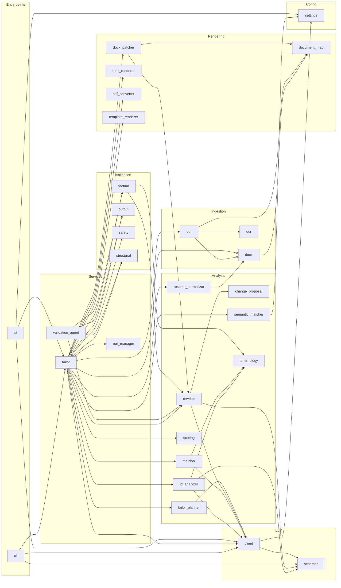

# Knowledge Graph — Resume-optimizer

> **Auto-generated** by `scripts/update_docs.py graph` (run by the pre-commit hook). Do not edit by hand —
> change the code, or the `STAGE_MAP` / `LAYERS` tables in the script. Machine-readable twin: `KNOWLEDGE_GRAPH.json`.

**35 app modules · 24 test files · 59 classes · 274 functions/methods · 8,168 lines of Python** · source hash `06a43a2929586a9d`

How to read this: every file sits at a point in a 3-D space — **where** it lives (path), **what** it is (layer), and **when** it runs (pipeline stage). Section 2 is that matrix; section 3 zooms into each module.

## Contents
1. [Directory map](#1-directory-map)
2. [Layer × Stage matrix](#2-layer--stage-matrix)
3. [Module cards](#3-module-cards)
4. [Dependency diagram](#4-dependency-diagram)
5. [Configuration keys](#5-configuration-keys)
6. [Prompts](#6-prompts)
7. [Gaps: untested and unmapped modules](#7-gaps-untested-and-unmapped-modules)

## 1. Directory map

```text
.env.example
ARCHITECTURE.md
BUILD.md
CLAUDE.md
README.md
pyproject.toml
.githooks/
  _python
  post-commit
  pre-commit
app/
  cli.py                                         check_llm(), main()
  ui.py                                          get_local_pdf_preview_url(), display_pdf_with_fallback(), _cleanup_ses…
  analysis/
    change_proposal.py                           ChangeProposal
    jd_analyzer.py                               JDAnalyzer
    matcher.py                                   EvidenceMatcher
    resume_normalizer.py                         ResumeNormalizer
    rewriter.py                                  LLMRewriter
    scoring.py                                   ScoreComponents, AlignmentScorer
    semantic_matcher.py                          Semantic (embedding-based) matching layer.
    tailor_planner.py                            TailoringPlanner
    terminology.py                               flat_alias_to_canonical(), normalize_phrase()
  config/
    settings.py                                  Settings
  domain/
    evidence.py                                  Evidence
    job.py                                       Requirement, JobDescription
    report.py                                    Match, TailoringReport
    resume.py                                    Candidate, ResumeBullet, Experience, Project, Education, Resume
    resume_document.py                           ResumePresentation, ResumeSource, ResumeRevision, ResumeDocument
    tailoring.py                                 TailoringAction, TailoringPlan
  ingestion/
    docx.py                                      RawBlock, RawDocument, DocxParser
    ocr.py                                       OCREngine
    pdf.py                                       PdfParser
  llm/
    client.py                                    LLMClient
    schemas.py                                   LLMResponse, LLMError, LLMConnectionError, LLMTimeoutError, LLMInvalid…
    prompts/
      final_review.txt
      jd_analysis.txt
      resume_normalization.txt
      rewrite_bullet.txt
      tailoring_plan.txt
      validate_claims.txt
  rendering/
    document_map.py                              DocumentLocation, DocumentMap
    docx_patcher.py                              DocxPatcher
    html_renderer.py                             HtmlResumeRenderer
    pdf_converter.py                             PdfConverter
    template_renderer.py                         TemplateRenderer
  services/
    run_manager.py                               RunManager
    tailor.py                                    TailorService
    validation_agent.py                          ValidationAgent
  validation/
    factual.py                                   ClaimCheck, ValidationResult, FactualValidator
    output.py                                    OutputQAValidator
    safety.py                                    SafetyGuard
    structural.py                                StructuralValidator
scripts/
  autocommit.sh
  benchmark_model.py                             Benchmark local LLM latency and availability via Ollama.
  check_dependencies.py                          Simple dependency checker for LibreOffice and Ollama.
  create_sample_docx.py                          Generate sample fixture DOCX resume for testing.
  create_sample_pdf.py                           Generate sample PDF resume fixture using PyMuPDF.
  install_hooks.sh
  update_docs.py                                 Regenerate the repo's living docs: the knowledge graph and the change …
tests/
  conftest.py                                    Test-wide isolation from the developer's .env.
  fixtures/
    jds/
      sample.txt
    resumes/
      sample.docx
      sample.pdf
  integration/
    test_end_to_end.py                           test_integration_docx_pipeline(), test_integration_pdf_pipeline(), tes…
    test_preserve_rewrite_end_to_end.py          test_approved_rewrite_appears_in_all_outputs()
  unit/
    test_cli.py                                  test_tailor_service_analyze_only(), test_tailor_service_end_to_end_doc…
    test_docx_parser.py                          test_docx_parser_sample(), test_docx_parser_file_not_found()
    test_docx_renderer.py                        test_docx_patcher_preserve_mode(), test_template_renderer_ats_mode(), …
    test_env.py                                  test_environment_baseline()
    test_html_renderer.py                        test_html_renderer_outputs_ats_sections_and_escapes_content()
    test_jd_analyzer.py                          test_jd_analyzer_heuristic(), test_heading_variants_are_not_extracted_…
    test_jd_analyzer_llm.py                      _FakeLLMClient
    test_llm_client.py                           SampleSchema
    test_matcher.py                              test_evidence_matcher_exact_and_alias(), test_one_generic_word_cannot_…
    test_pdf_converter.py                        test_pdf_converter_find_binary_or_graceful_none(), test_output_qa_vali…
    test_pdf_parser.py                           test_pdf_parser_text_layer(), test_pdf_parser_file_not_found(), test_m…
    test_resume_document.py                      test_resume_document_has_versioned_json_snapshot(), test_resume_docume…
    test_resume_normalizer.py                    test_resume_normalizer()
    test_rewriter.py                             test_rewriter_deterministic_fallback(), test_rewrite_bullet_parses_str…
    test_scoring.py                              _req(), _match(), test_semantic_partial_excluded_from_headline_score()…
    test_semantic_matcher.py                     Tests for SemanticMatcher.
    test_tailor_planner.py                       test_tailor_planner(), test_semantic_only_match_produces_rewrite_with_…
    test_tailor_resume_flow.py                   tailor_resume orchestration: pre-approved proposals and Strict Factual…
    test_tailor_service_addition.py              _service(), test_incorporate_user_addition_appends_bullet_to_most_rece…
    test_template_renderer_standalone.py         _full_text(), test_template_renderer_ats_mode(), test_template_rendere…
    test_ui.py                                   test_ui_importable()
    test_validation.py                           test_factual_validator_preserves_grounded_claims(), test_factual_valid…
```

## 2. Layer × Stage matrix

Rows = layer (what kind of code), columns = pipeline stage (when it runs during a tailoring run). Orchestrators (`tailor.py`, `ui.py`, `cli.py`) span every stage and are listed once below the table.

| Layer | 1 Ingest | 2 Normalize | 3 JD analysis | 4 Match | 5 Score | 6 Plan | 7 Rewrite | 8 Validate | 9 Render | 10 Report |
|---|---|---|---|---|---|---|---|---|---|---|
| **Ingestion** | `docx`<br>`ocr`<br>`pdf` | · | · | · | · | · | · | · | · | · |
| **Analysis** | · | `resume_normalizer` | `jd_analyzer` | `matcher`<br>`semantic_matcher`<br>`terminology` | `scoring` | `tailor_planner` | `change_proposal`<br>`rewriter` | · | · | · |
| **LLM** | · | · | `client`<br>`schemas` | · | · | · | `client`<br>`schemas` | · | · | · |
| **Validation** | · | · | `safety` | · | · | · | · | `factual`<br>`output`<br>`structural` | · | · |
| **Rendering** | `document_map` | · | · | · | · | · | · | · | `document_map`<br>`docx_patcher`<br>`html_renderer`<br>`pdf_converter`<br>`template_renderer` | · |
| **Domain models** | · | `evidence`<br>`resume`<br>`resume_document` | `job` | `evidence`<br>`report` | `report` | `tailoring` | · | · | `resume_document` | · |
| **Services** | · | · | · | · | · | · | · | `validation_agent` | · | `run_manager` |

Spanning all stages: `app/cli.py`, `app/services/tailor.py`, `app/ui.py`

## 3. Module cards

### `app/analysis/change_proposal.py`

**Layer:** Analysis · **Stage:** 7 Rewrite · **Lines:** 78

- class **`ChangeProposal`** ([app/analysis/change_proposal.py:6](../app/analysis/change_proposal.py#L6)) — Richer change proposal schema for review and audit.
  - `model_dump()` :38
  - `semantic_id()` :53
  - `source_id()` :63
  - `rewritten_text()` :72
- **Imported by:** `analysis/rewriter.py`

### `app/analysis/jd_analyzer.py`

**Layer:** Analysis · **Stage:** 3 JD analysis · **Lines:** 307

- class **`JDAnalyzer`** ([app/analysis/jd_analyzer.py:8](../app/analysis/jd_analyzer.py#L8)) — Extract only text that is visibly present in the supplied job description.
  - `__init__()` :36
  - `extract_keywords_from_text()` :64 — Stopgap keyword extraction: keep only technical-looking terms,
  - `_category()` :107
  - `_is_requirement()` :118
  - `_segment_line()` :127 — Conservatively split a requirement line into atomic requirement phrases.
  - `_reflow_lines()` :147 — Undo hard line-wrapping from pasted JDs (job boards/PDFs often wrap
  - `_llm_select_requirement_lines()` :182 — Ask the LLM which of the given candidate line indices are genuine
  - `analyze()` :233
- **Imports:** `analysis/terminology.py`, `domain/job.py`, `llm/client.py`, `llm/schemas.py`
- **Imported by:** `services/tailor.py`
- **Tested by:** `tests/unit/test_jd_analyzer.py`, `tests/unit/test_jd_analyzer_llm.py`

### `app/analysis/matcher.py`

**Layer:** Analysis · **Stage:** 4 Match · **Lines:** 146

- class **`EvidenceMatcher`** ([app/analysis/matcher.py:20](../app/analysis/matcher.py#L20)) — Deterministic, evidence-only matcher.
  - `__init__()` :27
  - `_normalize_text()` :30
  - `_extract_key_tokens()` :38
  - `_meaningful_tokens()` :42
  - `_extract_requirement_units()` :45 — Break a requirement into comparable 'units' for coverage scoring.
  - `match()` :89
- **Imports:** `analysis/terminology.py`, `domain/evidence.py`, `domain/job.py`, `domain/report.py`, `llm/client.py`
- **Imported by:** `services/tailor.py`
- **Tested by:** `tests/unit/test_matcher.py`

### `app/analysis/resume_normalizer.py`

**Layer:** Analysis · **Stage:** 2 Normalize · **Lines:** 452

- class **`ResumeNormalizer`** ([app/analysis/resume_normalizer.py:8](../app/analysis/resume_normalizer.py#L8))
  - `_extract_date_range()` :53
  - `_strip_date_range()` :57
  - `_parse_title_and_dates()` :61 — 'Data Scientist II | August 2024 - Present' ->
  - `_split_respecting_parens()` :70 — Split on sep_chars, but never inside ( ) or [ ] groups — so
  - `normalize()` :93
- **Imports:** `domain/evidence.py`, `domain/resume.py`, `domain/resume_document.py`, `ingestion/docx.py`
- **Imported by:** `services/tailor.py`
- **Tested by:** `tests/integration/test_preserve_rewrite_end_to_end.py`, `tests/unit/test_resume_normalizer.py`, `tests/unit/test_tailor_resume_flow.py`

### `app/analysis/rewriter.py`

**Layer:** Analysis · **Stage:** 7 Rewrite · **Lines:** 229

- class **`LLMRewriter`** ([app/analysis/rewriter.py:48](../app/analysis/rewriter.py#L48))
  - `__init__()` :49
  - `rewrite_bullet()` :52 — Rewrite (or, given a single free-text `original_text` with no
  - `rewrite_bullet_with_status()` :72 — Like rewrite_bullet, plus what happened, so failures are visible
  - `suggest_for_missing_requirement()` :130 — Advisory only. For a JD requirement the resume doesn't currently
  - `execute_plan()` :178
- function **`normalize_llm_text()`** ([app/analysis/rewriter.py:27](../app/analysis/rewriter.py#L27))
- **Imports:** `analysis/change_proposal.py`, `domain/evidence.py`, `domain/job.py`, `domain/resume.py`, `domain/tailoring.py`, `llm/client.py`, `llm/schemas.py`
- **Imported by:** `rendering/docx_patcher.py`, `services/tailor.py`, `services/validation_agent.py`, `validation/factual.py`
- **Tested by:** `tests/integration/test_preserve_rewrite_end_to_end.py`, `tests/unit/test_docx_renderer.py`, `tests/unit/test_rewriter.py`, `tests/unit/test_tailor_resume_flow.py`, `tests/unit/test_validation.py`
- **Prompts:** `llm/prompts/rewrite_bullet.txt`

### `app/analysis/scoring.py`

**Layer:** Analysis · **Stage:** 5 Score · **Lines:** 134

- class **`ScoreComponents`** ([app/analysis/scoring.py:7](../app/analysis/scoring.py#L7))
- class **`AlignmentScorer`** ([app/analysis/scoring.py:31](../app/analysis/scoring.py#L31)) — A transparent weighted average of evidence-backed requirement coverage.
  - `calculate_components()` :43
  - `_compute()` :46
  - `calculate_score()` :123
- **Imports:** `domain/job.py`, `domain/report.py`
- **Imported by:** `services/tailor.py`
- **Tested by:** `tests/unit/test_matcher.py`, `tests/unit/test_scoring.py`

### `app/analysis/semantic_matcher.py`

**Layer:** Analysis · **Stage:** 4 Match · **Lines:** 166

_Semantic (embedding-based) matching layer._

- class **`SemanticMatcher`** ([app/analysis/semantic_matcher.py:42](../app/analysis/semantic_matcher.py#L42)) — Adds SEMANTIC_PARTIAL matches for requirements the deterministic
  - `__init__()` :54
  - `_get_embedder()` :77
  - `match()` :97 — Returns a new match list: every non-MISSING match from
- function **`_cosine_similarity()`** ([app/analysis/semantic_matcher.py:33](../app/analysis/semantic_matcher.py#L33))
- **Imports:** `config/settings.py`, `domain/evidence.py`, `domain/job.py`, `domain/report.py`
- **Imported by:** `services/tailor.py`
- **Tested by:** `tests/unit/test_semantic_matcher.py`

### `app/analysis/tailor_planner.py`

**Layer:** Analysis · **Stage:** 6 Plan · **Lines:** 103

- class **`TailoringPlanner`** ([app/analysis/tailor_planner.py:9](../app/analysis/tailor_planner.py#L9))
  - `__init__()` :10
  - `create_plan()` :13
  - `rank_missing_requirements()` :86 — Order MISSING matches so the most important, still-unaddressed
- **Imports:** `domain/evidence.py`, `domain/job.py`, `domain/report.py`, `domain/resume.py`, `domain/tailoring.py`, `llm/client.py`
- **Imported by:** `services/tailor.py`
- **Tested by:** `tests/unit/test_tailor_planner.py`

### `app/analysis/terminology.py`

**Layer:** Analysis · **Stage:** 4 Match · **Lines:** 55

- function **`flat_alias_to_canonical()`** ([app/analysis/terminology.py:32](../app/analysis/terminology.py#L32)) — Build a flat alias->canonical map (e.g. 'k8s' -> 'kubernetes') for
- function **`normalize_phrase()`** ([app/analysis/terminology.py:42](../app/analysis/terminology.py#L42)) — Normalize a phrase to its canonical lowercased form and expand common acronyms.
- **Imported by:** `analysis/jd_analyzer.py`, `analysis/matcher.py`, `validation/factual.py`

### `app/cli.py`

**Layer:** Entry points · **Stage:** all · **Lines:** 112

- function **`check_llm()`** ([app/cli.py:11](../app/cli.py#L11)) — One live, structured call to the configured provider. Returns an exit
- function **`main()`** ([app/cli.py:44](../app/cli.py#L44))
- **Imports:** `llm/client.py`, `llm/schemas.py`, `services/tailor.py`
- **Tested by:** `tests/unit/test_cli.py`

### `app/config/settings.py`

**Layer:** Config · **Stage:** — · **Lines:** 41

- class **`Settings`** ([app/config/settings.py:4](../app/config/settings.py#L4))
- **Imported by:** `analysis/semantic_matcher.py`, `llm/client.py`, `ui.py`

### `app/domain/evidence.py`

**Layer:** Domain models · **Stage:** 2 Normalize, 4 Match · **Lines:** 21

- class **`Evidence`** ([app/domain/evidence.py:4](../app/domain/evidence.py#L4))
- **Imported by:** `analysis/matcher.py`, `analysis/resume_normalizer.py`, `analysis/rewriter.py`, `analysis/semantic_matcher.py`, `analysis/tailor_planner.py`, `services/tailor.py`, `validation/factual.py`
- **Tested by:** `tests/unit/test_matcher.py`, `tests/unit/test_resume_normalizer.py`, `tests/unit/test_rewriter.py`, `tests/unit/test_semantic_matcher.py`, `tests/unit/test_tailor_planner.py`, `tests/unit/test_tailor_service_addition.py`, `tests/unit/test_validation.py`

### `app/domain/job.py`

**Layer:** Domain models · **Stage:** 3 JD analysis · **Lines:** 33

- class **`Requirement`** ([app/domain/job.py:4](../app/domain/job.py#L4))
- class **`JobDescription`** ([app/domain/job.py:28](../app/domain/job.py#L28))
- **Imported by:** `analysis/jd_analyzer.py`, `analysis/matcher.py`, `analysis/rewriter.py`, `analysis/scoring.py`, `analysis/semantic_matcher.py`, `analysis/tailor_planner.py`, `services/tailor.py`
- **Tested by:** `tests/unit/test_jd_analyzer.py`, `tests/unit/test_matcher.py`, `tests/unit/test_rewriter.py`, `tests/unit/test_scoring.py`, `tests/unit/test_semantic_matcher.py`, `tests/unit/test_tailor_planner.py`, `tests/unit/test_tailor_service_addition.py`

### `app/domain/report.py`

**Layer:** Domain models · **Stage:** 4 Match, 5 Score · **Lines:** 28

- class **`Match`** ([app/domain/report.py:4](../app/domain/report.py#L4))
- class **`TailoringReport`** ([app/domain/report.py:19](../app/domain/report.py#L19))
- **Imported by:** `analysis/matcher.py`, `analysis/scoring.py`, `analysis/semantic_matcher.py`, `analysis/tailor_planner.py`, `services/tailor.py`
- **Tested by:** `tests/unit/test_matcher.py`, `tests/unit/test_scoring.py`, `tests/unit/test_semantic_matcher.py`, `tests/unit/test_tailor_planner.py`, `tests/unit/test_tailor_service_addition.py`

### `app/domain/resume.py`

**Layer:** Domain models · **Stage:** 2 Normalize · **Lines:** 49

- class **`Candidate`** ([app/domain/resume.py:4](../app/domain/resume.py#L4))
- class **`ResumeBullet`** ([app/domain/resume.py:11](../app/domain/resume.py#L11))
- class **`Experience`** ([app/domain/resume.py:16](../app/domain/resume.py#L16))
- class **`Project`** ([app/domain/resume.py:25](../app/domain/resume.py#L25))
- class **`Education`** ([app/domain/resume.py:32](../app/domain/resume.py#L32))
- class **`Resume`** ([app/domain/resume.py:40](../app/domain/resume.py#L40))
- **Imported by:** `analysis/resume_normalizer.py`, `analysis/rewriter.py`, `analysis/tailor_planner.py`, `domain/resume_document.py`, `rendering/html_renderer.py`, `rendering/template_renderer.py`, `services/tailor.py`, `validation/structural.py`
- **Tested by:** `tests/unit/test_docx_renderer.py`, `tests/unit/test_html_renderer.py`, `tests/unit/test_resume_document.py`, `tests/unit/test_resume_normalizer.py`, `tests/unit/test_rewriter.py`, `tests/unit/test_tailor_planner.py`, `tests/unit/test_tailor_service_addition.py`, `tests/unit/test_template_renderer_standalone.py`

### `app/domain/resume_document.py`

**Layer:** Domain models · **Stage:** 2 Normalize, 9 Render · **Lines:** 75

- class **`ResumePresentation`** ([app/domain/resume_document.py:10](../app/domain/resume_document.py#L10)) — Display choices; content remains in the canonical Resume model.
- class **`ResumeSource`** ([app/domain/resume_document.py:21](../app/domain/resume_document.py#L21))
- class **`ResumeRevision`** ([app/domain/resume_document.py:27](../app/domain/resume_document.py#L27))
- class **`ResumeDocument`** ([app/domain/resume_document.py:39](../app/domain/resume_document.py#L39)) — Versioned source of truth for editing, tailoring, and rendering.
  - `record_revision()` :48
  - `snapshot()` :73 — Return a JSON-serializable, versioned document for storage or export.
- **Imports:** `domain/resume.py`
- **Imported by:** `analysis/resume_normalizer.py`, `rendering/html_renderer.py`, `rendering/template_renderer.py`, `services/tailor.py`, `services/validation_agent.py`
- **Tested by:** `tests/unit/test_docx_renderer.py`, `tests/unit/test_html_renderer.py`, `tests/unit/test_resume_document.py`, `tests/unit/test_template_renderer_standalone.py`

### `app/domain/tailoring.py`

**Layer:** Domain models · **Stage:** 6 Plan · **Lines:** 19

- class **`TailoringAction`** ([app/domain/tailoring.py:4](../app/domain/tailoring.py#L4))
- class **`TailoringPlan`** ([app/domain/tailoring.py:17](../app/domain/tailoring.py#L17))
- **Imported by:** `analysis/rewriter.py`, `analysis/tailor_planner.py`, `services/tailor.py`
- **Tested by:** `tests/unit/test_rewriter.py`, `tests/unit/test_tailor_planner.py`

### `app/ingestion/docx.py`

**Layer:** Ingestion · **Stage:** 1 Ingest · **Lines:** 128

- class **`RawBlock`** ([app/ingestion/docx.py:9](../app/ingestion/docx.py#L9))
- class **`RawDocument`** ([app/ingestion/docx.py:16](../app/ingestion/docx.py#L16))
- class **`DocxParser`** ([app/ingestion/docx.py:22](../app/ingestion/docx.py#L22))
  - `parse()` :28
- **Imports:** `rendering/document_map.py`
- **Imported by:** `analysis/resume_normalizer.py`, `ingestion/pdf.py`, `services/tailor.py`
- **Tested by:** `tests/integration/test_preserve_rewrite_end_to_end.py`, `tests/unit/test_docx_parser.py`, `tests/unit/test_docx_renderer.py`, `tests/unit/test_pdf_parser.py`, `tests/unit/test_resume_normalizer.py`, `tests/unit/test_tailor_resume_flow.py`

### `app/ingestion/ocr.py`

**Layer:** Ingestion · **Stage:** 1 Ingest · **Lines:** 33

- class **`OCREngine`** ([app/ingestion/ocr.py:6](../app/ingestion/ocr.py#L6))
  - `__init__()` :7
  - `is_available()` :15
  - `extract_text_from_image()` :18
- **Imported by:** `ingestion/pdf.py`

### `app/ingestion/pdf.py`

**Layer:** Ingestion · **Stage:** 1 Ingest · **Lines:** 167

- class **`PdfParser`** ([app/ingestion/pdf.py:18](../app/ingestion/pdf.py#L18))
  - `__init__()` :21
  - `_ensure_fitz()` :24
  - `_merge_wrapped_lines()` :32 — Join PDF-extracted lines that are word-wrap continuations of one
  - `parse()` :63
- **Imports:** `ingestion/docx.py`, `ingestion/ocr.py`, `rendering/document_map.py`
- **Imported by:** `services/tailor.py`
- **Tested by:** `tests/unit/test_pdf_parser.py`

### `app/llm/client.py`

**Layer:** LLM · **Stage:** 3 JD analysis, 7 Rewrite · **Lines:** 607

- class **`LLMClient`** ([app/llm/client.py:53](../app/llm/client.py#L53)) — Unified client for text generation across three interchangeable providers:
  - `__init__()` :69
  - `is_available()` :133 — Whether the configured provider is reachable AND the configured
  - `_check_available()` :145
  - `_ollama_check()` :152
  - `_groq_check()` :164
  - `_anthropic_check()` :185
  - `_record()` :206
  - `generate()` :224 — Generate text from the LLM using the chat interface.
  - `get_usage_summary()` :253 — Aggregate every LLM call made on this client instance so far
  - `_generate_ollama()` :275
  - `_groq_supports_strict_schema()` :320
  - `_generate_groq()` :324
  - `_split_system()` :402 — The Messages API takes the system prompt as a top-level field,
  - `_anthropic_request()` :409
  - `_anthropic_response()` :446
  - `_generate_anthropic()` :463
  - `_generate_json_anthropic()` :468 — Structured outputs guarantee the response matches the schema, so
  - `generate_json()` :489 — Generate structured JSON conforming to a Pydantic model.
- function **`_retry_after_seconds()`** ([app/llm/client.py:579](../app/llm/client.py#L579)) — Seconds to wait before retrying a 429: the server's `retry-after`
- function **`strict_json_schema()`** ([app/llm/client.py:594](../app/llm/client.py#L594)) — Adapt a Pydantic JSON schema for strict structured-output modes: every
- **Imports:** `config/settings.py`, `llm/schemas.py`
- **Imported by:** `analysis/jd_analyzer.py`, `analysis/matcher.py`, `analysis/rewriter.py`, `analysis/tailor_planner.py`, `cli.py`, `services/tailor.py`, `ui.py`, `scripts/benchmark_model.py`
- **Tested by:** `tests/unit/test_llm_client.py`, `tests/unit/test_rewriter.py`

### `app/llm/schemas.py`

**Layer:** LLM · **Stage:** 3 JD analysis, 7 Rewrite · **Lines:** 57

- class **`LLMResponse`** ([app/llm/schemas.py:4](../app/llm/schemas.py#L4))
- class **`LLMError`** ([app/llm/schemas.py:13](../app/llm/schemas.py#L13)) — Base exception for LLM errors.
- class **`LLMConnectionError`** ([app/llm/schemas.py:18](../app/llm/schemas.py#L18)) — Raised when Ollama server is unreachable.
- class **`LLMTimeoutError`** ([app/llm/schemas.py:23](../app/llm/schemas.py#L23)) — Raised when LLM call exceeds timeout.
- class **`LLMInvalidJSONError`** ([app/llm/schemas.py:28](../app/llm/schemas.py#L28)) — Raised when structured JSON output parsing fails after retries.
- class **`BulletRewriteResult`** ([app/llm/schemas.py:32](../app/llm/schemas.py#L32)) — Structured response for a single bullet rewrite/composition call.
- class **`MissingRequirementSuggestion`** ([app/llm/schemas.py:39](../app/llm/schemas.py#L39)) — Advisory-only suggestion for a JD requirement the resume doesn't
- class **`JDRequirementSelection`** ([app/llm/schemas.py:48](../app/llm/schemas.py#L48)) — Which job-description line indices (from a numbered list the caller
- **Imported by:** `analysis/jd_analyzer.py`, `analysis/rewriter.py`, `cli.py`, `llm/client.py`
- **Tested by:** `tests/unit/test_cli.py`, `tests/unit/test_jd_analyzer_llm.py`, `tests/unit/test_llm_client.py`, `tests/unit/test_rewriter.py`, `tests/unit/test_tailor_resume_flow.py`

### `app/rendering/document_map.py`

**Layer:** Rendering · **Stage:** 1 Ingest, 9 Render · **Lines:** 22

- class **`DocumentLocation`** ([app/rendering/document_map.py:4](../app/rendering/document_map.py#L4))
- class **`DocumentMap`** ([app/rendering/document_map.py:15](../app/rendering/document_map.py#L15))
  - `add_location()` :18
  - `get_location()` :21
- **Imported by:** `ingestion/docx.py`, `ingestion/pdf.py`, `rendering/docx_patcher.py`
- **Tested by:** `tests/unit/test_docx_parser.py`

### `app/rendering/docx_patcher.py`

**Layer:** Rendering · **Stage:** 9 Render · **Lines:** 59

- class **`DocxPatcher`** ([app/rendering/docx_patcher.py:9](../app/rendering/docx_patcher.py#L9)) — Apply approved text-only rewrites without rebuilding the source document.
  - `_replace_paragraph_text()` :13
  - `patch()` :26
- **Imports:** `analysis/rewriter.py`, `rendering/document_map.py`
- **Imported by:** `services/tailor.py`
- **Tested by:** `tests/integration/test_preserve_rewrite_end_to_end.py`, `tests/unit/test_docx_renderer.py`

### `app/rendering/html_renderer.py`

**Layer:** Rendering · **Stage:** 9 Render · **Lines:** 115

- class **`HtmlResumeRenderer`** ([app/rendering/html_renderer.py:8](../app/rendering/html_renderer.py#L8)) — Render an ATS-safe, printable résumé from the canonical document.
  - `_items()` :11
  - `_meta_line()` :14 — A de-emphasized 'Company · Location' style line under a bolded
  - `render()` :22
  - `write_html()` :111
- **Imports:** `domain/resume.py`, `domain/resume_document.py`
- **Imported by:** `services/tailor.py`
- **Tested by:** `tests/integration/test_preserve_rewrite_end_to_end.py`, `tests/unit/test_html_renderer.py`

### `app/rendering/pdf_converter.py`

**Layer:** Rendering · **Stage:** 9 Render · **Lines:** 60

- class **`PdfConverter`** ([app/rendering/pdf_converter.py:9](../app/rendering/pdf_converter.py#L9))
  - `find_libreoffice_binary()` :10
  - `convert_docx_to_pdf()` :27
- **Imported by:** `services/tailor.py`
- **Tested by:** `tests/integration/test_preserve_rewrite_end_to_end.py`, `tests/unit/test_pdf_converter.py`

### `app/rendering/template_renderer.py`

**Layer:** Rendering · **Stage:** 9 Render · **Lines:** 269

- class **`TemplateRenderer`** ([app/rendering/template_renderer.py:25](../app/rendering/template_renderer.py#L25)) — Standard single-column, ATS-safe DOCX renderer with support for ResumeDocument.
  - `render_ats_default()` :28
  - `_set_document_defaults()` :194 — Tighter, more consistent margins/typography than python-docx's
  - `_content_width()` :218
  - `_add_section_heading()` :222 — A section label in the accent color with a rule underneath —
  - `_add_title_dates_line()` :237 — Title (bold) on the left, date range right-aligned on the same
  - `_add_bottom_border()` :256 — Adds a single bottom border to a paragraph via raw OOXML — the
- **Imports:** `domain/resume.py`, `domain/resume_document.py`
- **Imported by:** `services/tailor.py`
- **Tested by:** `tests/unit/test_docx_renderer.py`, `tests/unit/test_template_renderer_standalone.py`

### `app/services/run_manager.py`

**Layer:** Services · **Stage:** 10 Report · **Lines:** 37

- class **`RunManager`** ([app/services/run_manager.py:8](../app/services/run_manager.py#L8))
  - `__init__()` :9
  - `create_run()` :12
  - `save_json()` :30
- **Imported by:** `services/tailor.py`
- **Tested by:** `tests/unit/test_tailor_resume_flow.py`

### `app/services/tailor.py`

**Layer:** Services · **Stage:** all · **Lines:** 596

- class **`TailorService`** ([app/services/tailor.py:33](../app/services/tailor.py#L33))
  - `__init__()` :34
  - `generate_preview_md()` :58
  - `analyze_only()` :94
  - `generate_proposals()` :122 — Generate rewrite proposals without applying them, plus advisory
  - `incorporate_user_addition()` :181 — Fold a user-supplied free-text addition (a project, an
  - `tailor_resume()` :255
- function **`_merge_usage()`** ([app/services/tailor.py:587](../app/services/tailor.py#L587)) — Combine two LLMClient.get_usage_summary() dicts into one.
- **Imports:** `analysis/jd_analyzer.py`, `analysis/matcher.py`, `analysis/resume_normalizer.py`, `analysis/rewriter.py`, `analysis/scoring.py`, `analysis/semantic_matcher.py`, `analysis/tailor_planner.py`, `domain/evidence.py`, `domain/job.py`, `domain/report.py`, `domain/resume.py`, `domain/resume_document.py`, `domain/tailoring.py`, `ingestion/docx.py`, `ingestion/pdf.py`, `llm/client.py`, `rendering/docx_patcher.py`, `rendering/html_renderer.py`, `rendering/pdf_converter.py`, `rendering/template_renderer.py`, `services/run_manager.py`, `validation/factual.py`, `validation/output.py`, `validation/safety.py`, `validation/structural.py`
- **Imported by:** `cli.py`, `ui.py`
- **Tested by:** `tests/integration/test_end_to_end.py`, `tests/unit/test_cli.py`, `tests/unit/test_tailor_resume_flow.py`, `tests/unit/test_tailor_service_addition.py`

### `app/services/validation_agent.py`

**Layer:** Services · **Stage:** 8 Validate · **Lines:** 71

- class **`ValidationAgent`** ([app/services/validation_agent.py:8](../app/services/validation_agent.py#L8))
  - `__init__()` :9
  - `validate_run()` :14
- **Imports:** `analysis/rewriter.py`, `domain/resume_document.py`, `validation/factual.py`, `validation/output.py`, `validation/structural.py`

### `app/ui.py`

**Layer:** Entry points · **Stage:** all · **Lines:** 554

- function **`get_local_pdf_preview_url()`** ([app/ui.py:25](../app/ui.py#L25)) — Serve a PDF from a temporary HTTP endpoint so Chrome can render it in an iframe.
- function **`display_pdf_with_fallback()`** ([app/ui.py:42](../app/ui.py#L42)) — Try to use Streamlit's native PDF display if available, otherwise fall back
- function **`_cleanup_session_state()`** ([app/ui.py:79](../app/ui.py#L79)) — Remove temp files from a previous run and reset to a clean 'idle' state.
- function **`model_options()`** ([app/ui.py:136](../app/ui.py#L136)) — Models offered in the sidebar for the configured provider. The
- **Imports:** `config/settings.py`, `llm/client.py`, `services/tailor.py`
- **Tested by:** `tests/unit/test_ui.py`

### `app/validation/factual.py`

**Layer:** Validation · **Stage:** 8 Validate · **Lines:** 199

- class **`ClaimCheck`** ([app/validation/factual.py:13](../app/validation/factual.py#L13))
- class **`ValidationResult`** ([app/validation/factual.py:20](../app/validation/factual.py#L20))
- class **`FactualValidator`** ([app/validation/factual.py:32](../app/validation/factual.py#L32)) — Checks that a rewrite adds no facts beyond the resume's evidence.
  - `__init__()` :62
  - `extract_numbers()` :74
  - `_stem()` :79 — Crude stemmer so inflections compare equal:
  - `_keys()` :93 — All forms a term can match by: stem plus canonical alias.
  - `_term_keys()` :101
  - `_is_factual()` :114
  - `validate_proposal()` :128
- **Imports:** `analysis/rewriter.py`, `analysis/terminology.py`, `domain/evidence.py`
- **Imported by:** `services/tailor.py`, `services/validation_agent.py`
- **Tested by:** `tests/unit/test_validation.py`

### `app/validation/output.py`

**Layer:** Validation · **Stage:** 8 Validate · **Lines:** 56

- class **`OutputQAValidator`** ([app/validation/output.py:6](../app/validation/output.py#L6))
  - `validate_docx()` :7
  - `validate_pdf()` :29
- **Imported by:** `services/tailor.py`, `services/validation_agent.py`
- **Tested by:** `tests/integration/test_end_to_end.py`, `tests/integration/test_preserve_rewrite_end_to_end.py`, `tests/unit/test_pdf_converter.py`

### `app/validation/safety.py`

**Layer:** Validation · **Stage:** 3 JD analysis · **Lines:** 16

- class **`SafetyGuard`** ([app/validation/safety.py:3](../app/validation/safety.py#L3))
  - `sanitize()` :11 — Sanitize text input by escaping system prompt injection attempts.
- **Imported by:** `services/tailor.py`
- **Tested by:** `tests/unit/test_validation.py`

### `app/validation/structural.py`

**Layer:** Validation · **Stage:** 8 Validate · **Lines:** 22

- class **`StructuralValidator`** ([app/validation/structural.py:4](../app/validation/structural.py#L4))
  - `validate()` :5
- **Imports:** `domain/resume.py`
- **Imported by:** `services/tailor.py`, `services/validation_agent.py`
- **Tested by:** `tests/unit/test_validation.py`

## 4. Dependency diagram

Arrows point from importer to imported module (app code only; domain models omitted for readability, since almost everything imports them).



## 5. Configuration keys

From `app/config/settings.py`; each can be overridden by the env var of the same name in `.env`.

| Env var | Type | Default |
|---|---|---|
| `LLM_PROVIDER` | str | `'ollama'` |
| `LLM_HOST` | str | `'http://localhost:11434'` |
| `LLM_MODEL` | str | `'qwen3:4b'` |
| `LLM_TEMPERATURE` | float | `0.1` |
| `LLM_TIMEOUT_SECONDS` | int | `180` |
| `MAX_CONTEXT_TOKENS` | int | `12000` |
| `STRICT_FACTUAL_MODE` | bool | `True` |
| `GROQ_API_KEY` | str | `''` |
| `GROQ_MODEL` | str | `'openai/gpt-oss-120b'` |
| `GROQ_BASE_URL` | str | `'https://api.groq.com/openai/v1'` |
| `ANTHROPIC_API_KEY` | str | `''` |
| `ANTHROPIC_MODEL` | str | `'claude-opus-5-5'` |
| `SEMANTIC_MATCH_ENABLED` | bool | `True` |
| `SEMANTIC_MATCH_MODEL` | str | `'all-MiniLM-L6-v2'` |
| `SEMANTIC_MATCH_THRESHOLD` | float | `0.58` |

## 6. Prompts

| Prompt file | Loaded by |
|---|---|
| `final_review.txt` | **unused** |
| `jd_analysis.txt` | **unused** |
| `resume_normalization.txt` | **unused** |
| `rewrite_bullet.txt` | `app/analysis/rewriter.py` |
| `tailoring_plan.txt` | **unused** |
| `validate_claims.txt` | **unused** |

## 7. Gaps: untested and unmapped modules

**No test file imports these directly** (they may still be exercised indirectly):

- `app/analysis/change_proposal.py`
- `app/analysis/terminology.py`
- `app/config/settings.py`
- `app/ingestion/ocr.py`
- `app/services/validation_agent.py`

**Not imported by any app code** (possibly dead code, or only used by tests/scripts):

- `app/services/validation_agent.py`

**Not in `STAGE_MAP`** (add them in `scripts/update_docs.py`):

- none
